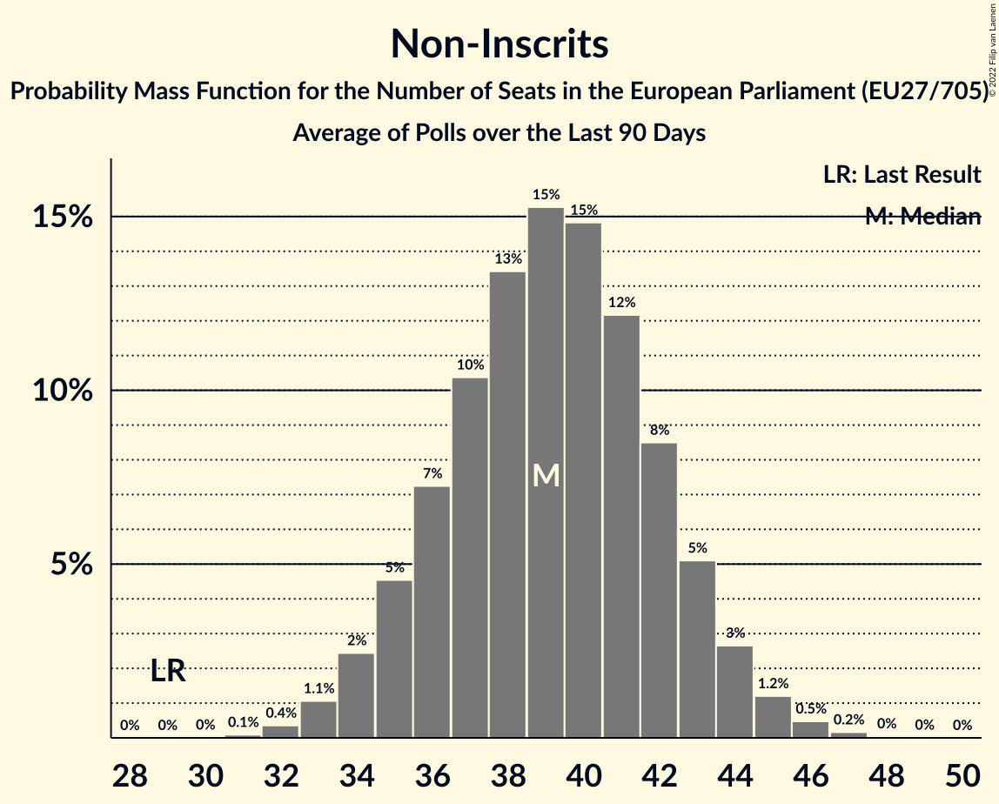

# Non-Inscrits

Members registered from **15 countries**:

> BG, CY, DK, ES, FI, FR, GR, HR, HU, IT, LT, LV, PL, SI, SK

## Seats

Last result: **29** seats (General Election of 26 May 2019)

Current median: **40** seats (+11 seats)

At least one member in **9 countries** have a median of 1 seat or more:

> BG, CY, ES, GR, HU, IT, LT, PL, SK

### Confidence Intervals

| Party | Area | Last Result | Median | 80% Confidence Interval | 90% Confidence Interval | 95% Confidence Interval | 99% Confidence Interval |
|:-----:|:----:|:-----------:|:------:|:-----------------------:|:-----------------------:|:-----------------------:|:-----------------------:|
| Non-Inscrits | EU | 29 | 40 | 37–42 | 36–43 | 35–44 | 34–45 |
| Movimento 5 Stelle | IT | | 14 | 14 | 14 | 14 | 14 |
| Fidesz–Kereszténydemokrata Néppárt | HU | | 13 | 11–17 | 11–17 | 10–17 | 10–18 |
| Konfederacja | PL | | 3 | 0–4 | 0–4 | 0–4 | 0–5 |
| Mi Hazánk Mozgalom | HU | | 2 | 1–2 | 1–2 | 1–2 | 0–2 |
| Възраждане | BG | | 2 | 1–2 | 1–3 | 1–3 | 1–3 |
| Darbo Partija | LT | | 1 | 0–1 | 0–1 | 0–1 | 0–1 |
| Jobbik | HU | | 1 | 0–1 | 0–2 | 0–2 | 0–2 |
| Partit Demòcrata Europeu Català | ES | | 1 | 1 | 0–1 | 0–2 | 0–2 |
| REPUBLIKA | SK | | 1 | 0–1 | 0–1 | 0–2 | 0–2 |
| Εθνικό Λαϊκό Μέτωπο | CY | | 1 | 1 | 1 | 1 | 1 |
| Κομμουνιστικό Κόμμα Ελλάδας | GR | | 1 | 1 | 1–2 | 1–2 | 1–2 |
| Impegno Civico | IT | | 0 | 0 | 0 | 0 | 0 |
| Kotleba–Ľudová strana Naše Slovensko | SK | | 0 | 0 | 0 | 0 | 0 |
| Kukiz’15 | PL | | 0 | 0 | 0 | 0 | 0 |
| Latvijas Krievu savienība | LV | | 0 | 0 | 0 | 0 | 0 |
| Liike Nyt | FI | | 0 | 0 | 0 | 0 | 0 |
| Magyar Kétfarkú Kutya Párt | HU | | 0 | 0–1 | 0–1 | 0–1 | 0–2 |
| Nye Borgerlige | DK | | 0 | 0–1 | 0–1 | 0–1 | 0–1 |
| Reconquête | FR | | 0 | 0 | 0 | 0 | 0 |
| Slovenska nacionalna stranka | SI | | 0 | 0 | 0 | 0 | 0 |
| Živi zid | HR | | 0 | 0 | 0 | 0 | 0 |
| Има такъв народ | BG | | 0 | 0–1 | 0–1 | 0–1 | 0–2 |

### Probability Mass Function

The following table shows the probability mass function per seat for the [poll average](average-2022-10-31.html) for Non-Inscrits.

| Number of Seats | Probability | Accumulated | Special Marks |
|:---------------:|:-----------:|:-----------:|:-------------:|
| 29 | 0% | 100% | Last Result |
| 30 | 0% | 100% |  |
| 31 | 0% | 100% |  |
| 32 | 0% | 100% |  |
| 33 | 0.2% | 100% |  |
| 34 | 0.7% | 99.8% |  |
| 35 | 2% | 99.1% |  |
| 36 | 4% | 97% |  |
| 37 | 8% | 93% |  |
| 38 | 14% | 85% |  |
| 39 | 19% | 70% |  |
| 40 | 19% | 51% | Median |
| 41 | 14% | 33% |  |
| 42 | 9% | 19% |  |
| 43 | 6% | 9% |  |
| 44 | 3% | 4% |  |
| 45 | 0.9% | 1.1% |  |
| 46 | 0.2% | 0.2% |  |
| 47 | 0% | 0% |  |

