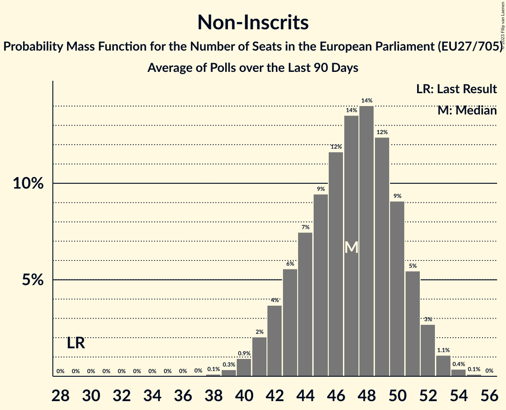

# Non-Inscrits

Members registered from **15 countries**:

> BG, CY, DE, DK, ES, FI, FR, GR, HU, IT, LT, LV, PL, SI, SK

## Seats

Last result: **29** seats (General Election of 26 May 2019)

Current median: **47** seats (+18 seats)

At least one member in **13 countries** have a median of 1 seat or more:

> BG, CY, DE, DK, ES, FR, GR, HU, IT, LT, LV, PL, SK

### Confidence Intervals

| Party | Area | Last Result | Median | 80% Confidence Interval | 90% Confidence Interval | 95% Confidence Interval | 99% Confidence Interval |
|:-----:|:----:|:-----------:|:------:|:-----------------------:|:-----------------------:|:-----------------------:|:-----------------------:|
| Non-Inscrits | EU | 29 | 47 | 43–50 | 42–51 | 41–52 | 40–54 |
| Movimento 5 Stelle | IT | | 15 | 13–16 | 13–17 | 13–17 | 12–18 |
| Fidesz–Kereszténydemokrata Néppárt | HU | | 12 | 11–12 | 11–12 | 11–13 | 11–13 |
| Reconquête | FR | | 4 | 0–4 | 0–5 | 0–5 | 0–5 |
| Konfederacja | PL | | 3 | 3–5 | 3–5 | 2–5 | 0–6 |
| Die PARTEI | DE | | 2 | 1–2 | 1–2 | 1–2 | 0–3 |
| Mi Hazánk Mozgalom | HU | | 2 | 1–2 | 1–2 | 1–2 | 1–2 |
| Възраждане | BG | | 2 | 2–3 | 2–3 | 2–3 | 2–3 |
| Danmarksdemokraterne | DK | | 1 | 1–2 | 1–2 | 1–2 | 1–2 |
| Darbo Partija | LT | | 1 | 0–1 | 0–1 | 0–1 | 0–1 |
| Latvija pirmajā vietā | LV | | 1 | 1 | 1 | 1 | 1 |
| Magyar Kétfarkú Kutya Párt | HU | | 1 | 0–1 | 0–1 | 0–1 | 0–1 |
| Moderaterne | DK | | 1 | 1–2 | 1–2 | 1–2 | 1–2 |
| Partit Demòcrata Europeu Català | ES | | 1 | 0–1 | 0–2 | 0–2 | 0–2 |
| REPUBLIKA | SK | | 1 | 1–2 | 1–2 | 1–2 | 1–2 |
| Εθνικό Λαϊκό Μέτωπο | CY | | 1 | 1 | 1 | 1 | 1 |
| Κομμουνιστικό Κόμμα Ελλάδας | GR | | 1 | 1–2 | 1–2 | 1–2 | 1–2 |
| Democrazia Sovrana e Popolare | IT | | 0 | 0 | 0 | 0 | 0 |
| Jobbik | HU | | 0 | 0 | 0 | 0–1 | 0–1 |
| Kotleba–Ľudová strana Naše Slovensko | SK | | 0 | 0 | 0 | 0 | 0 |
| Kukiz’15 | PL | | 0 | 0 | 0 | 0 | 0 |
| Latvijas Krievu savienība | LV | | 0 | 0 | 0 | 0 | 0 |
| Liike Nyt | FI | | 0 | 0 | 0 | 0 | 0 |
| Nye Borgerlige | DK | | 0 | 0 | 0 | 0 | 0 |
| Slovenska nacionalna stranka | SI | | 0 | 0 | 0 | 0 | 0 |
| Χρυσή Αυγή | GR | | 0 | 0 | 0 | 0 | 0 |
| Български възход | BG | | 0 | 0–1 | 0–1 | 0–1 | 0–1 |
| Има такъв народ | BG | | 0 | 0 | 0 | 0–1 | 0–1 |

### Probability Mass Function

The following table shows the probability mass function per seat for the [poll average](average-2023-02-28.html) for Non-Inscrits.

| Number of Seats | Probability | Accumulated | Special Marks |
|:---------------:|:-----------:|:-----------:|:-------------:|
| 29 | 0% | 100% | Last Result |
| 30 | 0% | 100% |  |
| 31 | 0% | 100% |  |
| 32 | 0% | 100% |  |
| 33 | 0% | 100% |  |
| 34 | 0% | 100% |  |
| 35 | 0% | 100% |  |
| 36 | 0% | 100% |  |
| 37 | 0% | 100% |  |
| 38 | 0.1% | 100% |  |
| 39 | 0.3% | 99.8% |  |
| 40 | 0.9% | 99.5% |  |
| 41 | 2% | 98.6% |  |
| 42 | 4% | 97% |  |
| 43 | 6% | 93% |  |
| 44 | 7% | 87% |  |
| 45 | 9% | 80% |  |
| 46 | 12% | 70% |  |
| 47 | 14% | 59% | Median |
| 48 | 14% | 45% |  |
| 49 | 12% | 31% |  |
| 50 | 9% | 19% |  |
| 51 | 5% | 10% |  |
| 52 | 3% | 4% |  |
| 53 | 1.1% | 2% |  |
| 54 | 0.4% | 0.5% |  |
| 55 | 0.1% | 0.1% |  |
| 56 | 0% | 0% |  |

