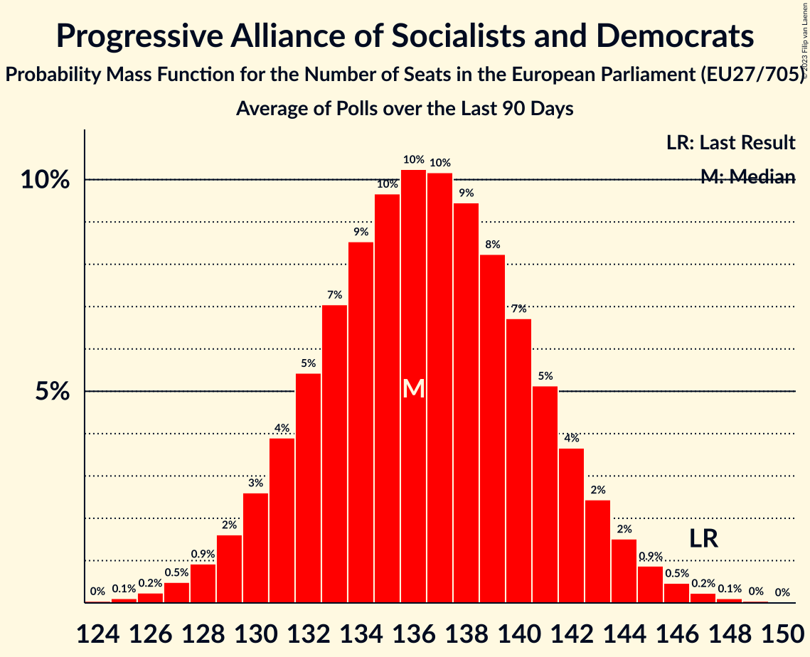

# Progressive Alliance of Socialists and Democrats

Members registered from **27 countries**:

> AT, BE, BG, CY, CZ, DE, DK, EE, ES, FI, FR, GR, HR, HU, IE, IT, LT, LU, LV, MT, NL, PL, PT, RO, SE, SI, SK

## Seats

Last result: **147** seats (General Election of 26 May 2019)

Current median: **137** seats (-10 seats)

At least one member in **25 countries** have a median of 1 seat or more:

> AT, BE, BG, CY, DE, DK, EE, ES, FI, FR, GR, HR, HU, IE, IT, LT, LU, MT, NL, PL, PT, RO, SE, SI, SK

### Confidence Intervals

| Party | Area | Last Result | Median | 80% Confidence Interval | 90% Confidence Interval | 95% Confidence Interval | 99% Confidence Interval |
|:-----:|:----:|:-----------:|:------:|:-----------------------:|:-----------------------:|:-----------------------:|:-----------------------:|
| Progressive Alliance of Socialists and Democrats | EU | 147 | 137 | 132–142 | 130–143 | 129–144 | 127–146 |
| Sozialdemokratische Partei Deutschlands | DE | | 19 | 17–20 | 17–20 | 16–21 | 15–22 |
| Partito Democratico | IT | | 17 | 15–19 | 15–19 | 14–19 | 13–20 |
| Partido Socialista Obrero Español | ES | | 15 | 13–18 | 13–18 | 12–18 | 11–19 |
| Partidul Social Democrat | RO | | 11 | 10–12 | 10–12 | 9–13 | 9–13 |
| Sveriges socialdemokratiska arbetareparti | SE | | 8 | 8–9 | 8–9 | 7–9 | 7–9 |
| Partido Socialista | PT | | 7 | 6–8 | 6–8 | 6–9 | 6–9 |
| Parti socialiste | FR | | 6 | 6–7 | 6–8 | 5–8 | 5–8 |
| Lewica | PL | | 5 | 3–6 | 3–6 | 3–6 | 3–6 |
| Sozialdemokratische Partei Österreichs | AT | | 5 | 4–5 | 4–5 | 4–5 | 4–6 |
| Demokratikus Koalíció | HU | | 4 | 2–5 | 2–5 | 2–5 | 2–5 |
| Socialdemokraterne | DK | | 4 | 4 | 4–5 | 4–5 | 3–5 |
| HLAS–sociálna demokracia | SK | | 3 | 3 | 2–3 | 2–3 | 2–4 |
| Lietuvos socialdemokratų partija | LT | | 3 | 2–4 | 2–4 | 2–4 | 2–4 |
| Partij van de Arbeid | NL | | 3 | 2–3 | 2–3 | 2–3 | 2–3 |
| Partit Laburista | MT | | 3 | 3 | 3–4 | 3–4 | 3–4 |
| SMER–sociálna demokracia | SK | | 3 | 3 | 3–4 | 3–4 | 2–4 |
| Suomen Sosialidemokraattinen Puolue | FI | | 3 | 3–4 | 3–4 | 3–4 | 3–4 |
| Demokratų sąjunga „Vardan Lietuvos“ | LT | | 2 | 1–3 | 1–3 | 1–3 | 1–3 |
| Parti Socialiste | BE-FRC | | 2 | 2 | 2 | 2 | 2–3 |
| Socijaldemokratska partija Hrvatske | HR | | 2 | 2–3 | 2–3 | 2–3 | 2–3 |
| Vooruit | BE-VLG | | 2 | 2 | 2 | 2 | 1–2 |
| Κίνημα Αλλαγής | GR | | 2 | 2–3 | 2–3 | 2–3 | 2–3 |
| Българска социалистическа партия | BG | | 2 | 1–2 | 1–2 | 1–2 | 1–2 |
| Lëtzebuerger Sozialistesch Aarbechterpartei | LU | | 1 | 1 | 1–2 | 1–2 | 1–2 |
| Social Democrats | IE | | 1 | 1–2 | 1–2 | 1–2 | 1–2 |
| Socialni demokrati | SI | | 1 | 0–1 | 0–1 | 0–1 | 0–1 |
| Sotsiaaldemokraatlik Erakond | EE | | 1 | 1 | 1 | 1 | 1–2 |
| Δημοκρατικό Κόμμα | CY | | 1 | 1 | 1 | 1 | 1 |
| Κίνημα Σοσιαλδημοκρατών–Συνεργασία Πολιτών | CY | | 1 | 1 | 1 | 1 | 1 |
| Labour Party | IE | | 0 | 0 | 0 | 0 | 0 |
| Lietuvos regionų partija | LT | | 0 | 0 | 0 | 0 | 0 |
| Magyar Szocialista Párt | HU | | 0 | 0–1 | 0–1 | 0–1 | 0–1 |
| PRO România | RO | | 0 | 0 | 0 | 0 | 0–2 |
| Socijaldemokrati | HR | | 0 | 0 | 0 | 0 | 0 |
| Sociāldemokrātiskā partija “Saskaņa” | LV | | 0 | 0 | 0 | 0 | 0 |
| Česká strana sociálně demokratická | CZ | | 0 | 0–1 | 0–1 | 0–1 | 0–1 |

### Probability Mass Function

The following table shows the probability mass function per seat for the [poll average](average-2023-04-30.html) for Progressive Alliance of Socialists and Democrats.

| Number of Seats | Probability | Accumulated | Special Marks |
|:---------------:|:-----------:|:-----------:|:-------------:|
| 124 | 0.1% | 100% |  |
| 125 | 0.1% | 99.9% |  |
| 126 | 0.3% | 99.8% |  |
| 127 | 0.5% | 99.5% |  |
| 128 | 1.0% | 99.0% |  |
| 129 | 2% | 98% |  |
| 130 | 3% | 96% |  |
| 131 | 4% | 94% |  |
| 132 | 5% | 90% |  |
| 133 | 7% | 85% |  |
| 134 | 8% | 78% |  |
| 135 | 9% | 70% |  |
| 136 | 10% | 60% |  |
| 137 | 10% | 50% | Median |
| 138 | 9% | 40% |  |
| 139 | 8% | 31% |  |
| 140 | 7% | 22% |  |
| 141 | 5% | 15% |  |
| 142 | 4% | 10% |  |
| 143 | 3% | 6% |  |
| 144 | 2% | 4% |  |
| 145 | 1.0% | 2% |  |
| 146 | 0.5% | 1.0% |  |
| 147 | 0.3% | 0.5% | Last Result |
| 148 | 0.1% | 0.2% |  |
| 149 | 0.1% | 0.1% |  |
| 150 | 0% | 0% |  |

