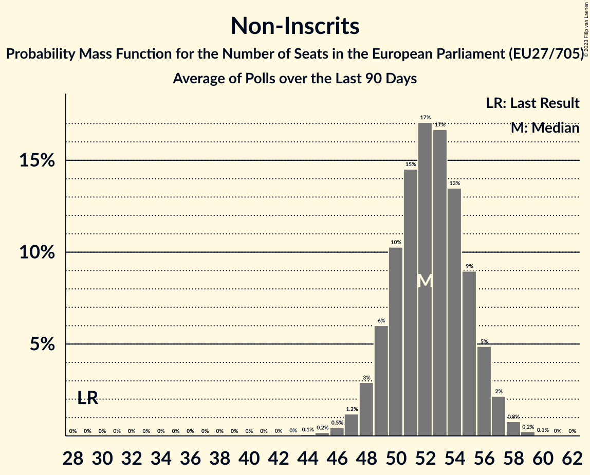

# Non-Inscrits

Members registered from **16 countries**:

> BG, CY, DE, DK, ES, FI, FR, GR, HR, HU, IT, LT, LV, PL, SI, SK

## Seats

Last result: **29** seats (General Election of 26 May 2019)

Current median: **51** seats (+22 seats)

At least one member in **13 countries** have a median of 1 seat or more:

> BG, CY, DE, DK, ES, FR, GR, HU, IT, LT, LV, PL, SK

### Confidence Intervals

| Party | Area | Last Result | Median | 80% Confidence Interval | 90% Confidence Interval | 95% Confidence Interval | 99% Confidence Interval |
|:-----:|:----:|:-----------:|:------:|:-----------------------:|:-----------------------:|:-----------------------:|:-----------------------:|
| Non-Inscrits | EU | 29 | 51 | 48–54 | 48–55 | 47–56 | 45–57 |
| Movimento 5 Stelle | IT | | 14 | 12–15 | 12–16 | 11–16 | 11–17 |
| Fidesz–Kereszténydemokrata Néppárt | HU | | 12 | 11–13 | 11–13 | 10–13 | 10–14 |
| Konfederacja | PL | | 6 | 5–7 | 5–8 | 4–8 | 4–9 |
| Reconquête | FR | | 5 | 4–6 | 4–6 | 4–6 | 0–7 |
| Възраждане | BG | | 3 | 2–3 | 2–3 | 2–3 | 2–3 |
| Die PARTEI | DE | | 2 | 1–2 | 1–2 | 1–2 | 1–3 |
| Κομμουνιστικό Κόμμα Ελλάδας | GR | | 2 | 2 | 2 | 2 | 2 |
| Danmarksdemokraterne | DK | | 1 | 1–2 | 1–2 | 1–2 | 1–2 |
| Darbo Partija | LT | | 1 | 1 | 1 | 0–1 | 0–1 |
| Jobbik | HU | | 1 | 1 | 1 | 1 | 0–2 |
| Latvija pirmajā vietā | LV | | 1 | 1 | 1 | 1 | 1 |
| Mi Hazánk Mozgalom | HU | | 1 | 1–2 | 1–2 | 1–2 | 1–2 |
| Partit Demòcrata Europeu Català | ES | | 1 | 0–1 | 0–1 | 0–1 | 0–2 |
| REPUBLIKA | SK | | 1 | 1–2 | 1–2 | 1–2 | 1–2 |
| Εθνικό Λαϊκό Μέτωπο | CY | | 1 | 1 | 1 | 1 | 1 |
| Democrazia Sovrana e Popolare | IT | | 0 | 0 | 0 | 0 | 0 |
| España Vaciada | ES | | 0 | 0 | 0 | 0 | 0–1 |
| Ključ Hrvatske | HR | | 0 | 0 | 0 | 0 | 0 |
| Kotleba–Ľudová strana Naše Slovensko | SK | | 0 | 0 | 0 | 0 | 0 |
| Kukiz’15 | PL | | 0 | 0 | 0 | 0 | 0 |
| Latvijas Krievu savienība | LV | | 0 | 0 | 0 | 0 | 0 |
| Liike Nyt | FI | | 0 | 0 | 0 | 0 | 0 |
| Magyar Kétfarkú Kutya Párt | HU | | 0 | 0 | 0–1 | 0–1 | 0–1 |
| Nye Borgerlige | DK | | 0 | 0 | 0 | 0 | 0 |
| Slovenska nacionalna stranka | SI | | 0 | 0 | 0 | 0 | 0 |
| Български възход | BG | | 0 | 0 | 0 | 0 | 0–1 |
| Има такъв народ | BG | | 0 | 0–1 | 0–1 | 0–1 | 0–1 |

### Probability Mass Function

The following table shows the probability mass function per seat for the [poll average](average-2023-06-30.html) for Non-Inscrits.

| Number of Seats | Probability | Accumulated | Special Marks |
|:---------------:|:-----------:|:-----------:|:-------------:|
| 29 | 0% | 100% | Last Result |
| 30 | 0% | 100% |  |
| 31 | 0% | 100% |  |
| 32 | 0% | 100% |  |
| 33 | 0% | 100% |  |
| 34 | 0% | 100% |  |
| 35 | 0% | 100% |  |
| 36 | 0% | 100% |  |
| 37 | 0% | 100% |  |
| 38 | 0% | 100% |  |
| 39 | 0% | 100% |  |
| 40 | 0% | 100% |  |
| 41 | 0% | 100% |  |
| 42 | 0% | 100% |  |
| 43 | 0.1% | 99.9% |  |
| 44 | 0.2% | 99.8% |  |
| 45 | 0.5% | 99.6% |  |
| 46 | 1.2% | 99.1% |  |
| 47 | 3% | 98% |  |
| 48 | 6% | 95% |  |
| 49 | 10% | 89% |  |
| 50 | 14% | 80% |  |
| 51 | 17% | 65% | Median |
| 52 | 17% | 48% |  |
| 53 | 14% | 32% |  |
| 54 | 9% | 18% |  |
| 55 | 5% | 8% |  |
| 56 | 2% | 3% |  |
| 57 | 0.8% | 1.2% |  |
| 58 | 0.3% | 0.3% |  |
| 59 | 0.1% | 0.1% |  |
| 60 | 0% | 0% |  |

