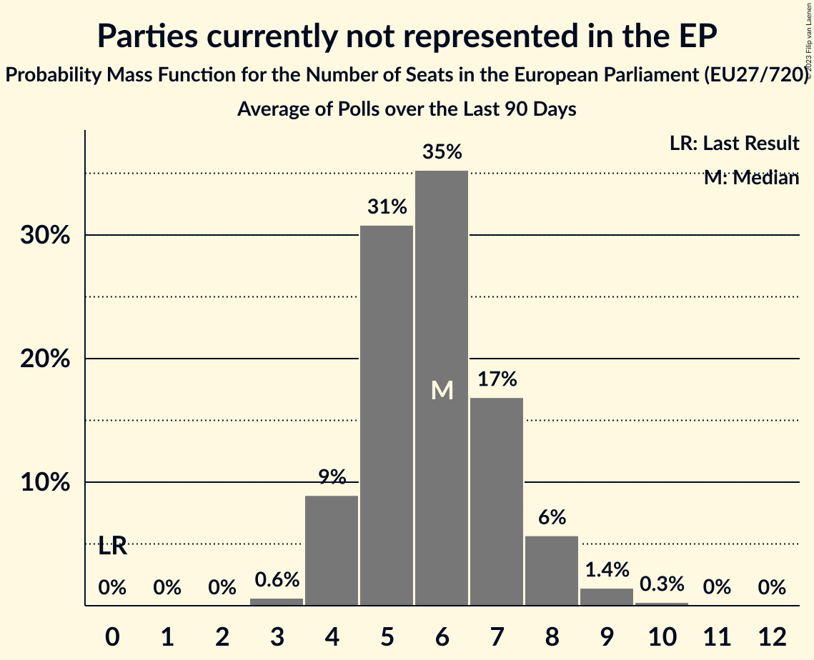

# Parties currently not represented in the EP

Members registered from **18 countries**:

> BE, BG, CZ, DE, DK, EE, ES, FR, HR, HU, IE, IT, LU, LV, NL, PL, RO, SI

## Seats

Last result: **0** seats (General Election of 26 May 2019)

Current median: **2** seats (+2 seats)

At least one member in **2 countries** have a median of 1 seat or more:

> IE, LV

### Confidence Intervals

| Party | Area | Last Result | Median | 80% Confidence Interval | 90% Confidence Interval | 95% Confidence Interval | 99% Confidence Interval |
|:-----:|:----:|:-----------:|:------:|:-----------------------:|:-----------------------:|:-----------------------:|:-----------------------:|
| Parties currently not represented in the EP | EU | 0 | 2 | 1–4 | 1–4 | 1–5 | 1–6 |
| Independents [IE] (*) | IE | | 1 | 0–1 | 0–1 | 0–1 | 0–1 |
| Stabilitātei! [LV] (*) | LV | | 1 | 1 | 1 | 1 | 1 |
| Aontú [IE] (*) | IE | | 0 | 0 | 0 | 0 | 0 |
| Basisdemokratische Partei Deutschland [DE] (*) | DE | | 0 | 0–1 | 0–1 | 0–1 | 0–1 |
| Belang van Nederland [NL] (*) | NL | | 0 | 0 | 0 | 0 | 0 |
| Bezpartyjni Samorządowcy [PL] (*) | PL | | 0 | 0 | 0 | 0 | 0 |
| Bij1 [NL] (*) | NL | | 0 | 0 | 0 | 0 | 0 |
| DENK [NL] (*) | NL | | 0 | 0–1 | 0–1 | 0–1 | 0–1 |
| DéFI [BE-FRC] (*) | BE-FRC | | 0 | 0 | 0 | 0 | 0 |
| Erakond Parempoolsed [EE] (*) | EE | | 0 | 0 | 0 | 0 | 0 |
| Frie Grønne [DK] (*) | DK | | 0 | 0 | 0 | 0 | 0 |
| Hrvatska stranka umirovljenika [HR] (*) | HR | | 0 | 0 | 0 | 0 | 0 |
| Italexit–Per l’Italia con Paragone [IT] (*) | IT | | 0 | 0 | 0 | 0 | 0 |
| Kommunistesch Partei Lëtzebuerg [LU] (*) | LU | | 0 | 0 | 0 | 0 | 0 |
| Likums un kārtība [LV] (*) | LV | | 0 | 0 | 0 | 0 | 0 |
| Lutte Ouvrière [FR] (*) | FR | | 0 | 0 | 0 | 0 | 0 |
| Mindenki Magyarországa Mozgalom [HU] (*) | HU | | 0 | 0–1 | 0–1 | 0–1 | 0–1 |
| Naša dežela [SI] (*) | SI | | 0 | 0 | 0 | 0 | 0 |
| Nép Pártján [HU] (*) | HU | | 0 | 0–1 | 0–1 | 0–1 | 0–1 |
| Odlučnost i Pravednost [HR] (*) | HR | | 0 | 0 | 0 | 0 | 0 |
| Partidul S.O.S. România [RO] (*) | RO | | 0 | 0 | 0–2 | 0–2 | 0–2 |
| Polska Jest Jedna [PL] (*) | PL | | 0 | 0 | 0 | 0 | 0 |
| Právo Respekt Odbornost [CZ] (*) | CZ | | 0 | 0 | 0 | 0 | 0 |
| Přísaha [CZ] (*) | CZ | | 0 | 0 | 0 | 0 | 0 |
| Resni.ca [SI] (*) | SI | | 0 | 0 | 0 | 0 | 0 |
| Suverēnā vara [LV] (*) | LV | | 0 | 0 | 0 | 0 | 0 |
| Unión del Pueblo Navarro [ES] (*) | ES | | 0 | 0 | 0 | 0 | 0 |
| Левицата! [BG] (*) | BG | | 0 | 0 | 0 | 0 | 0 |

### Probability Mass Function

The following table shows the probability mass function per seat for the [poll average](average-2023-10-31.html) for Parties currently not represented in the EP.

| Number of Seats | Probability | Accumulated | Special Marks |
|:---------------:|:-----------:|:-----------:|:-------------:|
| 0 | 0% | 100% | Last Result |
| 1 | 22% | 100% |  |
| 2 | 38% | 78% | Median |
| 3 | 24% | 39% |  |
| 4 | 11% | 16% |  |
| 5 | 4% | 5% |  |
| 6 | 0.9% | 1.2% |  |
| 7 | 0.2% | 0.3% |  |
| 8 | 0.1% | 0.1% |  |
| 9 | 0% | 0% |  |

