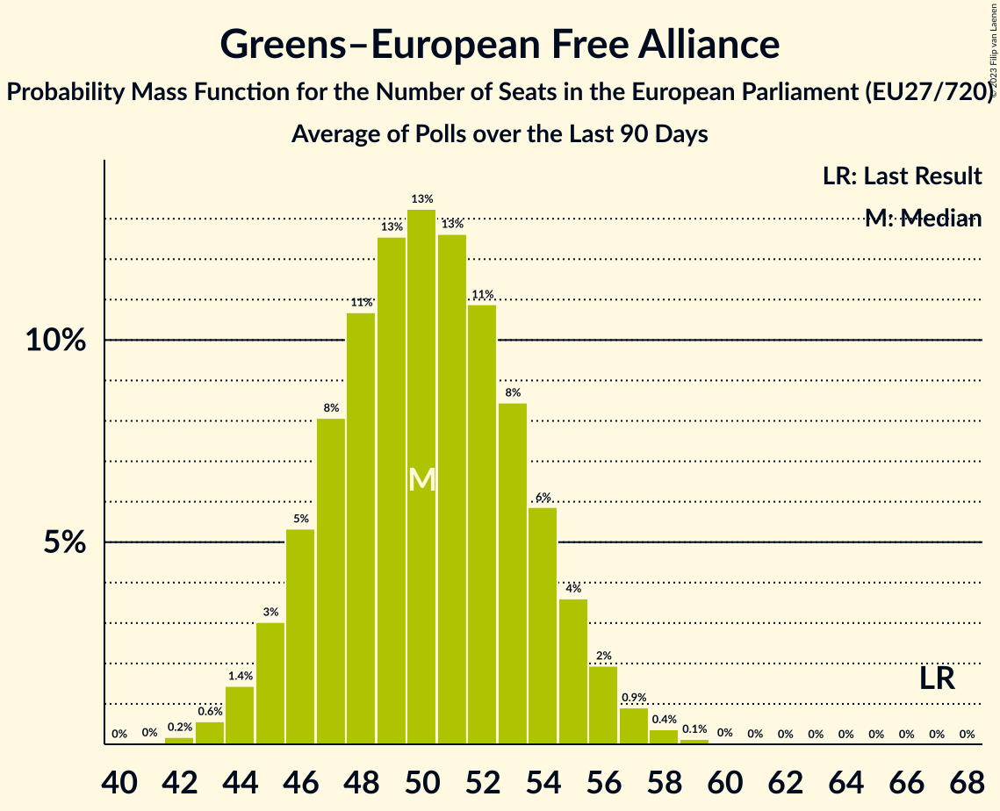

# Greens–European Free Alliance

Members registered from **22 countries**:

> AT, BE, CY, CZ, DE, DK, EE, ES, FI, FR, HR, HU, IE, IT, LT, LU, LV, MT, NL, PT, SE, SI

## Seats

Last result: **67** seats (General Election of 26 May 2019)

Current median: **50** seats (-17 seats)

At least one member in **15 countries** have a median of 1 seat or more:

> AT, BE, CZ, DE, DK, ES, FI, FR, HR, HU, IT, LT, LV, NL, SE

### Confidence Intervals

| Party | Area | Last Result | Median | 80% Confidence Interval | 90% Confidence Interval | 95% Confidence Interval | 99% Confidence Interval |
|:-----:|:----:|:-----------:|:------:|:-----------------------:|:-----------------------:|:-----------------------:|:-----------------------:|
| Greens–European Free Alliance | EU | 67 | 50 | 46–54 | 45–55 | 45–56 | 43–58 |
| Bündnis 90/Die Grünen | DE | | 13 | 11–15 | 11–16 | 11–16 | 11–17 |
| Europe Écologie Les Verts | FR | | 8 | 7–8 | 7–9 | 6–9 | 6–9 |
| Catalunya en Comú–Més–Compromís–Más País–Chunta | ES | | 3 | 2–3 | 2–4 | 2–4 | 2–4 |
| Die Grünen–Die Grüne Alternative | AT | | 3 | 2–3 | 2–3 | 2–3 | 2–4 |
| GroenLinks | NL | | 3 | 3–4 | 2–4 | 2–4 | 2–4 |
| Socialistisk Folkeparti | DK | | 3 | 2–3 | 2–3 | 2–3 | 2–3 |
| Česká pirátská strana | CZ | | 3 | 2–3 | 2–3 | 2–3 | 2–4 |
| Europa Verde | IT | | 2 | 1–3 | 1–3 | 1–3 | 1–3 |
| PROGRESĪVIE | LV | | 2 | 1–2 | 1–2 | 1–2 | 1–2 |
| Demokratų sąjunga „Vardan Lietuvos“ | LT | | 1 | 1–2 | 1–2 | 1–2 | 1–2 |
| Ecolo | BE-FRC | | 1 | 1 | 1 | 1 | 1–2 |
| Esquerra Republicana de Catalunya–Catalunya Sí | ES | | 1 | 0–1 | 0–1 | 0–1 | 0–2 |
| Groen | BE-VLG | | 1 | 0–1 | 0–1 | 0–1 | 0–1 |
| Lietuvos valstiečių ir žaliųjų sąjunga | LT | | 1 | 1–2 | 1–2 | 1–2 | 1–2 |
| Magyar Kétfarkú Kutya Párt | HU | | 1 | 1–2 | 1–2 | 1–2 | 0–2 |
| Miljöpartiet de gröna | SE | | 1 | 0–1 | 0–1 | 0–1 | 0–1 |
| Možemo! | HR | | 1 | 1–2 | 1–2 | 1–2 | 1–2 |
| Vihreä liitto | FI | | 1 | 1 | 1–2 | 1–2 | 1–2 |
| Volt Europa | DE | | 1 | 0–1 | 0–1 | 0–1 | 0–1 |
| Ökologisch-Demokratische Partei | DE | | 1 | 0–1 | 0–1 | 0–1 | 0–1 |
| Alternativet | DK | | 0 | 0 | 0 | 0 | 0 |
| Alternattiva Demokratika–Partit Demokratiku | MT | | 0 | 0 | 0 | 0 | 0 |
| Bloque Nacionalista Galego–Nós Candidatura Galega | ES | | 0 | 0 | 0 | 0 | 0–1 |
| Erakond Eestimaa Rohelised | EE | | 0 | 0 | 0 | 0 | 0 |
| Green Party | IE | | 0 | 0 | 0 | 0 | 0 |
| LIVRE | PT | | 0 | 0 | 0 | 0–1 | 0–1 |
| Lehet Más a Politika | HU | | 0 | 0 | 0–1 | 0–1 | 0–1 |
| Pessoas–Animais–Natureza | PT | | 0 | 0–1 | 0–1 | 0–1 | 0–1 |
| Piratenpartei Deutschland | DE | | 0 | 0 | 0–1 | 0–1 | 0–1 |
| Piratepartei Lëtzebuerg | LU | | 0 | 0 | 0 | 0 | 0 |
| Piratska stranka Slovenije | SI | | 0 | 0 | 0 | 0 | 0 |
| Párbeszéd | HU | | 0 | 0 | 0 | 0 | 0–1 |
| Strana zelených | CZ | | 0 | 0 | 0 | 0 | 0 |
| VESNA–Zelena stranka | SI | | 0 | 0 | 0 | 0 | 0 |
| Volt Europa | NL | | 0 | 0 | 0–1 | 0–1 | 0–1 |
| déi gréng | LU | | 0 | 0 | 0 | 0 | 0 |
| Κίνημα Οικολόγων—Συνεργασία Πολιτών | CY | | 0 | 0 | 0 | 0 | 0–1 |

### Probability Mass Function

The following table shows the probability mass function per seat for the [poll average](average-2023-11-30.html) for Greens–European Free Alliance.

| Number of Seats | Probability | Accumulated | Special Marks |
|:---------------:|:-----------:|:-----------:|:-------------:|
| 41 | 0% | 100% |  |
| 42 | 0.2% | 99.9% |  |
| 43 | 0.6% | 99.8% |  |
| 44 | 1.4% | 99.2% |  |
| 45 | 3% | 98% |  |
| 46 | 5% | 95% |  |
| 47 | 8% | 89% |  |
| 48 | 11% | 81% |  |
| 49 | 13% | 71% |  |
| 50 | 13% | 58% | Median |
| 51 | 13% | 45% |  |
| 52 | 11% | 32% |  |
| 53 | 8% | 21% |  |
| 54 | 6% | 13% |  |
| 55 | 4% | 7% |  |
| 56 | 2% | 3% |  |
| 57 | 0.9% | 1.5% |  |
| 58 | 0.4% | 0.6% |  |
| 59 | 0.1% | 0.2% |  |
| 60 | 0% | 0.1% |  |
| 61 | 0% | 0% |  |
| 62 | 0% | 0% |  |
| 63 | 0% | 0% |  |
| 64 | 0% | 0% |  |
| 65 | 0% | 0% |  |
| 66 | 0% | 0% |  |
| 67 | 0% | 0% | Last Result |

