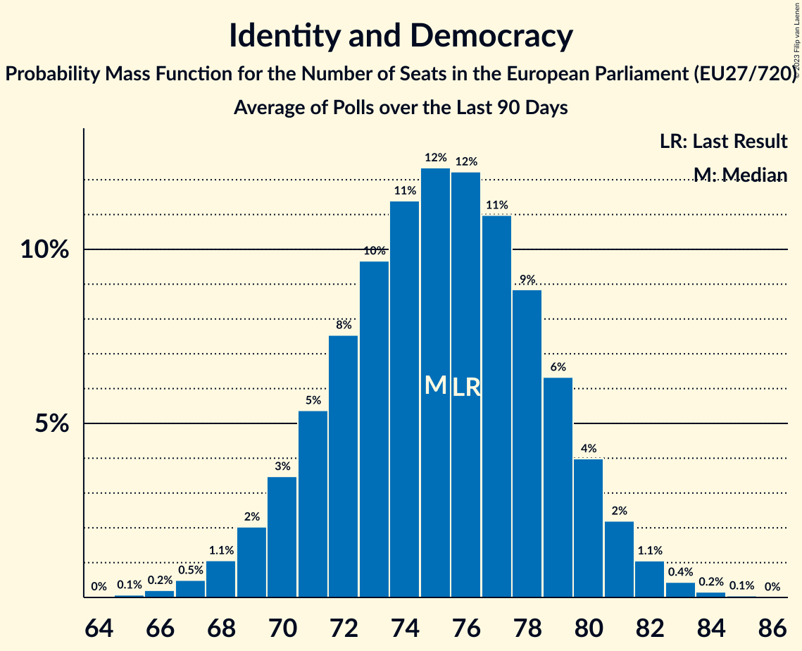

# Identity and Democracy

Members registered from **12 countries**:

> AT, BE, BG, CZ, DE, DK, EE, FR, IT, NL, PT, SK

## Seats

Last result: **76** seats (General Election of 26 May 2019)

Current median: **85** seats (+9 seats)

At least one member in **10 countries** have a median of 1 seat or more:

> AT, BE, BG, CZ, DE, EE, FR, IT, NL, PT

### Confidence Intervals

| Party | Area | Last Result | Median | 80% Confidence Interval | 90% Confidence Interval | 95% Confidence Interval | 99% Confidence Interval |
|:-----:|:----:|:-----------:|:------:|:-----------------------:|:-----------------------:|:-----------------------:|:-----------------------:|
| Identity and Democracy | EU | 76 | 85 | 82–89 | 81–90 | 80–91 | 79–92 |
| Rassemblement national | FR | | 27 | 25–28 | 25–28 | 24–29 | 24–30 |
| Alternative für Deutschland | DE | | 20 | 18–22 | 18–22 | 17–22 | 17–23 |
| Partij voor de Vrijheid | NL | | 10 | 10 | 10 | 10 | 10 |
| Lega Nord | IT | | 8 | 6–9 | 6–10 | 6–10 | 5–11 |
| Freiheitliche Partei Österreichs | AT | | 6 | 6–7 | 6–7 | 6–8 | 5–8 |
| Chega | PT | | 4 | 3–5 | 3–5 | 3–5 | 2–5 |
| Vlaams Belang | BE-VLG | | 4 | 3–4 | 3–4 | 3–4 | 3–4 |
| Svoboda a přímá demokracie | CZ | | 3 | 2–3 | 2–3 | 2–3 | 2–3 |
| Възраждане | BG | | 3 | 3–4 | 3–4 | 3–4 | 3–4 |
| Eesti Konservatiivne Rahvaerakond | EE | | 2 | 1–2 | 1–2 | 1–2 | 1–2 |
| Dansk Folkeparti | DK | | 0 | 0 | 0 | 0 | 0 |
| SME RODINA | SK | | 0 | 0 | 0 | 0 | 0 |

### Probability Mass Function

The following table shows the probability mass function per seat for the [poll average](average-2023-11-30.html) for Identity and Democracy.

| Number of Seats | Probability | Accumulated | Special Marks |
|:---------------:|:-----------:|:-----------:|:-------------:|
| 76 | 0% | 100% | Last Result |
| 77 | 0.1% | 100% |  |
| 78 | 0.2% | 99.9% |  |
| 79 | 0.7% | 99.7% |  |
| 80 | 2% | 99.0% |  |
| 81 | 4% | 97% |  |
| 82 | 6% | 94% |  |
| 83 | 10% | 87% |  |
| 84 | 13% | 77% |  |
| 85 | 15% | 65% | Median |
| 86 | 15% | 50% |  |
| 87 | 13% | 35% |  |
| 88 | 10% | 22% |  |
| 89 | 6% | 13% |  |
| 90 | 4% | 6% |  |
| 91 | 2% | 3% |  |
| 92 | 0.7% | 1.0% |  |
| 93 | 0.2% | 0.3% |  |
| 94 | 0.1% | 0.1% |  |
| 95 | 0% | 0% |  |

