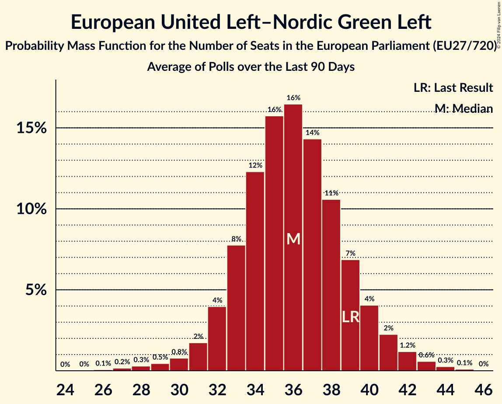

# European United Left–Nordic Green Left

Members registered from **18 countries**:

> AT, BE, CY, CZ, DE, DK, ES, FI, FR, GR, HR, IE, IT, LU, NL, PT, SE, SI

## Seats

Last result: **39** seats (General Election of 26 May 2019)

Current median: **35** seats (-4 seats)

At least one member in **11 countries** have a median of 1 seat or more:

> BE, CY, DE, DK, ES, FI, FR, GR, IE, PT, SE

### Confidence Intervals

| Party | Area | Last Result | Median | 80% Confidence Interval | 90% Confidence Interval | 95% Confidence Interval | 99% Confidence Interval |
|:-----:|:----:|:-----------:|:------:|:-----------------------:|:-----------------------:|:-----------------------:|:-----------------------:|
| European United Left–Nordic Green Left | EU | 39 | 35 | 32–38 | 32–40 | 31–41 | 28–42 |
| La France insoumise | FR | | 6 | 5–7 | 5–7 | 4–7 | 0–8 |
| Sinn Féin | IE | | 5 | 5–6 | 5–6 | 5–7 | 4–7 |
| Die Linke | DE | | 3 | 3–4 | 2–5 | 2–5 | 2–5 |
| Movimiento Sumar–Podemos–Izquierda Unida | ES | | 3 | 3–4 | 2–4 | 2–5 | 2–5 |
| Συνασπισμός Ριζοσπαστικής Αριστεράς | GR | | 3 | 2–4 | 2–4 | 2–4 | 2–4 |
| Parti du Travail de Belgique | BE-FRC | | 2 | 1–2 | 1–2 | 1–2 | 1–2 |
| Vänsterpartiet | SE | | 2 | 2 | 2 | 2 | 1–3 |
| Ανορθωτικό Κόμμα Εργαζόμενου Λαού | CY | | 2 | 2 | 2 | 2 | 1–2 |
| Bloco de Esquerda | PT | | 1 | 1–2 | 1–2 | 1–2 | 1–2 |
| Enhedslisten–De Rød-Grønne | DK | | 1 | 1 | 1 | 1 | 1–2 |
| Partei Mensch Umwelt Tierschutz | DE | | 1 | 1–2 | 1–2 | 0–2 | 0–2 |
| Partij van de Arbeid van België | BE-VLG | | 1 | 1 | 1 | 1 | 1–2 |
| Vasemmistoliitto | FI | | 1 | 1–2 | 1–2 | 1–2 | 1–2 |
| Νέα Αριστερά | GR | | 1 | 0–1 | 0–1 | 0–1 | 0–1 |
| Coligação Democrática Unitária | PT | | 0 | 0 | 0–1 | 0–1 | 0–1 |
| Euskal Herria Bildu | ES | | 0 | 0–1 | 0–1 | 0–1 | 0–1 |
| Independents 4 Change | IE | | 0 | 0 | 0 | 0 | 0 |
| Kommunistische Partei Österreichs | AT | | 0 | 0 | 0 | 0 | 0–1 |
| Komunistická strana Čech a Moravy | CZ | | 0 | 0 | 0 | 0 | 0 |
| Levica | SI | | 0 | 0–1 | 0–1 | 0–1 | 0–1 |
| Parti communiste français | FR | | 0 | 0 | 0–4 | 0–5 | 0–5 |
| Partij voor de Dieren | NL | | 0 | 0–1 | 0–1 | 0–1 | 0–1 |
| Radnička fronta | HR | | 0 | 0 | 0 | 0 | 0 |
| Sinistra Italiana | IT | | 0 | 0–2 | 0–2 | 0–2 | 0–2 |
| Socialistische Partij | NL | | 0 | 0–1 | 0–1 | 0–1 | 0–1 |
| Solidarity–People Before Profit | IE | | 0 | 0 | 0 | 0 | 0 |
| Unione Popolare | IT | | 0 | 0 | 0 | 0 | 0 |
| déi Lénk | LU | | 0 | 0 | 0 | 0 | 0 |
| Μέτωπο Ευρωπαϊκής Ρεαλιστικής Ανυπακοής | GR | | 0 | 0 | 0 | 0–1 | 0–1 |

### Probability Mass Function

The following table shows the probability mass function per seat for the [poll average](average-2024-01-15.html) for European United Left–Nordic Green Left.

| Number of Seats | Probability | Accumulated | Special Marks |
|:---------------:|:-----------:|:-----------:|:-------------:|
| 26 | 0.1% | 100% |  |
| 27 | 0.2% | 99.9% |  |
| 28 | 0.4% | 99.6% |  |
| 29 | 0.5% | 99.2% |  |
| 30 | 1.0% | 98.7% |  |
| 31 | 2% | 98% |  |
| 32 | 5% | 95% |  |
| 33 | 10% | 90% |  |
| 34 | 15% | 80% |  |
| 35 | 18% | 64% | Median |
| 36 | 16% | 47% |  |
| 37 | 12% | 30% |  |
| 38 | 8% | 18% |  |
| 39 | 5% | 10% | Last Result |
| 40 | 3% | 5% |  |
| 41 | 1.4% | 3% |  |
| 42 | 0.7% | 1.1% |  |
| 43 | 0.3% | 0.5% |  |
| 44 | 0.1% | 0.2% |  |
| 45 | 0% | 0% |  |

