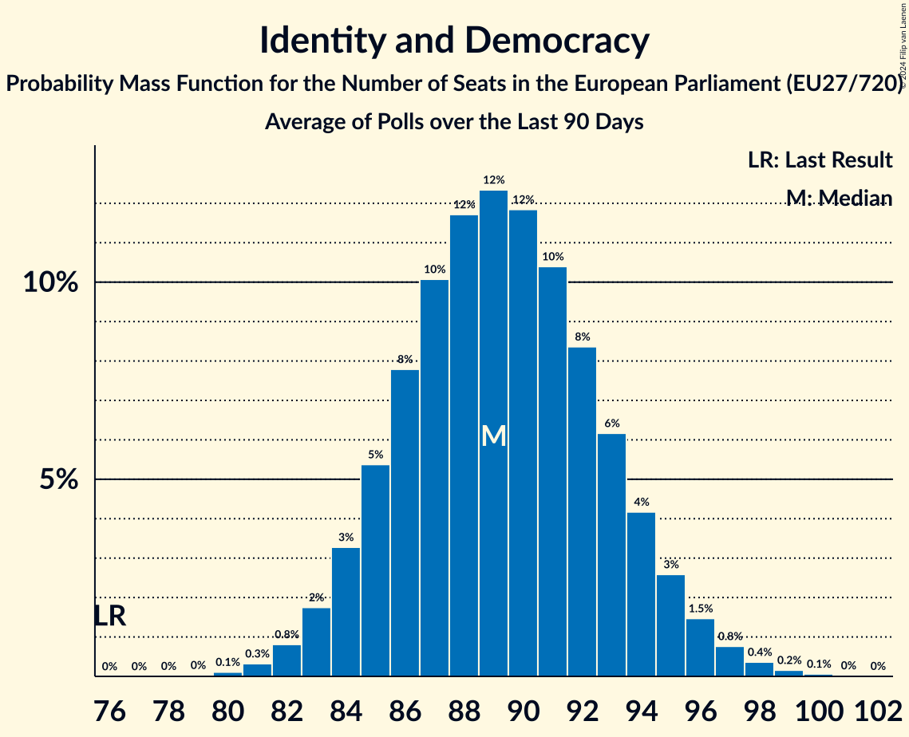

# Identity and Democracy

Members registered from **14 countries**:

> AT, BE, BG, CZ, DE, DK, EE, FR, IT, NL, PL, PT, RO, SK

## Seats

Last result: **76** seats (General Election of 26 May 2019)

Current median: **91** seats (+15 seats)

At least one member in **12 countries** have a median of 1 seat or more:

> AT, BE, BG, CZ, DE, EE, FR, IT, NL, PL, PT, RO

### Confidence Intervals

| Party | Area | Last Result | Median | 80% Confidence Interval | 90% Confidence Interval | 95% Confidence Interval | 99% Confidence Interval |
|:-----:|:----:|:-----------:|:------:|:-----------------------:|:-----------------------:|:-----------------------:|:-----------------------:|
| Identity and Democracy | EU | 76 | 91 | 86–95 | 84–97 | 83–98 | 80–100 |
| Rassemblement national | FR | | 26 | 24–29 | 24–30 | 23–31 | 22–32 |
| Alternative für Deutschland | DE | | 21 | 18–23 | 15–24 | 15–25 | 15–25 |
| Partij voor de Vrijheid | NL | | 12 | 11–13 | 11–13 | 10–13 | 10–13 |
| Lega Nord | IT | | 8 | 7–10 | 7–10 | 6–11 | 6–11 |
| Freiheitliche Partei Österreichs | AT | | 6 | 6–7 | 6–7 | 6–7 | 6–7 |
| Chega | PT | | 4 | 3–4 | 3–4 | 3–4 | 2–5 |
| Vlaams Belang | BE-VLG | | 4 | 3–4 | 3–4 | 3–4 | 3–4 |
| Svoboda a přímá demokracie | CZ | | 3 | 2–4 | 2–4 | 2–4 | 2–4 |
| Възраждане | BG | | 3 | 2–3 | 2–4 | 2–4 | 2–4 |
| Eesti Konservatiivne Rahvaerakond | EE | | 2 | 1–2 | 1–2 | 1–2 | 1–2 |
| Partidul S.O.S. România | RO | | 2 | 0–2 | 0–2 | 0–2 | 0–2 |
| Konfederacja Korony Polskiej | PL | | 1 | 0–1 | 0–1 | 0–2 | 0–2 |
| Dansk Folkeparti | DK | | 0 | 0–1 | 0–1 | 0–1 | 0–1 |
| SME RODINA | SK | | 0 | 0 | 0 | 0 | 0 |
| Trikolóra hnutí občanů | CZ | | 0 | 0 | 0 | 0 | 0 |

### Probability Mass Function

The following table shows the probability mass function per seat for the [poll average](average-2024-01-31.html) for Identity and Democracy.

| Number of Seats | Probability | Accumulated | Special Marks |
|:---------------:|:-----------:|:-----------:|:-------------:|
| 76 | 0% | 100% | Last Result |
| 77 | 0% | 100% |  |
| 78 | 0.1% | 100% |  |
| 79 | 0.2% | 99.9% |  |
| 80 | 0.4% | 99.7% |  |
| 81 | 0.6% | 99.3% |  |
| 82 | 1.0% | 98.7% |  |
| 83 | 2% | 98% |  |
| 84 | 2% | 96% |  |
| 85 | 3% | 94% |  |
| 86 | 5% | 91% |  |
| 87 | 6% | 86% |  |
| 88 | 8% | 80% |  |
| 89 | 9% | 72% |  |
| 90 | 10% | 63% |  |
| 91 | 11% | 52% | Median |
| 92 | 10% | 42% |  |
| 93 | 9% | 31% |  |
| 94 | 7% | 22% |  |
| 95 | 6% | 15% |  |
| 96 | 4% | 9% |  |
| 97 | 2% | 5% |  |
| 98 | 1.5% | 3% |  |
| 99 | 0.8% | 2% |  |
| 100 | 0.4% | 0.7% |  |
| 101 | 0.2% | 0.3% |  |
| 102 | 0.1% | 0.1% |  |
| 103 | 0% | 0% |  |

