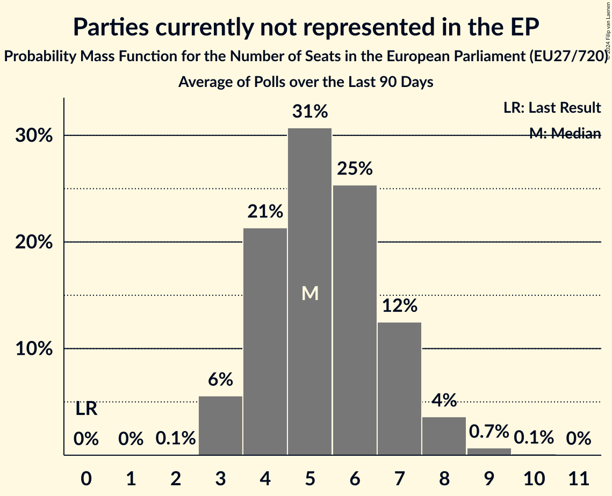

# Parties currently not represented in the EP

Members registered from **19 countries**:

> BE, BG, CY, CZ, DE, EE, ES, FR, GR, HR, HU, IE, IT, LU, LV, NL, PL, SI, SK

## Seats

Last result: **0** seats (General Election of 26 May 2019)

Current median: **7** seats (+7 seats)

At least one member in **6 countries** have a median of 1 seat or more:

> DE, GR, IE, LV, PL, SK

### Confidence Intervals

| Party | Area | Last Result | Median | 80% Confidence Interval | 90% Confidence Interval | 95% Confidence Interval | 99% Confidence Interval |
|:-----:|:----:|:-----------:|:------:|:-----------------------:|:-----------------------:|:-----------------------:|:-----------------------:|
| Parties currently not represented in the EP | EU | 0 | 7 | 4–9 | 4–11 | 4–11 | 3–13 |
| Bündnis Sahra Wagenknecht [DE] (*) | DE | | 4 | 4 | 4–5 | 4–5 | 3–5 |
| Independents [IE] (*) | IE | | 1 | 1 | 1 | 1–2 | 1–2 |
| Lewica Razem [PL] (*) | PL | | 1 | 1–2 | 1–2 | 1–2 | 0–2 |
| Slovenská národná strana [SK] (*) | SK | | 1 | 0–1 | 0–1 | 0–1 | 0–1 |
| Stabilitātei! [LV] (*) | LV | | 1 | 1 | 1 | 1 | 1 |
| Δημοκρατικό Πατριωτικό Κίνημα ΝΙΚΗ [GR] (*) | GR | | 1 | 0–1 | 0–1 | 0–1 | 0–1 |
| Σπαρτιάτες [GR] (*) | GR | | 1 | 0–1 | 0–1 | 0–1 | 0–1 |
| Aontú [IE] (*) | IE | | 0 | 0 | 0 | 0 | 0 |
| Basisdemokratische Partei Deutschland [DE] (*) | DE | | 0 | 0–1 | 0–1 | 0–1 | 0–1 |
| Bezpartyjni Samorządowcy [PL] (*) | PL | | 0 | 0 | 0 | 0 | 0 |
| Centrum dla Polski [PL] (*) | PL | | 0 | 0 | 0 | 0–1 | 0–1 |
| DENK [NL] (*) | NL | | 0 | 0 | 0–1 | 0–1 | 0–1 |
| DéFI [BE-FRC] (*) | BE-FRC | | 0 | 0 | 0 | 0 | 0 |
| Erakond Parempoolsed [EE] (*) | EE | | 0 | 0 | 0 | 0 | 0 |
| Fokus na bitno [HR] (*) | HR | | 0 | 0 | 0 | 0 | 0 |
| Hrvatska stranka umirovljenika [HR] (*) | HR | | 0 | 0 | 0 | 0 | 0 |
| Italexit–Per l’Italia con Paragone [IT] (*) | IT | | 0 | 0 | 0 | 0 | 0–3 |
| Kommunistesch Partei Lëtzebuerg [LU] (*) | LU | | 0 | 0 | 0 | 0 | 0 |
| Likums un kārtība [LV] (*) | LV | | 0 | 0 | 0 | 0 | 0 |
| Lutte Ouvrière [FR] (*) | FR | | 0 | 0 | 0 | 0 | 0 |
| Második Reformkor [HU] (*) | HU | | 0 | 0–1 | 0–1 | 0–1 | 0–1 |
| Naša dežela [SI] (*) | SI | | 0 | 0 | 0 | 0 | 0 |
| Nép Pártján [HU] (*) | HU | | 0 | 0 | 0 | 0–1 | 0–1 |
| Odlučnost i Pravednost [HR] (*) | HR | | 0 | 0 | 0 | 0 | 0 |
| Partito Progressista [IT] (*) | IT | | 0 | 0 | 0–1 | 0–1 | 0–1 |
| Polska Jest Jedna [PL] (*) | PL | | 0 | 0 | 0 | 0 | 0 |
| Právo Respekt Odbornost [CZ] (*) | CZ | | 0 | 0 | 0 | 0 | 0 |
| Přísaha [CZ] (*) | CZ | | 0 | 0 | 0 | 0 | 0 |
| Resni.ca [SI] (*) | SI | | 0 | 0 | 0 | 0 | 0 |
| Suverēnā vara [LV] (*) | LV | | 0 | 0 | 0 | 0 | 0 |
| Unión del Pueblo Navarro [ES] (*) | ES | | 0 | 0 | 0 | 0 | 0 |
| Ενεργοί Πολίτες–Κίνημα Ενωμένων Κυπρίων Κυνηγών [CY] (*) | CY | | 0 | 0 | 0 | 0 | 0 |
| Πλεύση Ελευθερίας [GR] (*) | GR | | 0 | 0–1 | 0–1 | 0–1 | 0–1 |
| Левицата! [BG] (*) | BG | | 0 | 0 | 0 | 0–1 | 0–1 |

### Probability Mass Function

The following table shows the probability mass function per seat for the [poll average](average-2024-01-31.html) for Parties currently not represented in the EP.

| Number of Seats | Probability | Accumulated | Special Marks |
|:---------------:|:-----------:|:-----------:|:-------------:|
| 0 | 0% | 100% | Last Result |
| 1 | 0% | 100% |  |
| 2 | 0.1% | 100% |  |
| 3 | 2% | 99.9% |  |
| 4 | 8% | 98% |  |
| 5 | 17% | 90% |  |
| 6 | 23% | 73% |  |
| 7 | 21% | 50% | Median |
| 8 | 13% | 29% |  |
| 9 | 7% | 16% |  |
| 10 | 4% | 10% |  |
| 11 | 3% | 5% |  |
| 12 | 2% | 2% |  |
| 13 | 0.5% | 0.7% |  |
| 14 | 0.1% | 0.2% |  |
| 15 | 0% | 0% |  |

