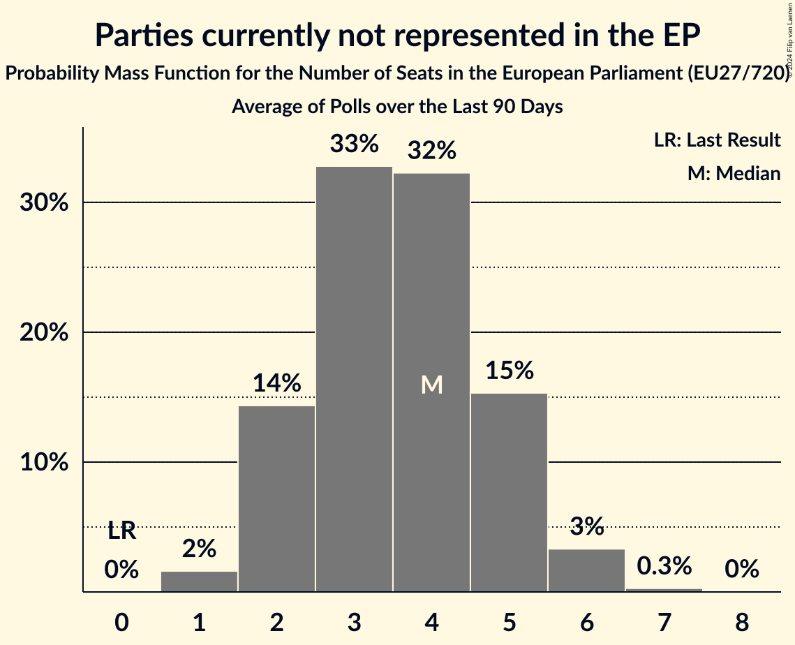

# Parties currently not represented in the EP

Members registered from **18 countries**:

> BE, BG, CZ, DE, EE, ES, FR, GR, HR, HU, IE, IT, LT, LU, LV, NL, PL, SI

## Seats

Last result: **0** seats (General Election of 26 May 2019)

Current median: **5** seats (+5 seats)

At least one member in **4 countries** have a median of 1 seat or more:

> DE, GR, IE, PL

### Confidence Intervals

| Party | Area | Last Result | Median | 80% Confidence Interval | 90% Confidence Interval | 95% Confidence Interval | 99% Confidence Interval |
|:-----:|:----:|:-----------:|:------:|:-----------------------:|:-----------------------:|:-----------------------:|:-----------------------:|
| Parties currently not represented in the EP | EU | 0 | 5 | 3–6 | 3–6 | 3–7 | 2–7 |
| Basisdemokratische Partei Deutschland [DE] (*) | DE | | 1 | 0–1 | 0–1 | 0–1 | 0–1 |
| Independents [IE] (*) | IE | | 1 | 1 | 1 | 1 | 1–2 |
| Lewica Razem [PL] (*) | PL | | 1 | 1 | 1 | 0–1 | 0–2 |
| Δημοκρατικό Πατριωτικό Κίνημα ΝΙΚΗ [GR] (*) | GR | | 1 | 0–1 | 0–1 | 0–1 | 0–1 |
| Alliance Rurale [FR] (*) | FR | | 0 | 0 | 0 | 0 | 0 |
| Aontú [IE] (*) | IE | | 0 | 0 | 0 | 0 | 0 |
| Bij1 [NL] (*) | NL | | 0 | 0 | 0 | 0 | 0 |
| Centrum dla Polski [PL] (*) | PL | | 0 | 0 | 0 | 0 | 0–1 |
| DENK [NL] (*) | NL | | 0 | 0 | 0 | 0 | 0 |
| DéFI [BE-FRC] (*) | BE-FRC | | 0 | 0 | 0 | 0 | 0 |
| Fokus na bitno [HR] (*) | HR | | 0 | 0 | 0 | 0 | 0 |
| Hrvatska stranka umirovljenika [HR] (*) | HR | | 0 | 0 | 0 | 0 | 0 |
| Italexit–Per l’Italia con Paragone [IT] (*) | IT | | 0 | 0 | 0 | 0 | 0 |
| Kommunistesch Partei Lëtzebuerg [LU] (*) | LU | | 0 | 0 | 0 | 0 | 0 |
| Koos [EE] (*) | EE | | 0 | 0 | 0 | 0 | 0 |
| Lutte Ouvrière [FR] (*) | FR | | 0 | 0 | 0 | 0 | 0 |
| Második Reformkor [HU] (*) | HU | | 0 | 0 | 0 | 0 | 0 |
| Nacionalinis Susivienijimas [LT] (*) | LT | | 0 | 0 | 0 | 0 | 0 |
| Naša dežela [SI] (*) | SI | | 0 | 0 | 0 | 0 | 0 |
| Nemuno aušra [LT] (*) | LT | | 0 | 0–1 | 0–1 | 0–1 | 0–1 |
| Nép Pártján [HU] (*) | HU | | 0 | 0 | 0 | 0 | 0–1 |
| Partito Progressista [IT] (*) | IT | | 0 | 0 | 0–1 | 0–1 | 0–1 |
| Právo Respekt Odbornost [CZ] (*) | CZ | | 0 | 0 | 0 | 0 | 0 |
| Přísaha [CZ] (*) | CZ | | 0 | 0 | 0 | 0 | 0 |
| Resni.ca [SI] (*) | SI | | 0 | 0 | 0 | 0 | 0 |
| Résistons! [FR] (*) | FR | | 0 | 0 | 0 | 0 | 0 |
| Suverēnā vara [LV] (*) | LV | | 0 | 0 | 0 | 0 | 0 |
| Union populaire républicaine [FR] (*) | FR | | 0 | 0 | 0 | 0 | 0 |
| Unión del Pueblo Navarro [ES] (*) | ES | | 0 | 0 | 0 | 0 | 0 |
| Πλεύση Ελευθερίας [GR] (*) | GR | | 0 | 0–1 | 0–1 | 0–1 | 0–1 |
| Σπαρτιάτες [GR] (*) | GR | | 0 | 0–1 | 0–1 | 0–1 | 0–1 |
| Левицата! [BG] (*) | BG | | 0 | 0 | 0 | 0 | 0 |

### Probability Mass Function

The following table shows the probability mass function per seat for the [poll average](average-2024-02-29.html) for Parties currently not represented in the EP.

| Number of Seats | Probability | Accumulated | Special Marks |
|:---------------:|:-----------:|:-----------:|:-------------:|
| 0 | 0% | 100% | Last Result |
| 1 | 0% | 100% |  |
| 2 | 2% | 100% |  |
| 3 | 15% | 98% |  |
| 4 | 32% | 83% |  |
| 5 | 32% | 51% | Median |
| 6 | 15% | 19% |  |
| 7 | 4% | 4% |  |
| 8 | 0.4% | 0.4% |  |
| 9 | 0% | 0.1% |  |
| 10 | 0% | 0% |  |

