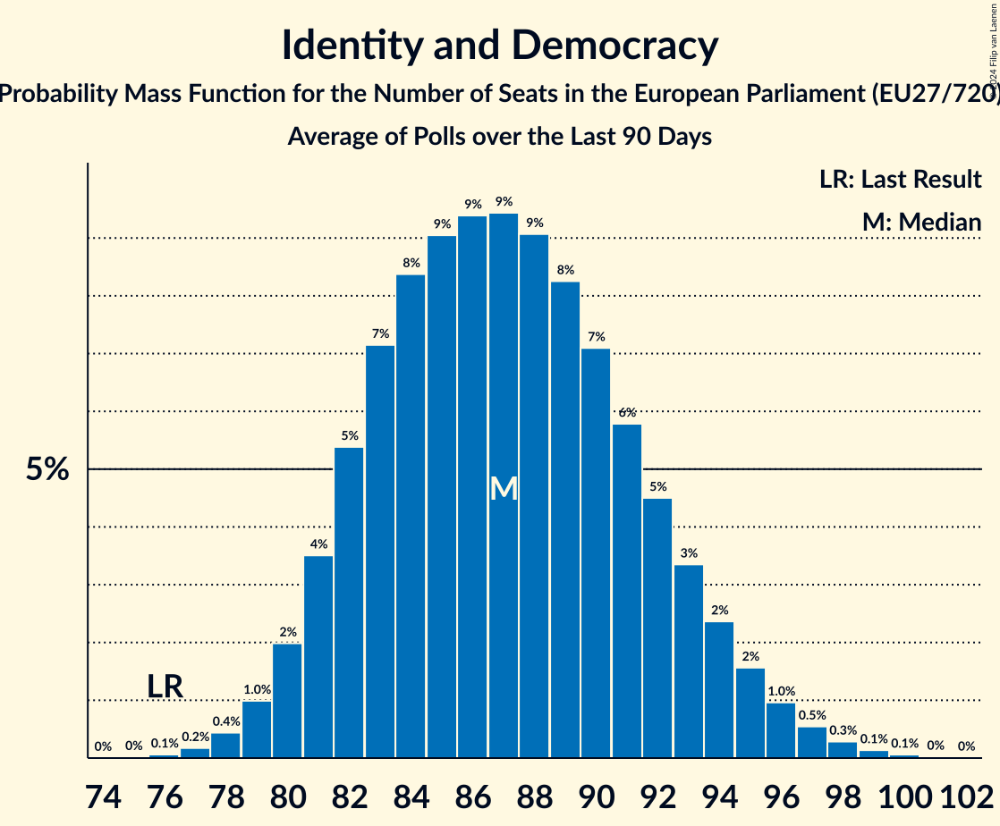

# Identity and Democracy

Members registered from **15 countries**:

> AT, BE, BG, CZ, DE, DK, EE, FR, HR, IT, NL, PL, PT, RO, SK

## Seats

Last result: **76** seats (General Election of 26 May 2019)

Current median: **87** seats (+11 seats)

At least one member in **13 countries** have a median of 1 seat or more:

> AT, BE, BG, CZ, DE, DK, EE, FR, HR, IT, NL, PL, PT

### Confidence Intervals

| Party | Area | Last Result | Median | 80% Confidence Interval | 90% Confidence Interval | 95% Confidence Interval | 99% Confidence Interval |
|:-----:|:----:|:-----------:|:------:|:-----------------------:|:-----------------------:|:-----------------------:|:-----------------------:|
| Identity and Democracy | EU | 76 | 87 | 82–92 | 81–94 | 80–95 | 78–98 |
| Rassemblement national | FR | | 28 | 27–32 | 25–33 | 25–33 | 24–35 |
| Alternative für Deutschland | DE | | 16 | 15–22 | 14–22 | 14–22 | 12–22 |
| Partij voor de Vrijheid | NL | | 9 | 9–10 | 9–10 | 9–10 | 8–11 |
| Lega Nord | IT | | 7 | 5–9 | 5–9 | 5–10 | 4–11 |
| Freiheitliche Partei Österreichs | AT | | 6 | 5–6 | 5–6 | 5–6 | 5–7 |
| Chega | PT | | 4 | 3–5 | 3–5 | 3–5 | 3–6 |
| Vlaams Belang | BE-VLG | | 4 | 4 | 3–4 | 3–4 | 3–5 |
| Svoboda a přímá demokracie | CZ | | 2 | 2–3 | 2–3 | 2–3 | 1–3 |
| Възраждане | BG | | 2 | 2–3 | 2–3 | 2–3 | 2–3 |
| Dansk Folkeparti | DK | | 1 | 1 | 1 | 1 | 0–1 |
| Domovinski pokret Miroslava Škore | HR | | 1 | 1 | 1 | 1–2 | 1–2 |
| Eesti Konservatiivne Rahvaerakond | EE | | 1 | 1–2 | 1–2 | 1–2 | 1–2 |
| Konfederacja Korony Polskiej | PL | | 1 | 0–1 | 0–1 | 0–1 | 0–1 |
| Partidul S.O.S. România | RO | | 0 | 0–2 | 0–2 | 0–3 | 0–3 |
| SME RODINA | SK | | 0 | 0 | 0 | 0 | 0–1 |
| Slovenská národná strana | SK | | 0 | 0–1 | 0–1 | 0–1 | 0–1 |
| Trikolóra hnutí občanů | CZ | | 0 | 0 | 0 | 0 | 0 |

### Probability Mass Function

The following table shows the probability mass function per seat for the [poll average](average-2024-03-15.html) for Identity and Democracy.

| Number of Seats | Probability | Accumulated | Special Marks |
|:---------------:|:-----------:|:-----------:|:-------------:|
| 75 | 0% | 100% |  |
| 76 | 0.1% | 99.9% | Last Result |
| 77 | 0.3% | 99.8% |  |
| 78 | 0.6% | 99.5% |  |
| 79 | 1.3% | 98.9% |  |
| 80 | 2% | 98% |  |
| 81 | 4% | 95% |  |
| 82 | 6% | 91% |  |
| 83 | 7% | 86% |  |
| 84 | 8% | 79% |  |
| 85 | 9% | 70% |  |
| 86 | 9% | 61% |  |
| 87 | 9% | 52% | Median |
| 88 | 9% | 43% |  |
| 89 | 8% | 34% |  |
| 90 | 7% | 26% |  |
| 91 | 6% | 19% |  |
| 92 | 4% | 14% |  |
| 93 | 3% | 9% |  |
| 94 | 2% | 6% |  |
| 95 | 2% | 4% |  |
| 96 | 1.0% | 2% |  |
| 97 | 0.6% | 1.2% |  |
| 98 | 0.3% | 0.6% |  |
| 99 | 0.2% | 0.3% |  |
| 100 | 0.1% | 0.1% |  |
| 101 | 0% | 0.1% |  |
| 102 | 0% | 0% |  |

