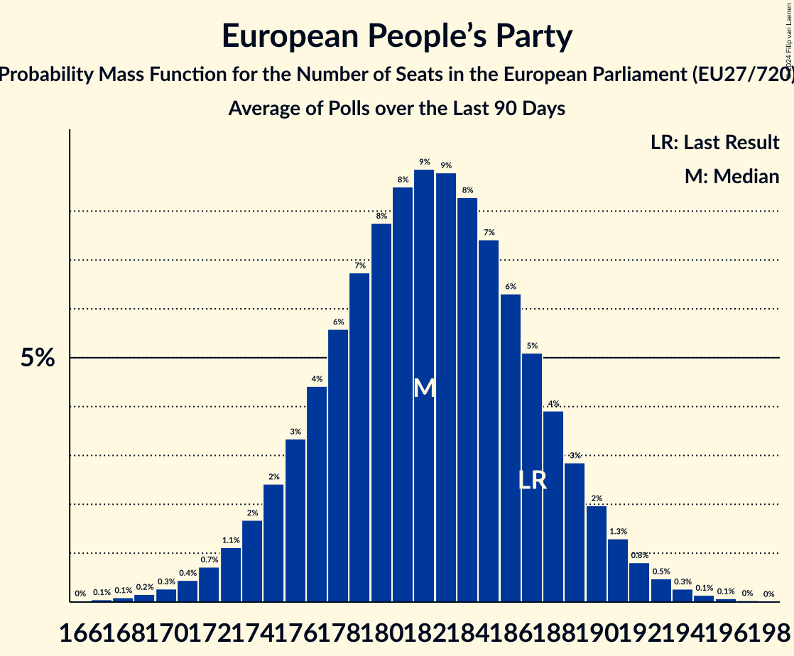

# European People’s Party

Members registered from **27 countries**:

> AT, BE, BG, CY, CZ, DE, DK, EE, ES, FI, FR, GR, HR, HU, IE, IT, LT, LU, LV, MT, NL, PL, PT, RO, SE, SI, SK

## Seats

Last result: **187** seats (General Election of 26 May 2019)

Current median: **182** seats (-5 seats)

At least one member in **27 countries** have a median of 1 seat or more:

> AT, BE, BG, CY, CZ, DE, DK, EE, ES, FI, FR, GR, HR, HU, IE, IT, LT, LU, LV, MT, NL, PL, PT, RO, SE, SI, SK

### Confidence Intervals

| Party | Area | Last Result | Median | 80% Confidence Interval | 90% Confidence Interval | 95% Confidence Interval | 99% Confidence Interval |
|:-----:|:----:|:-----------:|:------:|:-----------------------:|:-----------------------:|:-----------------------:|:-----------------------:|
| European People’s Party | EU | 187 | 182 | 177–187 | 175–189 | 174–190 | 172–192 |
| Partido Popular | ES | | 25 | 24–27 | 24–28 | 24–28 | 23–28 |
| Christlich Demokratische Union Deutschlands | DE | | 22 | 20–24 | 20–24 | 20–25 | 20–27 |
| Platforma Obywatelska | PL | | 17 | 16–18 | 16–18 | 16–18 | 15–18 |
| Aliança Democrática | PT | | 8 | 8 | 8 | 8 | 8 |
| Partidul Național Liberal | RO | | 8 | 7–10 | 7–10 | 7–11 | 6–11 |
| Christlich-Soziale Union in Bayern | DE | | 7 | 6–8 | 6–8 | 5–9 | 5–9 |
| Les Républicains | FR | | 7 | 6–8 | 5–8 | 5–8 | 5–9 |
| Νέα Δημοκρατία | GR | | 7 | 6–8 | 6–8 | 6–9 | 6–9 |
| Forza Italia | IT | | 6 | 4–7 | 4–7 | 4–8 | 3–9 |
| Hrvatska demokratska zajednica | HR | | 5 | 4–5 | 4–5 | 4–5 | 4–5 |
| Граждани за европейско развитие на България | BG | | 5 | 4–5 | 4–5 | 4–6 | 4–6 |
| Kansallinen Kokoomus | FI | | 4 | 4 | 4–5 | 3–5 | 3–5 |
| Moderata samlingspartiet | SE | | 4 | 3–5 | 3–5 | 3–5 | 3–5 |
| Slovenska demokratska stranka | SI | | 4 | 4 | 3–5 | 3–5 | 3–5 |
| Österreichische Volkspartei | AT | | 4 | 4–5 | 4–5 | 4–5 | 3–5 |
| Chrëschtlech-Sozial Vollekspartei | LU | | 3 | 3 | 3 | 3 | 3 |
| Fine Gael | IE | | 3 | 3–5 | 3–5 | 3–5 | 3–5 |
| Partit Nazzjonalista | MT | | 3 | 2–3 | 2–3 | 2–3 | 2–3 |
| Polskie Stronnictwo Ludowe | PL | | 3 | 3–4 | 3–4 | 3–4 | 3–5 |
| Starostové a nezávislí | CZ | | 3 | 2–3 | 2–3 | 2–4 | 1–4 |
| Tisztelet és Szabadság | HU | | 3 | 3 | 2–3 | 2–3 | 2–3 |
| Christen-Democratisch Appèl | NL | | 2 | 2 | 2 | 1–3 | 1–3 |
| Forța Dreptei–Partidul Mișcarea Populară | RO | | 2 | 1–2 | 1–3 | 1–3 | 1–3 |
| Jaunā VIENOTĪBA | LV | | 2 | 1–2 | 1–2 | 1–2 | 1–2 |
| Křesťanská a demokratická unie–Československá strana lidová | CZ | | 2 | 1–2 | 1–2 | 1–2 | 1–2 |
| Liberal Alliance | DK | | 2 | 1–2 | 1–2 | 1–2 | 1–3 |
| TOP 09 | CZ | | 2 | 1–2 | 1–2 | 1–2 | 1–2 |
| Δημοκρατικός Συναγερμός | CY | | 2 | 2 | 2 | 2 | 2 |
| BoerBurgerBeweging | NL | | 1 | 1–2 | 1–2 | 1–2 | 0–2 |
| Christen-Democratisch en Vlaams | BE-VLG | | 1 | 1–2 | 1–2 | 1–2 | 1–2 |
| Christlich-Soziale Partei | BE-DEG | | 1 | 1 | 1 | 1 | 1 |
| Det Konservative Folkeparti | DK | | 1 | 0–1 | 0–1 | 0–1 | 0–1 |
| Erakond Isamaa | EE | | 1 | 1–2 | 1–2 | 1–2 | 1–2 |
| Kereszténydemokrata Néppárt | HU | | 1 | 1 | 1 | 1–2 | 1–2 |
| Kresťanskodemokratické hnutie | SK | | 1 | 1–2 | 1–2 | 1–2 | 1–2 |
| Kristdemokraterna | SE | | 1 | 0–1 | 0–1 | 0–1 | 0–1 |
| Latvijas Reģionu Apvienība | LV | | 1 | 0–1 | 0–1 | 0–1 | 0–1 |
| Les Engagés | BE-FRC | | 1 | 1 | 1 | 0–1 | 0–1 |
| Nieuw Sociaal Contract | NL | | 1 | 1–2 | 0–2 | 0–2 | 0–2 |
| Nova Slovenija–Krščanski demokrati | SI | | 1 | 1 | 1 | 1 | 0–1 |
| Tėvynės sąjunga–Lietuvos krikščionys demokratai | LT | | 1 | 1–2 | 1–2 | 1–2 | 1–2 |
| Да, България! | BG | | 1 | 1 | 0–1 | 0–1 | 0–2 |
| ChristenUnie | NL | | 0 | 0 | 0–1 | 0–1 | 0–1 |
| Erakond Parempoolsed | EE | | 0 | 0 | 0 | 0 | 0 |
| Familienpartei Deutschlands | DE | | 0 | 0–1 | 0–1 | 0–1 | 0–1 |
| Jaunā konservatīvā partija | LV | | 0 | 0 | 0 | 0 | 0 |
| Kristillisdemokraatit | FI | | 0 | 0 | 0 | 0 | 0–1 |
| Mindenki Magyarországa Mozgalom | HU | | 0 | 0 | 0 | 0 | 0 |
| Noi Moderati | IT | | 0 | 0 | 0 | 0 | 0 |
| OBYČAJNÍ ĽUDIA a nezávislé osobnosti–Kresťanská únia–Za ľudí | SK | | 0 | 0–1 | 0–1 | 0–1 | 0–1 |
| SPOLU–Občianska Demokracia | SK | | 0 | 0 | 0 | 0 | 0 |
| Slovenska ljudska stranka | SI | | 0 | 0 | 0 | 0 | 0 |
| Strana maďarskej koalície–Magyar Koalíció Pártja | SK | | 0 | 0 | 0 | 0 | 0 |
| Uniunea Democrată Maghiară din România | RO | | 0 | 0–2 | 0–2 | 0–2 | 0–2 |
| Демократична България | BG | | 0 | 0–1 | 0–1 | 0–1 | 0–1 |

### Probability Mass Function

The following table shows the probability mass function per seat for the [poll average](average-2024-04-30.html) for European People’s Party.

| Number of Seats | Probability | Accumulated | Special Marks |
|:---------------:|:-----------:|:-----------:|:-------------:|
| 169 | 0.1% | 100% |  |
| 170 | 0.1% | 99.9% |  |
| 171 | 0.3% | 99.8% |  |
| 172 | 0.5% | 99.5% |  |
| 173 | 0.9% | 99.0% |  |
| 174 | 1.5% | 98% |  |
| 175 | 2% | 97% |  |
| 176 | 3% | 94% |  |
| 177 | 5% | 91% |  |
| 178 | 6% | 86% |  |
| 179 | 8% | 80% |  |
| 180 | 9% | 72% |  |
| 181 | 10% | 63% |  |
| 182 | 10% | 54% | Median |
| 183 | 9% | 44% |  |
| 184 | 8% | 34% |  |
| 185 | 7% | 26% |  |
| 186 | 6% | 19% |  |
| 187 | 4% | 13% | Last Result |
| 188 | 3% | 8% |  |
| 189 | 2% | 5% |  |
| 190 | 1.4% | 3% |  |
| 191 | 0.8% | 2% |  |
| 192 | 0.5% | 0.9% |  |
| 193 | 0.2% | 0.5% |  |
| 194 | 0.1% | 0.2% |  |
| 195 | 0.1% | 0.1% |  |
| 196 | 0% | 0% |  |

