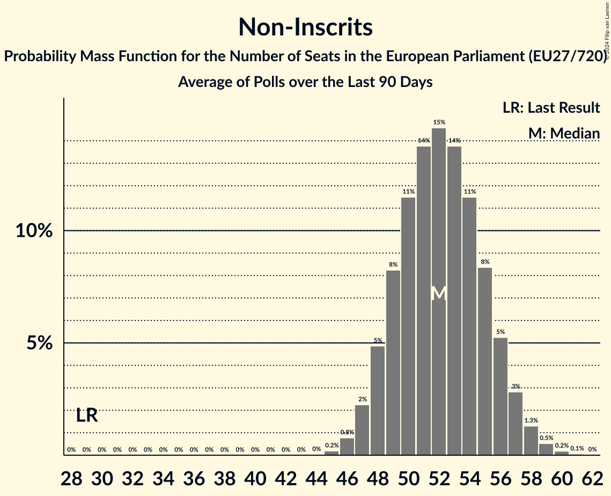

# Non-Inscrits

Members registered from **13 countries**:

> BG, DE, ES, FI, FR, GR, HU, IT, LT, LV, NL, PL, SK

## Seats

Last result: **29** seats (General Election of 26 May 2019)

Current median: **52** seats (+23 seats)

At least one member in **11 countries** have a median of 1 seat or more:

> BG, DE, ES, GR, HU, IT, LT, LV, NL, PL, SK

### Confidence Intervals

| Party | Area | Last Result | Median | 80% Confidence Interval | 90% Confidence Interval | 95% Confidence Interval | 99% Confidence Interval |
|:-----:|:----:|:-----------:|:------:|:-----------------------:|:-----------------------:|:-----------------------:|:-----------------------:|
| Non-Inscrits | EU | 29 | 52 | 49–55 | 48–56 | 47–57 | 46–59 |
| Movimento 5 Stelle | IT | | 13 | 12–15 | 12–15 | 11–16 | 10–17 |
| Fidesz | HU | | 9 | 8–11 | 8–11 | 8–11 | 8–12 |
| Bündnis Sahra Wagenknecht | DE | | 6 | 4–8 | 4–8 | 4–8 | 3–8 |
| HLAS–sociálna demokracia | SK | | 3 | 2–3 | 2–3 | 2–3 | 2–3 |
| SMER–sociálna demokracia | SK | | 3 | 3–4 | 2–4 | 2–4 | 2–5 |
| Възраждане | BG | | 3 | 2–3 | 2–3 | 2–3 | 2–3 |
| Die PARTEI | DE | | 2 | 1–2 | 1–2 | 1–3 | 1–3 |
| Nowa Nadzieja | PL | | 2 | 2–4 | 2–4 | 2–4 | 1–4 |
| REPUBLIKA | SK | | 2 | 1–2 | 1–2 | 1–2 | 1–3 |
| Κομμουνιστικό Κόμμα Ελλάδας | GR | | 2 | 2 | 1–3 | 1–3 | 1–3 |
| Darbo Partija | LT | | 1 | 1 | 1 | 1 | 1–2 |
| Forum voor Democratie | NL | | 1 | 0–1 | 0–1 | 0–1 | 0–1 |
| Latvija pirmajā vietā | LV | | 1 | 1 | 1 | 1 | 1 |
| Lewica Razem | PL | | 1 | 0–1 | 0–1 | 0–2 | 0–2 |
| Partit Demòcrata Europeu Català | ES | | 1 | 1–2 | 1–2 | 1–2 | 0–2 |
| Stabilitātei! | LV | | 1 | 1 | 1 | 1 | 1 |
| Δημοκρατικό Πατριωτικό Κίνημα ΝΙΚΗ | GR | | 1 | 0–1 | 0–1 | 0–1 | 0–1 |
| Democrazia Sovrana e Popolare | IT | | 0 | 0 | 0 | 0 | 0 |
| Inicjatywa Polska | PL | | 0 | 0 | 0 | 0 | 0–1 |
| Jobbik | HU | | 0 | 0 | 0 | 0 | 0 |
| Kotleba–Ľudová strana Naše Slovensko | SK | | 0 | 0 | 0 | 0 | 0 |
| Latvijas Krievu savienība | LV | | 0 | 0 | 0 | 0 | 0 |
| Les Patriotes | FR | | 0 | 0 | 0 | 0 | 0 |
| Liike Nyt | FI | | 0 | 0 | 0 | 0 | 0 |
| Mi Hazánk Mozgalom | HU | | 0 | 0–1 | 0–1 | 0–1 | 0–1 |
| Български възход | BG | | 0 | 0 | 0 | 0 | 0 |

### Probability Mass Function

The following table shows the probability mass function per seat for the [poll average](average-2024-05-23.html) for Non-Inscrits.

| Number of Seats | Probability | Accumulated | Special Marks |
|:---------------:|:-----------:|:-----------:|:-------------:|
| 29 | 0% | 100% | Last Result |
| 30 | 0% | 100% |  |
| 31 | 0% | 100% |  |
| 32 | 0% | 100% |  |
| 33 | 0% | 100% |  |
| 34 | 0% | 100% |  |
| 35 | 0% | 100% |  |
| 36 | 0% | 100% |  |
| 37 | 0% | 100% |  |
| 38 | 0% | 100% |  |
| 39 | 0% | 100% |  |
| 40 | 0% | 100% |  |
| 41 | 0% | 100% |  |
| 42 | 0% | 100% |  |
| 43 | 0% | 100% |  |
| 44 | 0.1% | 100% |  |
| 45 | 0.3% | 99.9% |  |
| 46 | 1.0% | 99.6% |  |
| 47 | 3% | 98.6% |  |
| 48 | 5% | 96% |  |
| 49 | 9% | 90% |  |
| 50 | 12% | 82% |  |
| 51 | 14% | 70% |  |
| 52 | 14% | 56% | Median |
| 53 | 13% | 42% |  |
| 54 | 11% | 29% |  |
| 55 | 8% | 18% |  |
| 56 | 5% | 10% |  |
| 57 | 3% | 5% |  |
| 58 | 1.3% | 2% |  |
| 59 | 0.5% | 0.8% |  |
| 60 | 0.2% | 0.3% |  |
| 61 | 0.1% | 0.1% |  |
| 62 | 0% | 0% |  |

