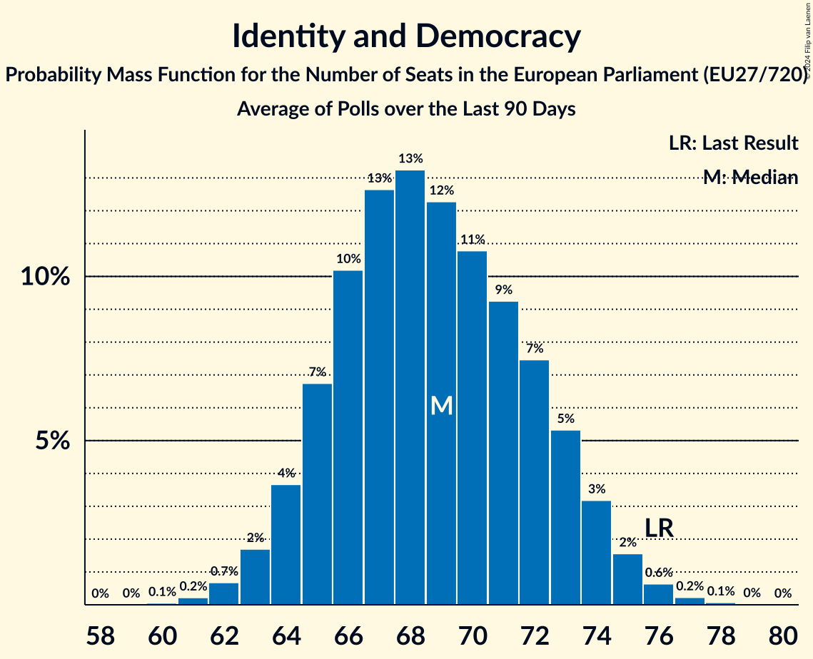

# Identity and Democracy

Members registered from **12 countries**:

> AT, BE, CZ, DK, EE, FR, HR, IT, NL, PL, PT, RO

## Seats

Last result: **76** seats (General Election of 26 May 2019)

Current median: **68** seats (-8 seats)

At least one member in **11 countries** have a median of 1 seat or more:

> AT, BE, CZ, DK, EE, FR, HR, IT, NL, PL, PT

### Confidence Intervals

| Party | Area | Last Result | Median | 80% Confidence Interval | 90% Confidence Interval | 95% Confidence Interval | 99% Confidence Interval |
|:-----:|:----:|:-----------:|:------:|:-----------------------:|:-----------------------:|:-----------------------:|:-----------------------:|
| Identity and Democracy | EU | 76 | 68 | 64–71 | 64–72 | 63–73 | 61–75 |
| Rassemblement national | FR | | 32 | 29–34 | 28–35 | 27–35 | 27–36 |
| Partij voor de Vrijheid | NL | | 8 | 8–9 | 8–9 | 8–9 | 7–9 |
| Lega Nord | IT | | 7 | 6–8 | 6–9 | 6–9 | 5–10 |
| Freiheitliche Partei Österreichs | AT | | 6 | 5–7 | 5–7 | 5–7 | 5–7 |
| Vlaams Belang | BE-VLG | | 4 | 4 | 3–4 | 3–4 | 3–5 |
| Chega | PT | | 3 | 2–4 | 2–4 | 2–5 | 1–5 |
| Ruch Narodowy | PL | | 2 | 1–3 | 1–3 | 1–3 | 1–4 |
| Svoboda a přímá demokracie–Trikolóra hnutí občanů | CZ | | 2 | 1–2 | 1–2 | 1–2 | 1–2 |
| Dansk Folkeparti | DK | | 1 | 0–1 | 0–1 | 0–1 | 0–1 |
| Domovinski pokret Miroslava Škore | HR | | 1 | 1 | 1 | 1 | 1 |
| Eesti Konservatiivne Rahvaerakond | EE | | 1 | 1 | 1 | 1 | 1 |
| Konfederacja Korony Polskiej | PL | | 1 | 1–2 | 1–2 | 1–2 | 0–2 |
| Partidul S.O.S. România | RO | | 0 | 0 | 0–2 | 0–2 | 0–2 |

### Probability Mass Function

The following table shows the probability mass function per seat for the [poll average](average-2024-06-05.html) for Identity and Democracy.

| Number of Seats | Probability | Accumulated | Special Marks |
|:---------------:|:-----------:|:-----------:|:-------------:|
| 60 | 0.1% | 100% |  |
| 61 | 0.5% | 99.8% |  |
| 62 | 1.3% | 99.3% |  |
| 63 | 3% | 98% |  |
| 64 | 5% | 95% |  |
| 65 | 9% | 90% |  |
| 66 | 12% | 81% |  |
| 67 | 15% | 69% |  |
| 68 | 15% | 54% | Median |
| 69 | 13% | 39% |  |
| 70 | 10% | 25% |  |
| 71 | 7% | 15% |  |
| 72 | 4% | 8% |  |
| 73 | 2% | 4% |  |
| 74 | 1.1% | 2% |  |
| 75 | 0.4% | 0.7% |  |
| 76 | 0.2% | 0.2% | Last Result |
| 77 | 0.1% | 0.1% |  |
| 78 | 0% | 0% |  |

