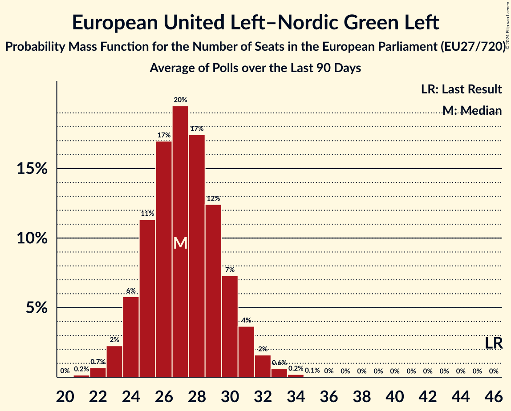

# European United Left–Nordic Green Left

Members registered from **15 countries**:

> AT, BE, DE, DK, EE, ES, FI, GR, HR, IE, IT, NL, PT, SE, SI

## Seats

Last result: **46** seats (General Election of 26 May 2019)

Current median: **33** seats (-13 seats)

At least one member in **10 countries** have a median of 1 seat or more:

> BE, DE, DK, ES, FI, GR, IE, IT, PT, SE

### Confidence Intervals

| Party | Area | Last Result | Median | 80% Confidence Interval | 90% Confidence Interval | 95% Confidence Interval | 99% Confidence Interval |
|:-----:|:----:|:-----------:|:------:|:-----------------------:|:-----------------------:|:-----------------------:|:-----------------------:|
| European United Left–Nordic Green Left | EU | 46 | 33 | 31–36 | 30–37 | 29–38 | 28–39 |
| Movimento 5 Stelle | IT | | 9 | 8–11 | 8–11 | 7–12 | 7–13 |
| Die Linke | DE | | 3 | 2–4 | 1–4 | 1–4 | 1–5 |
| Sinn Féin | IE | | 3 | 3–4 | 3–4 | 3–5 | 3–6 |
| Συνασπισμός Ριζοσπαστικής Αριστεράς | GR | | 3 | 3 | 3 | 3 | 2–4 |
| Podemos | ES | | 2 | 1–3 | 1–4 | 1–4 | 1–4 |
| Vasemmistoliitto | FI | | 2 | 1–2 | 1–2 | 1–2 | 1–2 |
| Vänsterpartiet | SE | | 2 | 2 | 2 | 2 | 2–3 |
| Bloco de Esquerda | PT | | 1 | 0–1 | 0–1 | 0–1 | 0–1 |
| Enhedslisten–De Rød-Grønne | DK | | 1 | 1 | 1 | 0–1 | 0–1 |
| Euskal Herria Bildu | ES | | 1 | 0–1 | 0–1 | 0–1 | 0–1 |
| Independents | IE | | 1 | 0–1 | 0–1 | 0–1 | 0–1 |
| Movimiento Sumar–Izquierda Unida | ES | | 1 | 1–2 | 1–2 | 1–3 | 0–3 |
| Partei Mensch Umwelt Tierschutz | DE | | 1 | 0–1 | 0–1 | 0–2 | 0–2 |
| Parti du Travail de Belgique | BE-FRC | | 1 | 1 | 1 | 1 | 1 |
| Solidarity–People Before Profit | IE | | 1 | 1 | 0–1 | 0–1 | 0–1 |
| Μέτωπο Ευρωπαϊκής Ρεαλιστικής Ανυπακοής | GR | | 1 | 0–1 | 0–1 | 0–1 | 0–1 |
| Coligação Democrática Unitária | PT | | 0 | 0–1 | 0–1 | 0–1 | 0–1 |
| Eestimaa Ühendatud Vasakpartei | EE | | 0 | 0 | 0 | 0 | 0 |
| Independents 4 Change | IE | | 0 | 0 | 0 | 0 | 0 |
| Kommunistische Partei Österreichs | AT | | 0 | 0 | 0 | 0 | 0–1 |
| Levica | SI | | 0 | 0–1 | 0–1 | 0–1 | 0–1 |
| Pace Terra Dignità | IT | | 0 | 0 | 0 | 0 | 0 |
| Partij voor de Dieren | NL | | 0 | 0 | 0 | 0 | 0–1 |
| Radnička fronta | HR | | 0 | 0 | 0 | 0 | 0 |
| Sinistra Italiana | IT | | 0 | 0 | 0 | 0 | 0 |
| Socialistische Partij | NL | | 0 | 0–1 | 0–1 | 0–1 | 0–1 |
| Νέα Αριστερά | GR | | 0 | 0 | 0 | 0 | 0–1 |

### Probability Mass Function

The following table shows the probability mass function per seat for the [poll average](average-2024-07-31.html) for European United Left–Nordic Green Left.

| Number of Seats | Probability | Accumulated | Special Marks |
|:---------------:|:-----------:|:-----------:|:-------------:|
| 26 | 0.1% | 100% |  |
| 27 | 0.3% | 99.9% |  |
| 28 | 0.9% | 99.7% |  |
| 29 | 2% | 98.8% |  |
| 30 | 5% | 96% |  |
| 31 | 10% | 91% |  |
| 32 | 15% | 81% |  |
| 33 | 18% | 66% | Median |
| 34 | 18% | 47% |  |
| 35 | 14% | 29% |  |
| 36 | 9% | 16% |  |
| 37 | 4% | 7% |  |
| 38 | 2% | 3% |  |
| 39 | 0.7% | 0.9% |  |
| 40 | 0.2% | 0.3% |  |
| 41 | 0.1% | 0.1% |  |
| 42 | 0% | 0% |  |
| 43 | 0% | 0% |  |
| 44 | 0% | 0% |  |
| 45 | 0% | 0% |  |
| 46 | 0% | 0% | Last Result |

