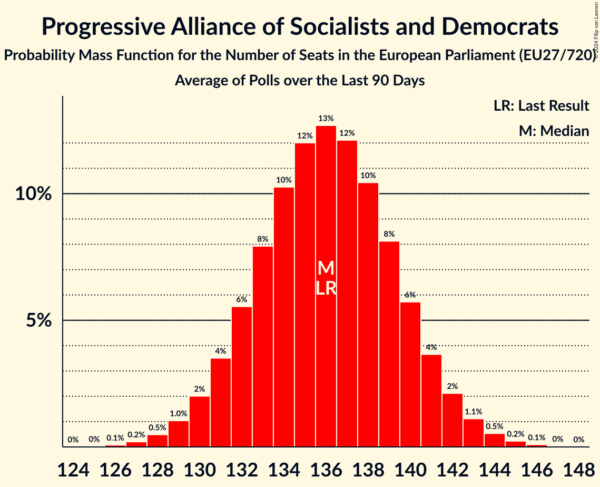

# Progressive Alliance of Socialists and Democrats

Members registered from **20 countries**:

> AT, CZ, DE, DK, EE, ES, FI, GR, HR, HU, IE, IT, LT, LV, NL, PL, PT, RO, SE, SI

## Seats

Last result: **136** seats (General Election of 26 May 2019)

Current median: **115** seats (-21 seats)

At least one member in **18 countries** have a median of 1 seat or more:

> AT, DE, DK, EE, ES, FI, GR, HR, HU, IT, LT, LV, NL, PL, PT, RO, SE, SI

### Confidence Intervals

| Party | Area | Last Result | Median | 80% Confidence Interval | 90% Confidence Interval | 95% Confidence Interval | 99% Confidence Interval |
|:-----:|:----:|:-----------:|:------:|:-----------------------:|:-----------------------:|:-----------------------:|:-----------------------:|
| Progressive Alliance of Socialists and Democrats | EU | 136 | 115 | 111–119 | 110–120 | 109–121 | 107–123 |
| Partido Socialista Obrero Español | ES | | 21 | 20–23 | 19–23 | 19–24 | 18–25 |
| Partito Democratico | IT | | 21 | 20–23 | 19–23 | 18–24 | 16–25 |
| Sozialdemokratische Partei Deutschlands | DE | | 15 | 13–16 | 12–17 | 11–18 | 11–18 |
| Partidul Social Democrat | RO | | 12 | 11–13 | 11–13 | 11–13 | 11–14 |
| Partido Socialista | PT | | 8 | 7–9 | 6–9 | 6–9 | 6–9 |
| Sveriges socialdemokratiska arbetareparti | SE | | 7 | 7–8 | 7–8 | 7–8 | 6–9 |
| Sozialdemokratische Partei Österreichs | AT | | 5 | 4–5 | 4–5 | 4–5 | 4–6 |
| Nowa Lewica | PL | | 4 | 3–4 | 3–5 | 3–5 | 2–5 |
| Suomen Sosialidemokraattinen Puolue | FI | | 4 | 3–4 | 3–4 | 3–4 | 3–4 |
| Partij van de Arbeid | NL | | 3 | 3–4 | 3–4 | 3–4 | 3–4 |
| Socialdemokraterne | DK | | 3 | 3 | 3–4 | 2–4 | 2–4 |
| Socijaldemokratska partija Hrvatske | HR | | 3 | 3–4 | 3–4 | 3–4 | 3–4 |
| Κίνημα Αλλαγής | GR | | 3 | 3 | 3 | 2–3 | 2–3 |
| Lietuvos socialdemokratų partija | LT | | 2 | 2–3 | 2–3 | 2–3 | 2–3 |
| Demokratikus Koalíció | HU | | 1 | 1–2 | 1–2 | 0–2 | 0–2 |
| Socialni demokrati | SI | | 1 | 1 | 1 | 1 | 0–1 |
| Sociāldemokrātiskā partija “Saskaņa” | LV | | 1 | 1 | 1 | 1 | 1 |
| Sotsiaaldemokraatlik Erakond | EE | | 1 | 1–2 | 1–2 | 1–2 | 1–2 |
| Labour Party | IE | | 0 | 0 | 0 | 0 | 0–1 |
| Magyar Szocialista Párt | HU | | 0 | 0 | 0 | 0 | 0 |
| PRO România | RO | | 0 | 0 | 0 | 0 | 0 |
| Partidul Puterii Umaniste (social-liberal) | RO | | 0 | 0 | 0 | 0 | 0 |
| Social Democrats | IE | | 0 | 0 | 0 | 0 | 0–1 |
| Sociální demokracie | CZ | | 0 | 0 | 0 | 0 | 0 |
| Szocialisták és demokraták | HU | | 0 | 0 | 0 | 0 | 0 |

### Probability Mass Function

The following table shows the probability mass function per seat for the [poll average](average-2024-07-31.html) for Progressive Alliance of Socialists and Democrats.

| Number of Seats | Probability | Accumulated | Special Marks |
|:---------------:|:-----------:|:-----------:|:-------------:|
| 105 | 0% | 100% |  |
| 106 | 0.1% | 99.9% |  |
| 107 | 0.3% | 99.8% |  |
| 108 | 0.7% | 99.5% |  |
| 109 | 2% | 98.7% |  |
| 110 | 3% | 97% |  |
| 111 | 5% | 94% |  |
| 112 | 7% | 90% |  |
| 113 | 10% | 82% |  |
| 114 | 12% | 72% |  |
| 115 | 13% | 60% | Median |
| 116 | 13% | 47% |  |
| 117 | 11% | 34% |  |
| 118 | 9% | 23% |  |
| 119 | 6% | 14% |  |
| 120 | 4% | 8% |  |
| 121 | 2% | 4% |  |
| 122 | 1.1% | 2% |  |
| 123 | 0.5% | 0.9% |  |
| 124 | 0.2% | 0.4% |  |
| 125 | 0.1% | 0.1% |  |
| 126 | 0% | 0% |  |
| 127 | 0% | 0% |  |
| 128 | 0% | 0% |  |
| 129 | 0% | 0% |  |
| 130 | 0% | 0% |  |
| 131 | 0% | 0% |  |
| 132 | 0% | 0% |  |
| 133 | 0% | 0% |  |
| 134 | 0% | 0% |  |
| 135 | 0% | 0% |  |
| 136 | 0% | 0% | Last Result |

