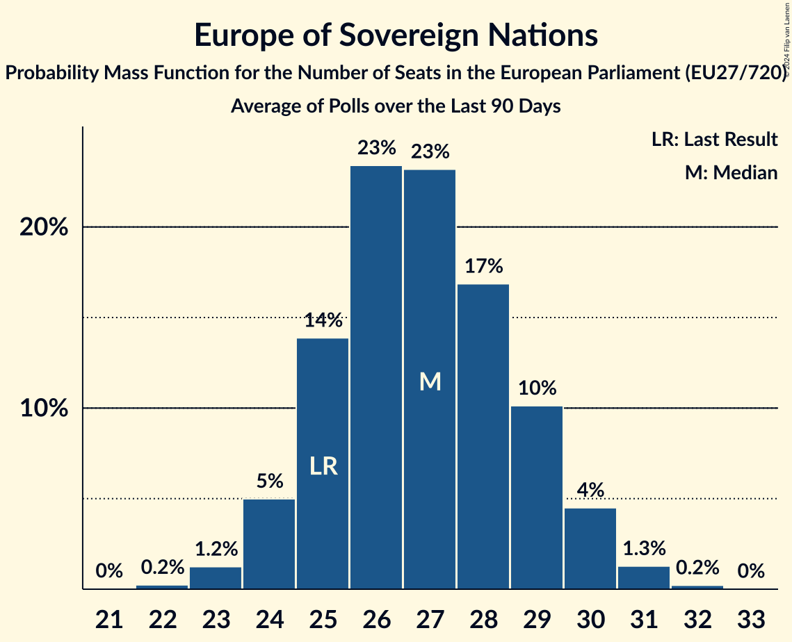

# Europe of Sovereign Nations

Members registered from **9 countries**:

> BG, CZ, DE, FR, HU, LT, NL, PL, SK

## Seats

Last result: **25** seats (General Election of 26 May 2019)

Current median: **27** seats (+2 seats)

At least one member in **7 countries** have a median of 1 seat or more:

> BG, CZ, DE, FR, HU, PL, SK

### Confidence Intervals

| Party | Area | Last Result | Median | 80% Confidence Interval | 90% Confidence Interval | 95% Confidence Interval | 99% Confidence Interval |
|:-----:|:----:|:-----------:|:------:|:-----------------------:|:-----------------------:|:-----------------------:|:-----------------------:|
| Europe of Sovereign Nations | EU | 25 | 27 | 24–30 | 24–30 | 23–31 | 22–33 |
| Alternative für Deutschland | DE | | 15 | 14–18 | 13–19 | 13–19 | 13–21 |
| Nowa Nadzieja | PL | | 3 | 2–4 | 2–4 | 2–4 | 2–5 |
| Възраждане | BG | | 3 | 3 | 3 | 3 | 3 |
| Svoboda a přímá demokracie | CZ | | 2 | 1–2 | 0–2 | 0–2 | 0–3 |
| Mi Hazánk Mozgalom | HU | | 1 | 1–2 | 1–2 | 0–2 | 0–2 |
| REPUBLIKA | SK | | 1 | 1–2 | 0–2 | 0–2 | 0–2 |
| Reconquête | FR | | 1 | 1 | 1 | 1 | 1 |
| Forum voor Democratie | NL | | 0 | 0 | 0 | 0 | 0 |
| Tautos ir teisingumo sąjunga (centristai, tautininkai) | LT | | 0 | 0 | 0 | 0 | 0 |
| Trikolóra hnutí občanů | CZ | | 0 | 0 | 0 | 0 | 0 |

### Probability Mass Function

The following table shows the probability mass function per seat for the [poll average](average-2024-08-31.html) for Europe of Sovereign Nations.

| Number of Seats | Probability | Accumulated | Special Marks |
|:---------------:|:-----------:|:-----------:|:-------------:|
| 21 | 0.2% | 100% |  |
| 22 | 0.9% | 99.8% |  |
| 23 | 3% | 98.9% |  |
| 24 | 8% | 96% |  |
| 25 | 15% | 88% | Last Result |
| 26 | 21% | 73% |  |
| 27 | 19% | 53% | Median |
| 28 | 14% | 34% |  |
| 29 | 10% | 20% |  |
| 30 | 6% | 10% |  |
| 31 | 3% | 4% |  |
| 32 | 1.1% | 2% |  |
| 33 | 0.4% | 0.5% |  |
| 34 | 0.1% | 0.1% |  |
| 35 | 0% | 0% |  |

