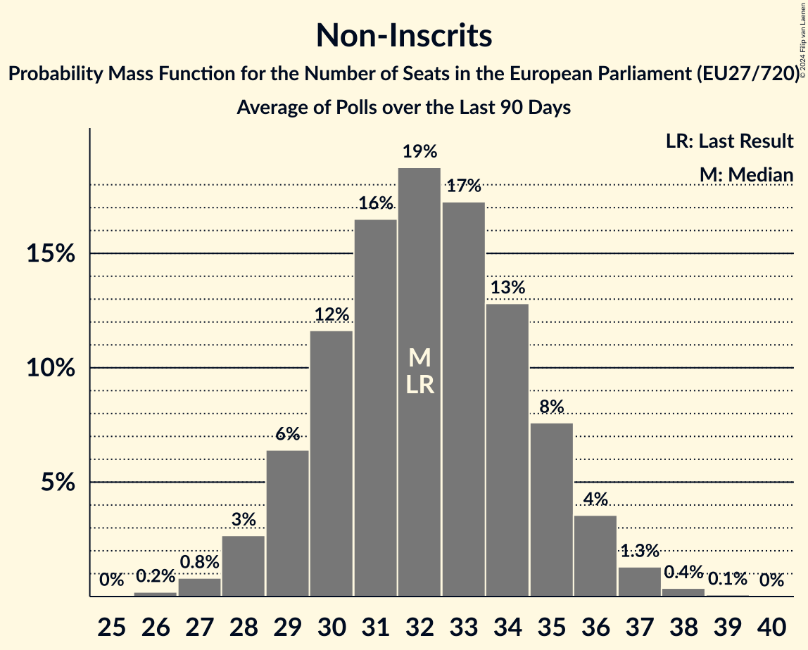

# Non-Inscrits

Members registered from **14 countries**:

> CY, CZ, DE, ES, FI, GR, HR, HU, LT, LV, PL, RO, SI, SK

## Seats

Last result: **32** seats (General Election of 26 May 2019)

Current median: **32** seats (0 seats)

At least one member in **8 countries** have a median of 1 seat or more:

> CY, DE, ES, GR, LV, PL, RO, SK

### Confidence Intervals

| Party | Area | Last Result | Median | 80% Confidence Interval | 90% Confidence Interval | 95% Confidence Interval | 99% Confidence Interval |
|:-----:|:----:|:-----------:|:------:|:-----------------------:|:-----------------------:|:-----------------------:|:-----------------------:|
| Non-Inscrits | EU | 32 | 32 | 29–34 | 28–35 | 28–36 | 26–37 |
| Bündnis Sahra Wagenknecht | DE | | 8 | 6–9 | 6–9 | 6–10 | 5–10 |
| SMER–sociálna demokracia | SK | | 5 | 4–5 | 4–5 | 4–5 | 4–5 |
| HLAS–sociálna demokracia | SK | | 3 | 2–3 | 2–3 | 2–3 | 2–3 |
| Partidul S.O.S. România | RO | | 2 | 2–3 | 0–3 | 0–3 | 0–3 |
| Ruch Narodowy | PL | | 2 | 2–3 | 1–3 | 1–3 | 1–3 |
| Se Acabó La Fiesta | ES | | 2 | 1–3 | 1–3 | 1–3 | 1–4 |
| Κομμουνιστικό Κόμμα Ελλάδας | GR | | 2 | 2 | 2–3 | 2–3 | 1–3 |
| Die PARTEI | DE | | 1 | 1–2 | 1–2 | 0–2 | 0–2 |
| Junts per Catalunya | ES | | 1 | 0–1 | 0–1 | 0–1 | 0–2 |
| Konfederacja Korony Polskiej | PL | | 1 | 1–2 | 1–2 | 1–2 | 0–2 |
| Lewica Razem | PL | | 1 | 1 | 1–2 | 1–2 | 0–2 |
| Stabilitātei! | LV | | 1 | 0–1 | 0–1 | 0–1 | 0–1 |
| Δημοκρατικό Πατριωτικό Κίνημα ΝΙΚΗ | GR | | 1 | 0–1 | 0–1 | 0–1 | 0–1 |
| Πλεύση Ελευθερίας | GR | | 1 | 1 | 0–1 | 0–2 | 0–2 |
| Φειδίας Παναγιώτου | CY | | 1 | 1 | 1 | 1 | 1 |
| Darbo Partija | LT | | 0 | 0–1 | 0–1 | 0–1 | 0–1 |
| Jobbik | HU | | 0 | 0 | 0 | 0 | 0 |
| Komunistická strana Čech a Moravy | CZ | | 0 | 0–1 | 0–2 | 0–2 | 0–2 |
| Kotleba–Ľudová strana Naše Slovensko | SK | | 0 | 0 | 0 | 0 | 0 |
| Latvijas Krievu savienība | LV | | 0 | 0 | 0 | 0 | 0 |
| Liike Nyt | FI | | 0 | 0 | 0 | 0 | 0 |
| Pravo i Pravda | HR | | 0 | 0 | 0 | 0 | 0 |
| Resni.ca | SI | | 0 | 0 | 0 | 0 | 0 |
| Strana svobodných občanů | CZ | | 0 | 0 | 0–1 | 0–1 | 0–2 |

### Probability Mass Function

The following table shows the probability mass function per seat for the [poll average](average-2024-09-30.html) for Non-Inscrits.

| Number of Seats | Probability | Accumulated | Special Marks |
|:---------------:|:-----------:|:-----------:|:-------------:|
| 25 | 0.1% | 100% |  |
| 26 | 0.5% | 99.9% |  |
| 27 | 2% | 99.3% |  |
| 28 | 5% | 98% |  |
| 29 | 10% | 93% |  |
| 30 | 15% | 83% |  |
| 31 | 18% | 68% |  |
| 32 | 18% | 51% | Last Result, Median |
| 33 | 15% | 33% |  |
| 34 | 10% | 18% |  |
| 35 | 5% | 8% |  |
| 36 | 2% | 3% |  |
| 37 | 0.6% | 0.8% |  |
| 38 | 0.2% | 0.2% |  |
| 39 | 0% | 0% |  |

