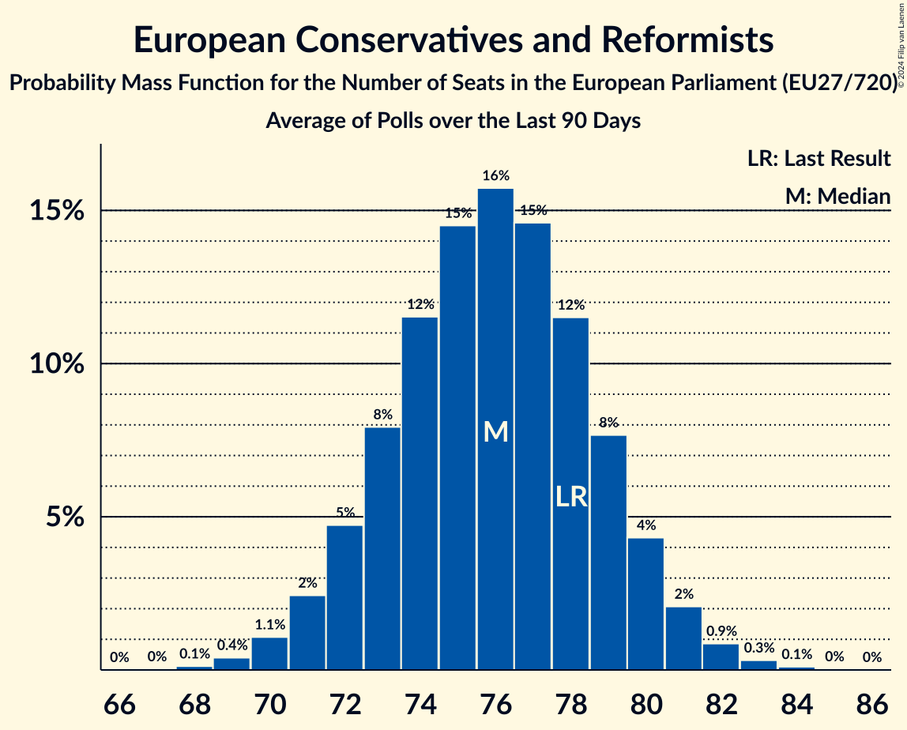

# European Conservatives and Reformists

Members registered from **19 countries**:

> BE, BG, CY, CZ, DK, EE, FI, FR, GR, HR, IT, LT, LU, LV, NL, PL, RO, SE, SK

## Seats

Last result: **78** seats (General Election of 26 May 2019)

Current median: **81** seats (+3 seats)

At least one member in **17 countries** have a median of 1 seat or more:

> BE, BG, CY, CZ, DK, FI, FR, GR, HR, IT, LT, LU, LV, PL, RO, SE, SK

### Confidence Intervals

| Party | Area | Last Result | Median | 80% Confidence Interval | 90% Confidence Interval | 95% Confidence Interval | 99% Confidence Interval |
|:-----:|:----:|:-----------:|:------:|:-----------------------:|:-----------------------:|:-----------------------:|:-----------------------:|
| European Conservatives and Reformists | EU | 78 | 81 | 77–84 | 76–85 | 75–86 | 74–88 |
| Fratelli d’Italia | IT | | 26 | 23–28 | 23–29 | 22–29 | 21–30 |
| Zjednoczona Prawica | PL | | 17 | 16–19 | 15–19 | 15–19 | 14–20 |
| Alianța pentru Unirea Românilor | RO | | 6 | 5–6 | 5–7 | 5–7 | 5–7 |
| Nieuw-Vlaamse Alliantie | BE-VLG | | 4 | 4 | 3–4 | 3–4 | 3–5 |
| Občanská demokratická strana | CZ | | 4 | 3–5 | 3–5 | 3–5 | 3–5 |
| Sverigedemokraterna | SE | | 4 | 4–5 | 4–5 | 4–5 | 4–6 |
| Independents | FR | | 3 | 3 | 3 | 3 | 3 |
| Perussuomalaiset | FI | | 3 | 3 | 3 | 2–3 | 2–3 |
| Danmarksdemokraterne | DK | | 2 | 1–2 | 1–2 | 1–2 | 1–2 |
| Nacionālā apvienība „Visu Latvijai!”–„Tēvzemei un Brīvībai/LNNK” | LV | | 2 | 1–2 | 1–2 | 1–2 | 1–2 |
| Ελληνική Λύση | GR | | 2 | 2–3 | 2–3 | 1–3 | 1–3 |
| Има такъв народ | BG | | 2 | 1–2 | 1–2 | 1–2 | 0–2 |
| Alternativ Demokratesch Reformpartei | LU | | 1 | 1 | 1 | 1 | 1 |
| Domovinski pokret | HR | | 1 | 0–1 | 0–1 | 0–1 | 0–1 |
| Lietuvos valstiečių ir žaliųjų sąjunga | LT | | 1 | 1 | 1–2 | 1–2 | 1–2 |
| Most nezavisnih lista | HR | | 1 | 1 | 0–1 | 0–1 | 0–1 |
| Mouvement conservateur | FR | | 1 | 1 | 1 | 1 | 1 |
| Sloboda a Solidarita | SK | | 1 | 1 | 1–2 | 0–2 | 0–2 |
| Εθνικό Λαϊκό Μέτωπο | CY | | 1 | 1 | 1 | 1 | 1 |
| Eesti Rahvuslased ja Konservatiivid | EE | | 0 | 0 | 0 | 0 | 0 |
| Hrvatski suverenisti | HR | | 0 | 0 | 0 | 0 | 0 |
| Juiste Antwoord 2021 | NL | | 0 | 0 | 0 | 0 | 0 |
| Kresťanská únia | SK | | 0 | 0 | 0 | 0 | 0 |
| Lietuvos lenkų rinkimų akcija | LT | | 0 | 0 | 0 | 0 | 0 |
| Staatkundig Gereformeerde Partij | NL | | 0 | 0 | 0 | 0 | 0 |
| Suverēnā vara | LV | | 0 | 0 | 0 | 0 | 0 |
| Синя България | BG | | 0 | 0 | 0 | 0 | 0 |

### Probability Mass Function

The following table shows the probability mass function per seat for the [poll average](average-2024-10-31.html) for European Conservatives and Reformists.

| Number of Seats | Probability | Accumulated | Special Marks |
|:---------------:|:-----------:|:-----------:|:-------------:|
| 72 | 0.1% | 100% |  |
| 73 | 0.3% | 99.9% |  |
| 74 | 0.8% | 99.6% |  |
| 75 | 2% | 98.8% |  |
| 76 | 3% | 97% |  |
| 77 | 6% | 94% |  |
| 78 | 8% | 88% | Last Result |
| 79 | 11% | 80% |  |
| 80 | 13% | 69% |  |
| 81 | 14% | 56% | Median |
| 82 | 13% | 42% |  |
| 83 | 11% | 29% |  |
| 84 | 8% | 18% |  |
| 85 | 5% | 10% |  |
| 86 | 3% | 5% |  |
| 87 | 1.2% | 2% |  |
| 88 | 0.4% | 0.6% |  |
| 89 | 0.1% | 0.2% |  |
| 90 | 0% | 0% |  |

