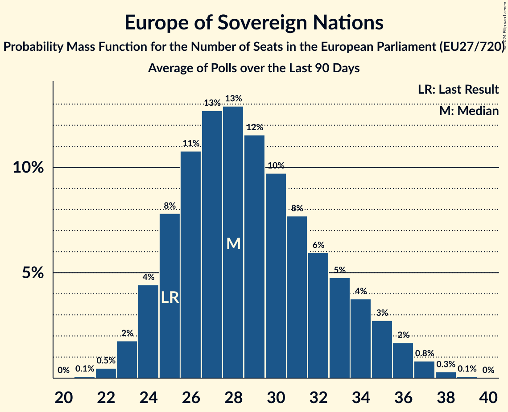

# Europe of Sovereign Nations

Members registered from **9 countries**:

> BG, CZ, DE, FR, HU, LT, NL, PL, SK

## Seats

Last result: **25** seats (General Election of 26 May 2019)

Current median: **28** seats (+3 seats)

At least one member in **6 countries** have a median of 1 seat or more:

> BG, CZ, DE, HU, PL, SK

### Confidence Intervals

| Party | Area | Last Result | Median | 80% Confidence Interval | 90% Confidence Interval | 95% Confidence Interval | 99% Confidence Interval |
|:-----:|:----:|:-----------:|:------:|:-----------------------:|:-----------------------:|:-----------------------:|:-----------------------:|
| Europe of Sovereign Nations | EU | 25 | 28 | 25–33 | 24–34 | 23–35 | 22–37 |
| Alternative für Deutschland | DE | | 17 | 15–20 | 15–20 | 14–20 | 14–20 |
| Nowa Nadzieja | PL | | 3 | 2–3 | 2–4 | 1–4 | 1–4 |
| Възраждане | BG | | 3 | 3 | 3–4 | 3–4 | 2–4 |
| Svoboda a přímá demokracie | CZ | | 2 | 1–3 | 1–3 | 1–3 | 0–3 |
| Mi Hazánk Mozgalom | HU | | 1 | 0–1 | 0–1 | 0–2 | 0–2 |
| REPUBLIKA | SK | | 1 | 0–2 | 0–2 | 0–2 | 0–2 |
| Forum voor Democratie | NL | | 0 | 0–1 | 0–1 | 0–1 | 0–1 |
| Reconquête | FR | | 0 | 0–5 | 0–6 | 0–6 | 0–7 |
| Tautos ir teisingumo sąjunga (centristai, tautininkai) | LT | | 0 | 0 | 0 | 0 | 0 |
| Trikolóra hnutí občanů | CZ | | 0 | 0 | 0 | 0 | 0 |

### Probability Mass Function

The following table shows the probability mass function per seat for the [poll average](average-2024-10-31.html) for Europe of Sovereign Nations.

| Number of Seats | Probability | Accumulated | Special Marks |
|:---------------:|:-----------:|:-----------:|:-------------:|
| 21 | 0.2% | 100% |  |
| 22 | 0.7% | 99.8% |  |
| 23 | 2% | 99.1% |  |
| 24 | 5% | 97% |  |
| 25 | 9% | 91% | Last Result |
| 26 | 12% | 82% |  |
| 27 | 12% | 70% |  |
| 28 | 11% | 58% | Median |
| 29 | 10% | 47% |  |
| 30 | 9% | 36% |  |
| 31 | 8% | 27% |  |
| 32 | 6% | 20% |  |
| 33 | 5% | 13% |  |
| 34 | 4% | 8% |  |
| 35 | 2% | 5% |  |
| 36 | 1.5% | 2% |  |
| 37 | 0.7% | 0.9% |  |
| 38 | 0.2% | 0.3% |  |
| 39 | 0% | 0.1% |  |
| 40 | 0% | 0% |  |

