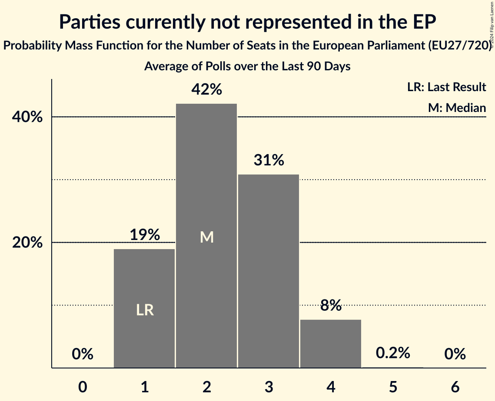

# Parties currently not represented in the EP

Members registered from **19 countries**:

> BE, BG, CY, CZ, DE, EE, ES, FR, GR, HR, HU, IE, IT, LT, LU, LV, NL, PL, SI

## Seats

Last result: **1** seats (General Election of 26 May 2019)

Current median: **2** seats (+1 seats)

At least one member in **1 countries** have a median of 1 seat or more:

> LT

### Confidence Intervals

| Party | Area | Last Result | Median | 80% Confidence Interval | 90% Confidence Interval | 95% Confidence Interval | 99% Confidence Interval |
|:-----:|:----:|:-----------:|:------:|:-----------------------:|:-----------------------:|:-----------------------:|:-----------------------:|
| Parties currently not represented in the EP | EU | 1 | 2 | 2–3 | 2–3 | 2–4 | 2–4 |
| Nemuno aušra [LT] (*) | LT | | 2 | 2 | 2 | 2 | 2 |
| Aontú [IE] (*) | IE | | 0 | 0 | 0–1 | 0–1 | 0–1 |
| Centrum dla Polski [PL] (*) | PL | | 0 | 0 | 0 | 0 | 0 |
| DENK [NL] (*) | NL | | 0 | 0 | 0 | 0 | 0–1 |
| DéFI [BE-FRC] (*) | BE-FRC | | 0 | 0 | 0 | 0 | 0 |
| Hrvatska stranka umirovljenika [HR] (*) | HR | | 0 | 0 | 0 | 0 | 0 |
| Independents [IE] (*) | IE | | 0 | 0 | 0 | 0 | 0 |
| Kommunistesch Partei Lëtzebuerg [LU] (*) | LU | | 0 | 0 | 0 | 0 | 0 |
| Koos [EE] (*) | EE | | 0 | 0 | 0 | 0 | 0 |
| Lutte Ouvrière [FR] (*) | FR | | 0 | 0 | 0 | 0 | 0 |
| Második Reformkor [HU] (*) | HU | | 0 | 0 | 0 | 0 | 0 |
| Nacionalinis Susivienijimas [LT] (*) | LT | | 0 | 0 | 0 | 0 | 0 |
| Naša dežela [SI] (*) | SI | | 0 | 0 | 0 | 0 | 0 |
| Nép Pártján [HU] (*) | HU | | 0 | 0 | 0 | 0 | 0 |
| Partei des Fortschritts [DE] (*) | DE | | 0 | 0–1 | 0–1 | 0–1 | 0–1 |
| Partito Progressista [IT] (*) | IT | | 0 | 0 | 0 | 0 | 0 |
| Platforma 21 [LV] (*) | LV | | 0 | 0 | 0 | 0 | 0 |
| Právo Respekt Odbornost [CZ] (*) | CZ | | 0 | 0 | 0 | 0 | 0 |
| Résistons! [FR] (*) | FR | | 0 | 0 | 0 | 0 | 0 |
| Sud chiama Nord [IT] (*) | IT | | 0 | 0 | 0 | 0 | 0 |
| Unión del Pueblo Navarro [ES] (*) | ES | | 0 | 0 | 0 | 0 | 0 |
| Zeleni Slovenije [SI] (*) | SI | | 0 | 0 | 0 | 0 | 0 |
| Ενεργοί Πολίτες–Κίνημα Ενωμένων Κυπρίων Κυνηγών [CY] (*) | CY | | 0 | 0 | 0 | 0 | 0 |
| Σπαρτιάτες [GR] (*) | GR | | 0 | 0 | 0 | 0 | 0–1 |
| Величие [BG] (*) | BG | | 0 | 0 | 0 | 0 | 0 |
| Морал, Единство, Чест [BG] (*) | BG | | 0 | 0 | 0 | 0 | 0 |

### Probability Mass Function

The following table shows the probability mass function per seat for the [poll average](average-2024-10-31.html) for Parties currently not represented in the EP.

| Number of Seats | Probability | Accumulated | Special Marks |
|:---------------:|:-----------:|:-----------:|:-------------:|
| 1 | 0% | 100% | Last Result |
| 2 | 68% | 100% | Median |
| 3 | 29% | 32% |  |
| 4 | 2% | 3% |  |
| 5 | 0.1% | 0.1% |  |
| 6 | 0% | 0% |  |

