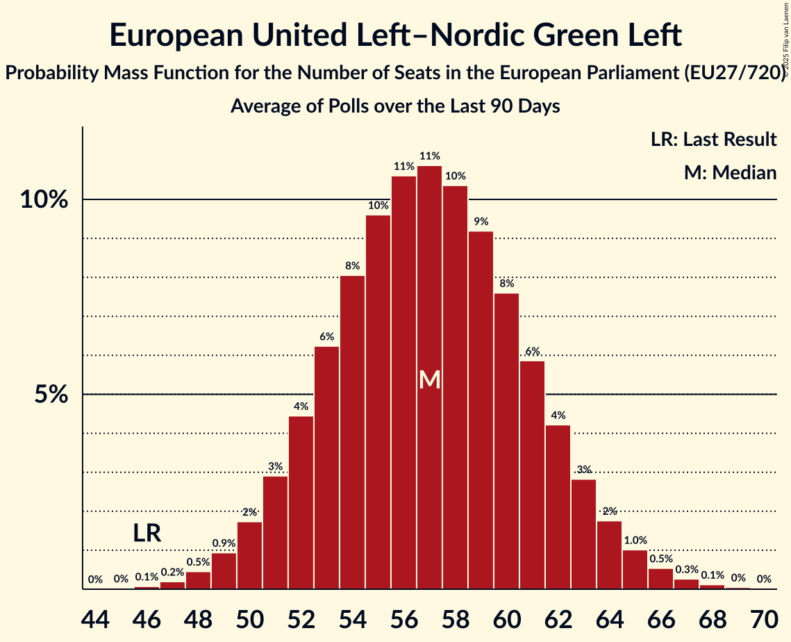

# European United Left–Nordic Green Left

Members registered from **19 countries**:

> AT, BE, CY, CZ, DE, DK, ES, FI, FR, GR, HR, IE, IT, LU, NL, PL, PT, SE, SI

## Seats

Last result: **46** seats (General Election of 26 May 2019)

Current median: **58** seats (+12 seats)

At least one member in **13 countries** have a median of 1 seat or more:

> BE, CY, CZ, DE, DK, ES, FI, FR, GR, IE, IT, NL, SE

### Confidence Intervals

| Party | Area | Last Result | Median | 80% Confidence Interval | 90% Confidence Interval | 95% Confidence Interval | 99% Confidence Interval |
|:-----:|:----:|:-----------:|:------:|:-----------------------:|:-----------------------:|:-----------------------:|:-----------------------:|
| European United Left–Nordic Green Left | EU | 46 | 58 | 53–63 | 52–64 | 50–65 | 48–67 |
| La France insoumise | FR | | 12 | 9–14 | 9–14 | 9–15 | 8–15 |
| Movimento 5 Stelle | IT | | 11 | 10–13 | 9–14 | 9–14 | 9–15 |
| Die Linke | DE | | 9 | 8–11 | 8–11 | 7–11 | 7–12 |
| Sinn Féin | IE | | 5 | 3–5 | 3–5 | 2–6 | 2–6 |
| Podemos | ES | | 3 | 2–3 | 1–4 | 1–4 | 1–5 |
| Vänsterpartiet | SE | | 2 | 2 | 2 | 1–2 | 1–2 |
| Enhedslisten–De Rød-Grønne | DK | | 1 | 1 | 1 | 1 | 1–2 |
| Movimiento Sumar–Izquierda Unida | ES | | 1 | 1–2 | 1–2 | 0–2 | 0–3 |
| Partei Mensch Umwelt Tierschutz | DE | | 1 | 1–2 | 1–2 | 1–2 | 0–2 |
| Parti du Travail de Belgique | BE-FRC | | 1 | 1–2 | 1–2 | 1–2 | 1–2 |
| Partij van de Arbeid van België | BE-VLG | | 1 | 1 | 1 | 1 | 1 |
| Partij voor de Dieren | NL | | 1 | 0–1 | 0–1 | 0–2 | 0–2 |
| Socialistische Partij | NL | | 1 | 0–2 | 0–2 | 0–2 | 0–2 |
| Stačilo! | CZ | | 1 | 0–2 | 0–2 | 0–2 | 0–2 |
| Vasemmistoliitto | FI | | 1 | 1–2 | 1–2 | 1–2 | 1–2 |
| Ανορθωτικό Κόμμα Εργαζόμενου Λαού | CY | | 1 | 1 | 1–2 | 1–2 | 1–2 |
| Μέτωπο Ευρωπαϊκής Ρεαλιστικής Ανυπακοής | GR | | 1 | 0–1 | 0–1 | 0–1 | 0–1 |
| Συνασπισμός Ριζοσπαστικής Αριστεράς | GR | | 1 | 1–2 | 1–2 | 1–2 | 1–2 |
| Bloco de Esquerda | PT | | 0 | 0 | 0 | 0 | 0 |
| Coligação Democrática Unitária | PT | | 0 | 0–1 | 0–1 | 0–1 | 0–1 |
| Euskal Herria Bildu | ES | | 0 | 0–1 | 0–1 | 0–1 | 0–1 |
| Independents 4 Change | IE | | 0 | 0 | 0 | 0 | 0 |
| Independents | IE | | 0 | 0–1 | 0–1 | 0–1 | 0–1 |
| Kommunistische Partei Österreichs | AT | | 0 | 0–1 | 0–1 | 0–1 | 0–1 |
| Levica | SI | | 0 | 0–1 | 0–1 | 0–1 | 0–1 |
| Lewica Razem | PL | | 0 | 0–4 | 0–4 | 0–4 | 0–4 |
| Nouveau Parti anticapitaliste | FR | | 0 | 0 | 0 | 0 | 0 |
| Pace Terra Dignità | IT | | 0 | 0 | 0 | 0 | 0 |
| Parti communiste français | FR | | 0 | 0–5 | 0–5 | 0–6 | 0–6 |
| Potere al Popolo | IT | | 0 | 0 | 0 | 0 | 0 |
| Radnička fronta | HR | | 0 | 0 | 0 | 0 | 0 |
| Sinistra Italiana | IT | | 0 | 0 | 0 | 0 | 0 |
| Solidarity–People Before Profit | IE | | 0 | 0–1 | 0–1 | 0–1 | 0–1 |
| déi Lénk | LU | | 0 | 0 | 0 | 0 | 0 |
| Νέα Αριστερά | GR | | 0 | 0 | 0–1 | 0–1 | 0–1 |

### Probability Mass Function

The following table shows the probability mass function per seat for the [poll average](average-2025-07-31.html) for European United Left–Nordic Green Left.

| Number of Seats | Probability | Accumulated | Special Marks |
|:---------------:|:-----------:|:-----------:|:-------------:|
| 46 | 0.1% | 100% | Last Result |
| 47 | 0.1% | 99.9% |  |
| 48 | 0.3% | 99.8% |  |
| 49 | 0.7% | 99.4% |  |
| 50 | 1.3% | 98.8% |  |
| 51 | 2% | 97% |  |
| 52 | 3% | 95% |  |
| 53 | 5% | 92% |  |
| 54 | 7% | 87% |  |
| 55 | 8% | 80% |  |
| 56 | 9% | 72% |  |
| 57 | 10% | 62% |  |
| 58 | 10% | 52% | Median |
| 59 | 10% | 42% |  |
| 60 | 9% | 32% |  |
| 61 | 7% | 23% |  |
| 62 | 6% | 16% |  |
| 63 | 4% | 10% |  |
| 64 | 3% | 6% |  |
| 65 | 2% | 4% |  |
| 66 | 1.0% | 2% |  |
| 67 | 0.5% | 1.0% |  |
| 68 | 0.3% | 0.5% |  |
| 69 | 0.1% | 0.2% |  |
| 70 | 0% | 0.1% |  |
| 71 | 0% | 0% |  |

