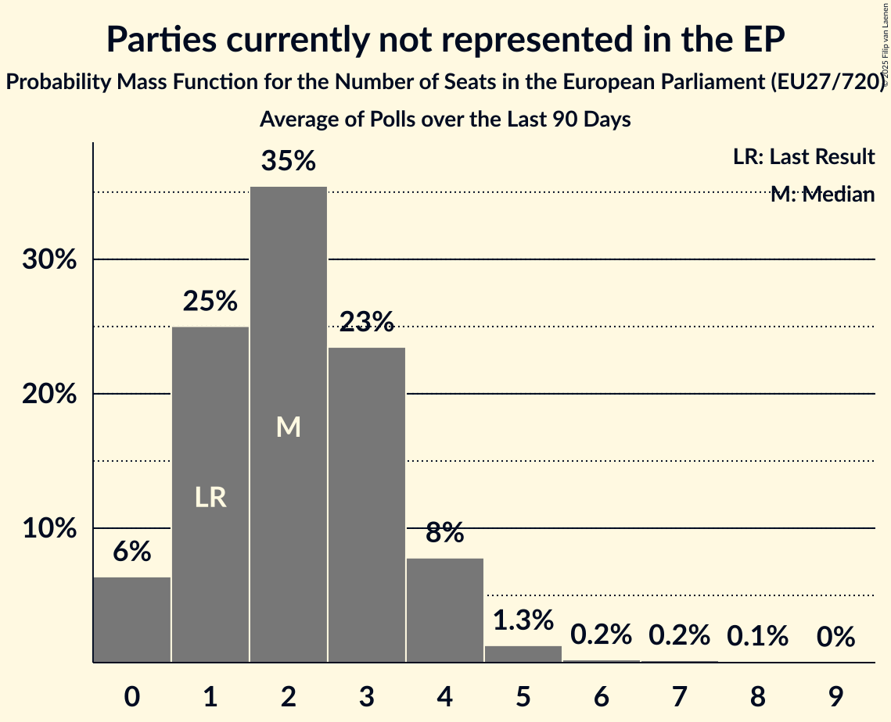

# Parties currently not represented in the EP

Members registered from **18 countries**:

> BE, BG, CY, CZ, DE, EE, ES, FR, GR, IE, IT, LT, LU, LV, MT, NL, SI, SK

## Seats

Last result: **1** seats (General Election of 26 May 2019)

Current median: **2** seats (+1 seats)

At least one member in **3 countries** have a median of 1 seat or more:

> BG, IE, LV

### Confidence Intervals

| Party | Area | Last Result | Median | 80% Confidence Interval | 90% Confidence Interval | 95% Confidence Interval | 99% Confidence Interval |
|:-----:|:----:|:-----------:|:------:|:-----------------------:|:-----------------------:|:-----------------------:|:-----------------------:|
| Parties currently not represented in the EP | EU | 1 | 2 | 1–4 | 0–4 | 0–4 | 0–6 |
| Aontú [IE] (*) | IE | | 1 | 0–1 | 0–1 | 0–1 | 0–1 |
| Politiskā kustība „Bez partijām“ [LV] (*) | LV | | 1 | 1 | 1 | 1 | 1 |
| Морал, Единство, Чест [BG] (*) | BG | | 1 | 0–2 | 0–2 | 0–2 | 0–2 |
| Basisdemokratische Partei Deutschland [DE] (*) | DE | | 0 | 0–1 | 0–1 | 0–1 | 0–1 |
| DENK [NL] (*) | NL | | 0 | 0 | 0 | 0 | 0 |
| DéFI [BE-FRC] (*) | BE-FRC | | 0 | 0 | 0 | 0 | 0 |
| Déi Konservativ [LU] (*) | LU | | 0 | 0 | 0 | 0 | 0 |
| FOKUS – za Slovenijo s ciljem [SI] (*) | SI | | 0 | 0 | 0 | 0 | 0 |
| Fokus [LU] (*) | LU | | 0 | 0 | 0 | 0 | 0 |
| Glas upokojencev [SI] (*) | SI | | 0 | 0 | 0 | 0 | 0 |
| Independents [IE] (*) | IE | | 0 | 0 | 0 | 0 | 0 |
| Kommunistesch Partei Lëtzebuerg [LU] (*) | LU | | 0 | 0 | 0 | 0 | 0 |
| Koos [EE] (*) | EE | | 0 | 0 | 0 | 0 | 0 |
| La France humaniste [FR] (*) | FR | | 0 | 0 | 0 | 0–4 | 0–5 |
| Liberté – Fräiheet! [LU] (*) | LU | | 0 | 0 | 0 | 0 | 0 |
| Lutte Ouvrière [FR] (*) | FR | | 0 | 0 | 0 | 0 | 0 |
| Mi, socialisti! [SI] (*) | SI | | 0 | 0 | 0 | 0 | 0 |
| Nacionalinis Susivienijimas [LT] (*) | LT | | 0 | 0 | 0–1 | 0–1 | 0–1 |
| Partit Momentum [MT] (*) | MT | | 0 | 0 | 0 | 0 | 0 |
| Partito Progressista [IT] (*) | IT | | 0 | 0–1 | 0–1 | 0–1 | 0–1 |
| Platforma 21 [LV] (*) | LV | | 0 | 0 | 0 | 0 | 0 |
| Právo na pravdu [SK] (*) | SK | | 0 | 0 | 0 | 0 | 0 |
| Stranka ZAUPANJE [SI] (*) | SI | | 0 | 0 | 0 | 0 | 0 |
| Stranka generacij [SI] (*) | SI | | 0 | 0 | 0 | 0 | 0 |
| Unión del Pueblo Navarro [ES] (*) | ES | | 0 | 0 | 0 | 0 | 0 |
| Česká strana národně sociální [CZ] (*) | CZ | | 0 | 0 | 0 | 0 | 0 |
| Αντικαπιταλιστική Αριστερή Συνεργασία για την Ανατροπή [GR] (*) | GR | | 0 | 0 | 0 | 0 | 0 |
| Ενεργοί Πολίτες–Κίνημα Ενωμένων Κυπρίων Κυνηγών [CY] (*) | CY | | 0 | 0 | 0 | 0 | 0 |
| Σπαρτιάτες [GR] (*) | GR | | 0 | 0 | 0 | 0 | 0 |
| Величие [BG] (*) | BG | | 0 | 0 | 0 | 0 | 0–1 |

### Probability Mass Function

The following table shows the probability mass function per seat for the [poll average](average-2025-12-31.html) for Parties currently not represented in the EP.

| Number of Seats | Probability | Accumulated | Special Marks |
|:---------------:|:-----------:|:-----------:|:-------------:|
| 0 | 6% | 100% |  |
| 1 | 24% | 94% | Last Result |
| 2 | 35% | 70% | Median |
| 3 | 24% | 34% |  |
| 4 | 8% | 10% |  |
| 5 | 1.5% | 2% |  |
| 6 | 0.2% | 0.6% |  |
| 7 | 0.2% | 0.3% |  |
| 8 | 0.1% | 0.2% |  |
| 9 | 0% | 0% |  |

