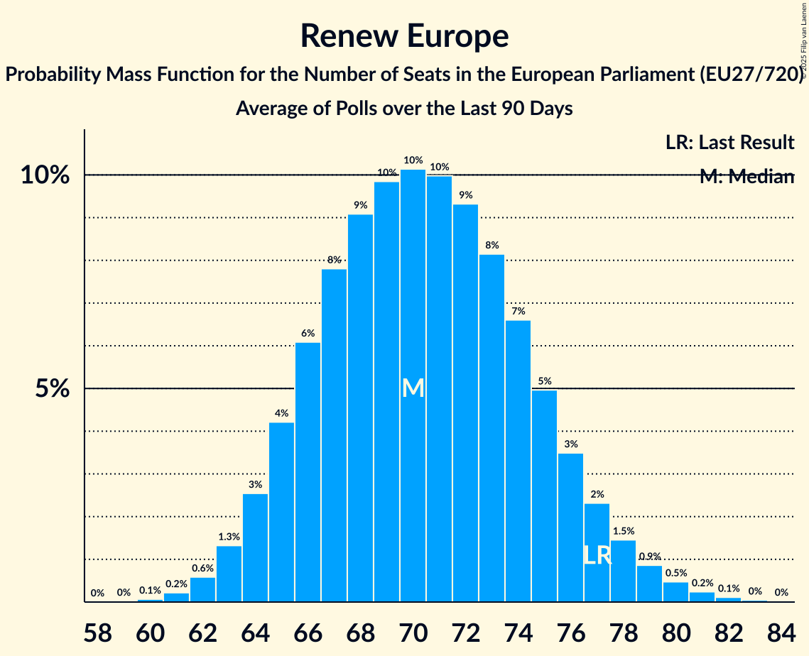

# Renew Europe

Members registered from **25 countries**:

> AT, BE, BG, CY, DE, DK, EE, ES, FI, FR, GR, HR, HU, IE, IT, LT, LU, LV, NL, PL, PT, RO, SE, SI, SK

## Seats

Last result: **77** seats (General Election of 26 May 2019)

Current median: **71** seats (-6 seats)

At least one member in **20 countries** have a median of 1 seat or more:

> AT, BE, BG, CY, DE, DK, EE, FI, FR, IE, LT, LU, LV, NL, PL, PT, RO, SE, SI, SK

### Confidence Intervals

| Party | Area | Last Result | Median | 80% Confidence Interval | 90% Confidence Interval | 95% Confidence Interval | 99% Confidence Interval |
|:-----:|:----:|:-----------:|:------:|:-----------------------:|:-----------------------:|:-----------------------:|:-----------------------:|
| Renew Europe | EU | 77 | 71 | 66–75 | 65–76 | 64–77 | 63–80 |
| Renaissance–Mouvement démocrate–Horizons | FR | | 14 | 11–17 | 11–17 | 11–18 | 10–19 |
| Democraten 66 | NL | | 7 | 7–8 | 7–8 | 6–8 | 6–8 |
| Volkspartij voor Vrijheid en Democratie | NL | | 5 | 5–6 | 5–6 | 4–6 | 4–6 |
| Freie Demokratische Partei | DE | | 4 | 3–4 | 3–5 | 2–5 | 2–5 |
| Progresívne Slovensko | SK | | 4 | 4–5 | 4–5 | 4–5 | 4–5 |
| Uniunea Salvați România | RO | | 4 | 3–5 | 3–5 | 3–5 | 3–5 |
| Fianna Fáil | IE | | 3 | 3–4 | 3–4 | 3–4 | 3–5 |
| Gibanje Svoboda | SI | | 3 | 2–3 | 2–3 | 2–3 | 2–4 |
| Demokratesch Partei | LU | | 2 | 1–2 | 1–2 | 1–2 | 1–2 |
| Eesti Keskerakond | EE | | 2 | 1–2 | 1–2 | 1–2 | 1–2 |
| Freie Wähler | DE | | 2 | 1–3 | 1–3 | 1–4 | 1–4 |
| Mouvement Réformateur | BE-FRC | | 2 | 2 | 2 | 2 | 2 |
| NEOS–Das Neue Österreich und Liberales Forum | AT | | 2 | 1–2 | 1–2 | 1–2 | 1–2 |
| Suomen Keskusta | FI | | 2 | 2–3 | 2–3 | 2–3 | 2–3 |
| Venstre | DK | | 2 | 2 | 2 | 2 | 1–2 |
| Продължаваме промяната | BG | | 2 | 2–3 | 2–3 | 2–4 | 1–4 |
| .Nowoczesna | PL | | 1 | 0–1 | 0–1 | 0–1 | 0–1 |
| Centerpartiet | SE | | 1 | 0–1 | 0–1 | 0–1 | 0–1 |
| Eesti Reformierakond | EE | | 1 | 1 | 1 | 1 | 1 |
| Iniciativa Liberal | PT | | 1 | 1–2 | 0–2 | 0–2 | 0–2 |
| Les Engagés | BE-FRC | | 1 | 1 | 1–2 | 1–2 | 1–2 |
| Liberalų Sąjūdis | LT | | 1 | 1 | 1 | 1 | 1 |
| Open Vlaamse Liberalen en Democraten | BE-VLG | | 1 | 1 | 0–1 | 0–1 | 0–1 |
| Radikale Venstre | DK | | 1 | 0–1 | 0–1 | 0–1 | 0–1 |
| Zaļo un Zemnieku savienība | LV | | 1 | 0–1 | 0–1 | 0–1 | 0–1 |
| Αξιοπρέπεια Λογοδοσία Μεταρρύθμιση Ανάπτυξη | CY | | 1 | 1 | 1 | 1 | 0–1 |
| Azione | IT | | 0 | 0 | 0–4 | 0–4 | 0–4 |
| Centar | HR | | 0 | 0 | 0 | 0 | 0 |
| Coalición Canaria–Partido Nacionalista Canario | ES | | 0 | 0 | 0 | 0 | 0 |
| Dreptate și Respect în Europa Pentru Toți | RO | | 0 | 0 | 0 | 0 | 0 |
| Euzko Alderdi Jeltzalea/Partido Nacionalista Vasco | ES | | 0 | 0–1 | 0–1 | 0–1 | 0–1 |
| Fokus na bitno | HR | | 0 | 0 | 0 | 0 | 0 |
| Hrvatska narodna stranka–liberalni demokrati | HR | | 0 | 0 | 0 | 0 | 0 |
| Hrvatska socijalno-liberalna stranka | HR | | 0 | 0 | 0 | 0 | 0 |
| Independent Ireland | IE | | 0 | 0 | 0 | 0 | 0–1 |
| Independents | IE | | 0 | 0 | 0–1 | 0–1 | 0–1 |
| Istarski demokratski sabor | HR | | 0 | 0 | 0 | 0 | 0 |
| Italia Viva | IT | | 0 | 0 | 0 | 0 | 0–4 |
| Kustība Par! | LV | | 0 | 0 | 0 | 0 | 0 |
| Laisvės partija | LT | | 0 | 0–1 | 0–1 | 0–1 | 0–1 |
| Latvijas attīstībai | LV | | 0 | 0 | 0 | 0 | 0 |
| Liberalerna | SE | | 0 | 0 | 0 | 0 | 0 |
| Moderaterne | DK | | 0 | 0 | 0 | 0 | 0 |
| Momentum Mozgalom | HU | | 0 | 0 | 0 | 0 | 0 |
| Partidul Mișcarea Populară | RO | | 0 | 0 | 0 | 0 | 0 |
| Partito Liberaldemocratico | IT | | 0 | 0 | 0 | 0 | 0 |
| Più Europa | IT | | 0 | 0 | 0 | 0 | 0 |
| Polska 2050 | PL | | 0 | 0 | 0 | 0 | 0–3 |
| Svenska folkpartiet i Finland | FI | | 0 | 0 | 0 | 0 | 0–1 |
| Zeleni Slovenije | SI | | 0 | 0 | 0 | 0 | 0 |
| Δημοκρατική Παράταξη | CY | | 0 | 0 | 0 | 0 | 0 |
| Κίνημα Δημοκρατίας | GR | | 0 | 0–1 | 0–1 | 0–1 | 0–1 |
| Алианс за права и свободи | BG | | 0 | 0 | 0 | 0 | 0 |

### Probability Mass Function

The following table shows the probability mass function per seat for the [poll average](average-2025-12-31.html) for Renew Europe.

| Number of Seats | Probability | Accumulated | Special Marks |
|:---------------:|:-----------:|:-----------:|:-------------:|
| 61 | 0.1% | 100% |  |
| 62 | 0.3% | 99.9% |  |
| 63 | 0.7% | 99.6% |  |
| 64 | 2% | 98.9% |  |
| 65 | 3% | 97% |  |
| 66 | 5% | 94% |  |
| 67 | 7% | 89% |  |
| 68 | 9% | 82% |  |
| 69 | 11% | 73% |  |
| 70 | 11% | 63% |  |
| 71 | 12% | 52% | Median |
| 72 | 11% | 40% |  |
| 73 | 9% | 29% |  |
| 74 | 7% | 20% |  |
| 75 | 5% | 13% |  |
| 76 | 3% | 7% |  |
| 77 | 2% | 4% | Last Result |
| 78 | 1.1% | 2% |  |
| 79 | 0.6% | 1.1% |  |
| 80 | 0.3% | 0.5% |  |
| 81 | 0.1% | 0.2% |  |
| 82 | 0.1% | 0.1% |  |
| 83 | 0% | 0% |  |

