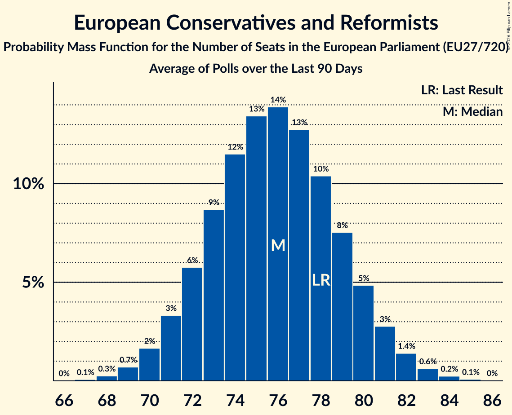

# European Conservatives and Reformists

Members registered from **15 countries**:

> BG, CY, CZ, DK, EE, FI, GR, HR, IT, LT, NL, PL, RO, SE, SK

## Seats

Last result: **78** seats (General Election of 26 May 2019)

Current median: **76** seats (-2 seats)

At least one member in **13 countries** have a median of 1 seat or more:

> CY, CZ, DK, FI, GR, HR, IT, LT, NL, PL, RO, SE, SK

### Confidence Intervals

| Party | Area | Last Result | Median | 80% Confidence Interval | 90% Confidence Interval | 95% Confidence Interval | 99% Confidence Interval |
|:-----:|:----:|:-----------:|:------:|:-----------------------:|:-----------------------:|:-----------------------:|:-----------------------:|
| European Conservatives and Reformists | EU | 78 | 76 | 72–80 | 71–81 | 70–82 | 69–83 |
| Fratelli d’Italia | IT | | 25 | 23–27 | 23–28 | 22–28 | 21–29 |
| Zjednoczona Prawica | PL | | 15 | 12–17 | 12–17 | 12–18 | 12–19 |
| Alianța pentru Unirea Românilor | RO | | 14 | 13–16 | 12–17 | 12–17 | 12–18 |
| Sverigedemokraterna | SE | | 5 | 4–5 | 4–5 | 4–5 | 4–6 |
| Občanská demokratická strana | CZ | | 4 | 3–4 | 3–5 | 3–5 | 3–5 |
| Juiste Antwoord 2021 | NL | | 3 | 3 | 3 | 3–4 | 2–4 |
| Perussuomalaiset | FI | | 2 | 2 | 2 | 2 | 2–3 |
| Ελληνική Λύση | GR | | 2 | 1–3 | 1–3 | 1–3 | 1–3 |
| Danmarksdemokraterne | DK | | 1 | 1–2 | 1–2 | 1–2 | 1–2 |
| Lietuvos valstiečių ir žaliųjų sąjunga | LT | | 1 | 1–2 | 1–2 | 1–2 | 1–2 |
| Most nezavisnih lista | HR | | 1 | 0–1 | 0–1 | 0–1 | 0–1 |
| Sloboda a Solidarita | SK | | 1 | 1–2 | 1–2 | 1–2 | 1–2 |
| Εθνικό Λαϊκό Μέτωπο | CY | | 1 | 1 | 1 | 1 | 1 |
| Dom i Nacionalno Okupljanje | HR | | 0 | 0 | 0 | 0 | 0 |
| Domovinski pokret | HR | | 0 | 0 | 0 | 0 | 0 |
| Eesti Rahvuslased ja Konservatiivid | EE | | 0 | 0 | 0 | 0 | 0 |
| Hrvatski suverenisti | HR | | 0 | 0 | 0 | 0 | 0 |
| Kresťanská únia | SK | | 0 | 0 | 0 | 0 | 0 |
| Lietuvos lenkų rinkimų akcija | LT | | 0 | 0 | 0 | 0 | 0 |
| NL Marija Selak Raspudić | HR | | 0 | 0 | 0 | 0 | 0 |
| Staatkundig Gereformeerde Partij | NL | | 0 | 0 | 0 | 0 | 0 |
| Има такъв народ | BG | | 0 | 0 | 0 | 0 | 0 |

### Probability Mass Function

The following table shows the probability mass function per seat for the [poll average](average-2026-02-28.html) for European Conservatives and Reformists.

| Number of Seats | Probability | Accumulated | Special Marks |
|:---------------:|:-----------:|:-----------:|:-------------:|
| 67 | 0.1% | 100% |  |
| 68 | 0.3% | 99.9% |  |
| 69 | 0.8% | 99.5% |  |
| 70 | 2% | 98.7% |  |
| 71 | 3% | 97% |  |
| 72 | 5% | 94% |  |
| 73 | 8% | 88% |  |
| 74 | 11% | 80% |  |
| 75 | 13% | 70% |  |
| 76 | 13% | 57% | Median |
| 77 | 13% | 43% |  |
| 78 | 11% | 31% | Last Result |
| 79 | 8% | 20% |  |
| 80 | 5% | 12% |  |
| 81 | 3% | 6% |  |
| 82 | 2% | 3% |  |
| 83 | 0.8% | 1.2% |  |
| 84 | 0.3% | 0.5% |  |
| 85 | 0.1% | 0.2% |  |
| 86 | 0% | 0% |  |

