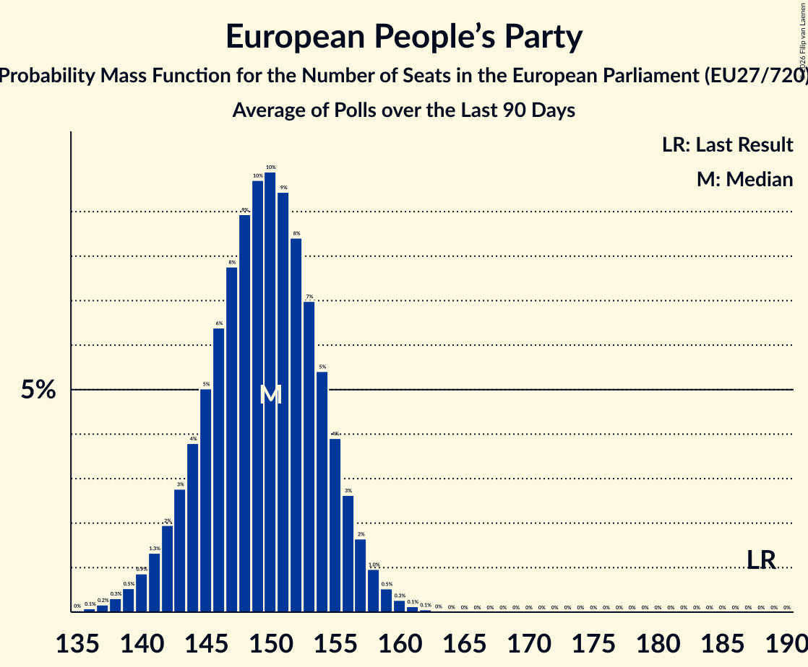

# European People’s Party

Members registered from **15 countries**:

> AT, DE, DK, EE, ES, FI, HR, IE, IT, LT, MT, NL, SE, SI, SK

## Seats

Last result: **188** seats (General Election of 26 May 2019)

Current median: **96** seats (-92 seats)

At least one member in **15 countries** have a median of 1 seat or more:

> AT, DE, DK, EE, ES, FI, HR, IE, IT, LT, MT, NL, SE, SI, SK

### Confidence Intervals

| Party | Area | Last Result | Median | 80% Confidence Interval | 90% Confidence Interval | 95% Confidence Interval | 99% Confidence Interval |
|:-----:|:----:|:-----------:|:------:|:-----------------------:|:-----------------------:|:-----------------------:|:-----------------------:|
| European People’s Party | EU | 188 | 96 | 91–101 | 89–102 | 88–103 | 86–105 |
| Partido Popular | ES | | 22 | 16–24 | 15–25 | 15–25 | 15–26 |
| Christlich Demokratische Union Deutschlands | DE | | 19 | 17–21 | 17–21 | 16–22 | 16–22 |
| Forza Italia | IT | | 6 | 5–8 | 5–8 | 5–9 | 4–9 |
| Christlich-Soziale Union in Bayern | DE | | 5 | 4–6 | 4–6 | 4–7 | 4–7 |
| Hrvatska demokratska zajednica | HR | | 5 | 4–5 | 4–5 | 4–6 | 4–6 |
| Christen-Democratisch Appèl | NL | | 4 | 3–4 | 3–5 | 3–5 | 3–5 |
| Moderata samlingspartiet | SE | | 4 | 4 | 4 | 4 | 3–5 |
| Slovenska demokratska stranka | SI | | 4 | 3–5 | 3–5 | 3–5 | 3–5 |
| Österreichische Volkspartei | AT | | 4 | 4–5 | 4–5 | 4–6 | 3–6 |
| Fine Gael | IE | | 3 | 3–4 | 3–4 | 3–4 | 2–5 |
| Kansallinen Kokoomus | FI | | 3 | 3 | 3–4 | 3–4 | 3–4 |
| Partit Nazzjonalista | MT | | 3 | 3 | 3 | 3 | 2–3 |
| Erakond Isamaa | EE | | 2 | 2–3 | 1–3 | 1–3 | 1–3 |
| Liberal Alliance | DK | | 2 | 1–2 | 1–2 | 1–2 | 1–2 |
| Tėvynės sąjunga–Lietuvos krikščionys demokratai | LT | | 2 | 2–3 | 2–3 | 2–3 | 2–3 |
| Demokrati | SI | | 1 | 0–2 | 0–2 | 0–2 | 0–2 |
| Demokrati | SK | | 1 | 0–1 | 0–1 | 0–1 | 0–1 |
| Det Konservative Folkeparti | DK | | 1 | 1 | 1 | 1 | 1 |
| Kresťanskodemokratické hnutie | SK | | 1 | 1 | 1–2 | 1–2 | 1–2 |
| Kristdemokraterna | SE | | 1 | 0–1 | 0–1 | 0–1 | 0–1 |
| Slovensko | SK | | 1 | 1–2 | 1–2 | 1–2 | 1–2 |
| 50Plus | NL | | 0 | 0–1 | 0–1 | 0–1 | 0–1 |
| BoerBurgerBeweging | NL | | 0 | 0 | 0 | 0 | 0 |
| ChristenUnie | NL | | 0 | 0 | 0 | 0 | 0 |
| Eesti 200 | EE | | 0 | 0 | 0 | 0 | 0 |
| Erakond Parempoolsed | EE | | 0 | 0 | 0–1 | 0–1 | 0–1 |
| Kristillisdemokraatit | FI | | 0 | 0 | 0 | 0 | 0 |
| Magyar Szövetség | SK | | 0 | 0 | 0 | 0–1 | 0–1 |
| Noi Moderati | IT | | 0 | 0 | 0 | 0 | 0 |
| Nova Slovenija–Krščanski demokrati | SI | | 0 | 0–1 | 0–1 | 0–1 | 0–1 |
| Slovenska ljudska stranka | SI | | 0 | 0 | 0 | 0 | 0 |
| Za ľudí | SK | | 0 | 0 | 0 | 0 | 0 |

### Probability Mass Function

The following table shows the probability mass function per seat for the [poll average](average-2026-02-28.html) for European People’s Party.

| Number of Seats | Probability | Accumulated | Special Marks |
|:---------------:|:-----------:|:-----------:|:-------------:|
| 83 | 0.1% | 100% |  |
| 84 | 0.1% | 99.9% |  |
| 85 | 0.3% | 99.8% |  |
| 86 | 0.5% | 99.5% |  |
| 87 | 0.9% | 99.0% |  |
| 88 | 1.4% | 98% |  |
| 89 | 2% | 97% |  |
| 90 | 3% | 95% |  |
| 91 | 3% | 92% |  |
| 92 | 4% | 89% |  |
| 93 | 6% | 84% |  |
| 94 | 8% | 79% |  |
| 95 | 10% | 71% |  |
| 96 | 11% | 61% | Median |
| 97 | 12% | 50% |  |
| 98 | 11% | 38% |  |
| 99 | 9% | 27% |  |
| 100 | 7% | 18% |  |
| 101 | 5% | 11% |  |
| 102 | 3% | 6% |  |
| 103 | 2% | 3% |  |
| 104 | 0.8% | 1.4% |  |
| 105 | 0.4% | 0.6% |  |
| 106 | 0.2% | 0.2% |  |
| 107 | 0.1% | 0.1% |  |
| 108 | 0% | 0% |  |
| 109 | 0% | 0% |  |
| 110 | 0% | 0% |  |
| 111 | 0% | 0% |  |
| 112 | 0% | 0% |  |
| 113 | 0% | 0% |  |
| 114 | 0% | 0% |  |
| 115 | 0% | 0% |  |
| 116 | 0% | 0% |  |
| 117 | 0% | 0% |  |
| 118 | 0% | 0% |  |
| 119 | 0% | 0% |  |
| 120 | 0% | 0% |  |
| 121 | 0% | 0% |  |
| 122 | 0% | 0% |  |
| 123 | 0% | 0% |  |
| 124 | 0% | 0% |  |
| 125 | 0% | 0% |  |
| 126 | 0% | 0% |  |
| 127 | 0% | 0% |  |
| 128 | 0% | 0% |  |
| 129 | 0% | 0% |  |
| 130 | 0% | 0% |  |
| 131 | 0% | 0% |  |
| 132 | 0% | 0% |  |
| 133 | 0% | 0% |  |
| 134 | 0% | 0% |  |
| 135 | 0% | 0% |  |
| 136 | 0% | 0% |  |
| 137 | 0% | 0% |  |
| 138 | 0% | 0% |  |
| 139 | 0% | 0% |  |
| 140 | 0% | 0% |  |
| 141 | 0% | 0% |  |
| 142 | 0% | 0% |  |
| 143 | 0% | 0% |  |
| 144 | 0% | 0% |  |
| 145 | 0% | 0% |  |
| 146 | 0% | 0% |  |
| 147 | 0% | 0% |  |
| 148 | 0% | 0% |  |
| 149 | 0% | 0% |  |
| 150 | 0% | 0% |  |
| 151 | 0% | 0% |  |
| 152 | 0% | 0% |  |
| 153 | 0% | 0% |  |
| 154 | 0% | 0% |  |
| 155 | 0% | 0% |  |
| 156 | 0% | 0% |  |
| 157 | 0% | 0% |  |
| 158 | 0% | 0% |  |
| 159 | 0% | 0% |  |
| 160 | 0% | 0% |  |
| 161 | 0% | 0% |  |
| 162 | 0% | 0% |  |
| 163 | 0% | 0% |  |
| 164 | 0% | 0% |  |
| 165 | 0% | 0% |  |
| 166 | 0% | 0% |  |
| 167 | 0% | 0% |  |
| 168 | 0% | 0% |  |
| 169 | 0% | 0% |  |
| 170 | 0% | 0% |  |
| 171 | 0% | 0% |  |
| 172 | 0% | 0% |  |
| 173 | 0% | 0% |  |
| 174 | 0% | 0% |  |
| 175 | 0% | 0% |  |
| 176 | 0% | 0% |  |
| 177 | 0% | 0% |  |
| 178 | 0% | 0% |  |
| 179 | 0% | 0% |  |
| 180 | 0% | 0% |  |
| 181 | 0% | 0% |  |
| 182 | 0% | 0% |  |
| 183 | 0% | 0% |  |
| 184 | 0% | 0% |  |
| 185 | 0% | 0% |  |
| 186 | 0% | 0% |  |
| 187 | 0% | 0% |  |
| 188 | 0% | 0% | Last Result |

