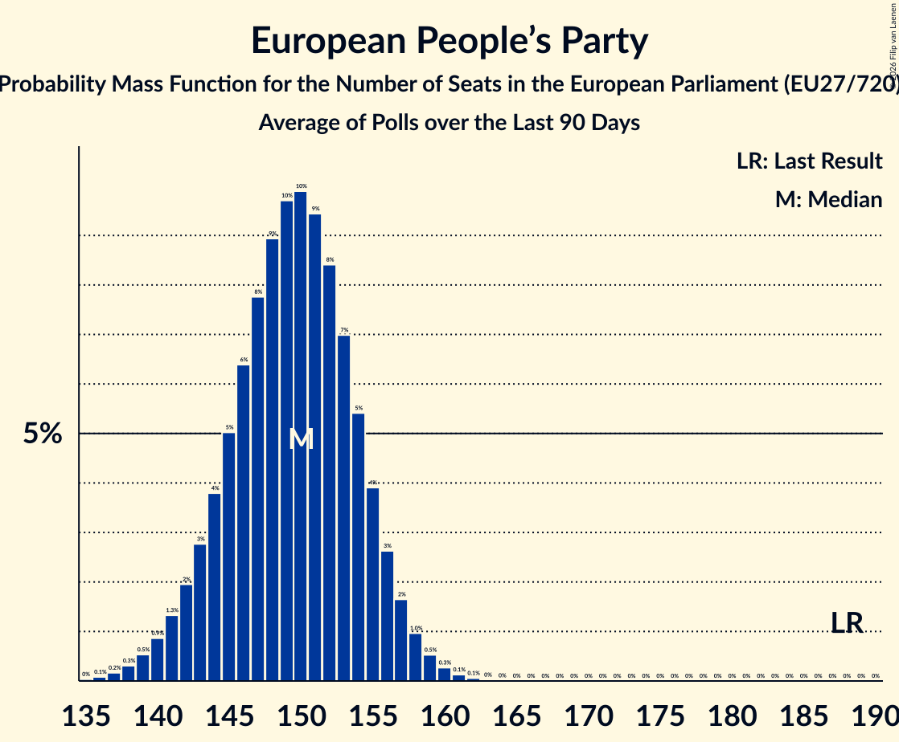

# European People’s Party

Members registered from **27 countries**:

> AT, BE, BG, CY, CZ, DE, DK, EE, ES, FI, FR, GR, HR, HU, IE, IT, LT, LU, LV, MT, NL, PL, PT, RO, SE, SI, SK

## Seats

Last result: **188** seats (General Election of 26 May 2019)

Current median: **171** seats (-17 seats)

At least one member in **27 countries** have a median of 1 seat or more:

> AT, BE, BG, CY, CZ, DE, DK, EE, ES, FI, FR, GR, HR, HU, IE, IT, LT, LU, LV, MT, NL, PL, PT, RO, SE, SI, SK

### Confidence Intervals

| Party | Area | Last Result | Median | 80% Confidence Interval | 90% Confidence Interval | 95% Confidence Interval | 99% Confidence Interval |
|:-----:|:----:|:-----------:|:------:|:-----------------------:|:-----------------------:|:-----------------------:|:-----------------------:|
| European People’s Party | EU | 188 | 171 | 165–177 | 163–179 | 161–180 | 158–183 |
| Partido Popular | ES | | 22 | 17–24 | 16–25 | 16–25 | 16–26 |
| Christlich Demokratische Union Deutschlands | DE | | 19 | 17–21 | 16–21 | 16–21 | 16–22 |
| Platforma Obywatelska | PL | | 19 | 18–21 | 17–21 | 17–21 | 16–22 |
| Tisztelet és Szabadság | HU | | 11 | 9–12 | 9–13 | 9–13 | 8–13 |
| Les Républicains | FR | | 8 | 5–11 | 5–12 | 5–12 | 0–13 |
| Aliança Democrática | PT | | 7 | 6–8 | 6–8 | 6–8 | 5–9 |
| Forza Italia | IT | | 7 | 6–8 | 5–8 | 5–8 | 5–9 |
| Νέα Δημοκρατία | GR | | 7 | 6–7 | 6–7 | 6–7 | 6–8 |
| Partidul Național Liberal | RO | | 6 | 5–7 | 5–7 | 4–8 | 4–8 |
| Christlich-Soziale Union in Bayern | DE | | 5 | 4–6 | 4–6 | 4–7 | 4–7 |
| Hrvatska demokratska zajednica | HR | | 5 | 4–6 | 4–6 | 4–6 | 4–6 |
| Christen-Democratisch Appèl | NL | | 4 | 3–4 | 3–4 | 3–4 | 3–5 |
| Moderata samlingspartiet | SE | | 4 | 4 | 4 | 4 | 3–5 |
| Slovenska demokratska stranka | SI | | 4 | 3–4 | 3–4 | 3–5 | 3–5 |
| Österreichische Volkspartei | AT | | 4 | 4–5 | 4–5 | 4–5 | 3–5 |
| Граждани за европейско развитие на България | BG | | 4 | 4–5 | 3–5 | 3–5 | 3–5 |
| Fine Gael | IE | | 3 | 3–4 | 3–4 | 3–4 | 2–5 |
| Kansallinen Kokoomus | FI | | 3 | 3 | 3–4 | 3–4 | 3–4 |
| Partit Nazzjonalista | MT | | 3 | 3 | 3 | 3 | 2–3 |
| Starostové a nezávislí | CZ | | 3 | 3–4 | 3–4 | 3–4 | 3–4 |
| Christen-Democratisch en Vlaams | BE-VLG | | 2 | 2 | 1–2 | 1–2 | 1–2 |
| Chrëschtlech-Sozial Vollekspartei | LU | | 2 | 2 | 2 | 2 | 2 |
| Erakond Isamaa | EE | | 2 | 2 | 2 | 2 | 2 |
| Liberal Alliance | DK | | 2 | 2 | 1–2 | 1–2 | 1–2 |
| Tėvynės sąjunga–Lietuvos krikščionys demokratai | LT | | 2 | 2–3 | 2–3 | 2–3 | 2–3 |
| Demokrati | SI | | 1 | 0–2 | 0–2 | 0–2 | 0–2 |
| Demokrati | SK | | 1 | 1 | 0–1 | 0–1 | 0–1 |
| Det Konservative Folkeparti | DK | | 1 | 1 | 1 | 1 | 1 |
| Jaunā VIENOTĪBA | LV | | 1 | 1–2 | 1–2 | 1–2 | 1–2 |
| Kresťanskodemokratické hnutie | SK | | 1 | 1 | 1–2 | 1–2 | 0–2 |
| Kristdemokraterna | SE | | 1 | 0–1 | 0–1 | 0–1 | 0–1 |
| Latvijas Reģionu Apvienība | LV | | 1 | 1 | 1 | 1 | 1 |
| Slovensko | SK | | 1 | 1–2 | 1–2 | 1–2 | 1–2 |
| Δημοκρατικός Συναγερμός | CY | | 1 | 1 | 1–2 | 1–2 | 1–2 |
| 50Plus | NL | | 0 | 0 | 0 | 0 | 0 |
| BoerBurgerBeweging | NL | | 0 | 0 | 0 | 0 | 0 |
| ChristenUnie | NL | | 0 | 0 | 0 | 0–1 | 0–1 |
| Eesti 200 | EE | | 0 | 0 | 0 | 0 | 0 |
| Erakond Parempoolsed | EE | | 0 | 0 | 0 | 0 | 0–1 |
| Inicjatywa Polska | PL | | 0 | 0 | 0 | 0 | 0–1 |
| Jaunā konservatīvā partija | LV | | 0 | 0 | 0 | 0 | 0 |
| Kristillisdemokraatit | FI | | 0 | 0 | 0 | 0 | 0 |
| Křesťanská a demokratická unie–Československá strana lidová | CZ | | 0 | 0 | 0 | 0–1 | 0–1 |
| Magyar Szövetség | SK | | 0 | 0–1 | 0–1 | 0–1 | 0–1 |
| Noi Moderati | IT | | 0 | 0 | 0 | 0 | 0 |
| Nova Slovenija–Krščanski demokrati | SI | | 0 | 0–1 | 0–1 | 0–1 | 0–1 |
| Polskie Stronnictwo Ludowe | PL | | 0 | 0–3 | 0–3 | 0–3 | 0–4 |
| Slovenska ljudska stranka | SI | | 0 | 0 | 0 | 0 | 0 |
| TOP 09 | CZ | | 0 | 0–1 | 0–1 | 0–1 | 0–1 |
| Uniunea Democrată Maghiară din România | RO | | 0 | 0–2 | 0–2 | 0–2 | 0–2 |
| Za ľudí | SK | | 0 | 0 | 0 | 0 | 0 |
| Да, България! | BG | | 0 | 0–1 | 0–1 | 0–1 | 0–1 |
| Демократична България | BG | | 0 | 0–1 | 0–1 | 0–1 | 0–1 |

### Probability Mass Function

The following table shows the probability mass function per seat for the [poll average](average-2026-02-28.html) for European People’s Party.

| Number of Seats | Probability | Accumulated | Special Marks |
|:---------------:|:-----------:|:-----------:|:-------------:|
| 154 | 0% | 100% |  |
| 155 | 0.1% | 99.9% |  |
| 156 | 0.1% | 99.9% |  |
| 157 | 0.2% | 99.8% |  |
| 158 | 0.3% | 99.6% |  |
| 159 | 0.5% | 99.3% |  |
| 160 | 0.7% | 98.9% |  |
| 161 | 1.0% | 98% |  |
| 162 | 1.5% | 97% |  |
| 163 | 2% | 96% |  |
| 164 | 3% | 94% |  |
| 165 | 4% | 91% |  |
| 166 | 5% | 87% |  |
| 167 | 6% | 83% |  |
| 168 | 7% | 77% |  |
| 169 | 7% | 70% |  |
| 170 | 8% | 63% |  |
| 171 | 8% | 55% | Median |
| 172 | 8% | 47% |  |
| 173 | 8% | 38% |  |
| 174 | 7% | 31% |  |
| 175 | 6% | 24% |  |
| 176 | 5% | 18% |  |
| 177 | 4% | 13% |  |
| 178 | 3% | 9% |  |
| 179 | 2% | 6% |  |
| 180 | 1.4% | 4% |  |
| 181 | 0.9% | 2% |  |
| 182 | 0.6% | 1.2% |  |
| 183 | 0.3% | 0.7% |  |
| 184 | 0.2% | 0.3% |  |
| 185 | 0.1% | 0.2% |  |
| 186 | 0% | 0.1% |  |
| 187 | 0% | 0% |  |
| 188 | 0% | 0% | Last Result |

