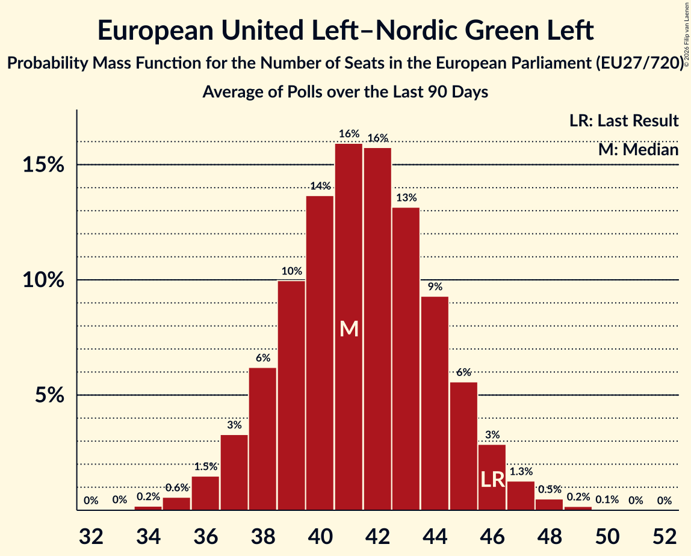

# European United Left–Nordic Green Left

Members registered from **11 countries**:

> AT, DE, DK, EE, ES, FI, IE, IT, NL, SE, SI

## Seats

Last result: **46** seats (General Election of 26 May 2019)

Current median: **38** seats (-8 seats)

At least one member in **7 countries** have a median of 1 seat or more:

> DE, DK, ES, FI, IE, IT, SE

### Confidence Intervals

| Party | Area | Last Result | Median | 80% Confidence Interval | 90% Confidence Interval | 95% Confidence Interval | 99% Confidence Interval |
|:-----:|:----:|:-----------:|:------:|:-----------------------:|:-----------------------:|:-----------------------:|:-----------------------:|
| European United Left–Nordic Green Left | EU | 46 | 38 | 35–41 | 34–42 | 34–42 | 32–44 |
| Die Linke | DE | | 10 | 9–11 | 8–11 | 8–11 | 8–12 |
| Movimento 5 Stelle | IT | | 10 | 9–12 | 9–12 | 9–13 | 8–13 |
| Sinn Féin | IE | | 5 | 3–5 | 2–5 | 2–5 | 2–6 |
| Podemos | ES | | 2 | 2–3 | 2–4 | 2–4 | 1–4 |
| Sinistra Italiana | IT | | 2 | 1–3 | 1–3 | 1–3 | 1–4 |
| Vasemmistoliitto | FI | | 2 | 1–2 | 1–2 | 1–2 | 1–2 |
| Vänsterpartiet | SE | | 2 | 2 | 1–2 | 1–2 | 1–2 |
| Enhedslisten–De Rød-Grønne | DK | | 1 | 1 | 1 | 1 | 1 |
| Euskal Herria Bildu | ES | | 1 | 0–1 | 0–1 | 0–1 | 0–1 |
| Movimiento Sumar–Izquierda Unida | ES | | 1 | 1–2 | 1–2 | 1–2 | 0–3 |
| Partei Mensch Umwelt Tierschutz | DE | | 1 | 1–2 | 1–2 | 1–2 | 0–3 |
| Eesti Vasakliit | EE | | 0 | 0 | 0 | 0 | 0 |
| Independents 4 Change | IE | | 0 | 0 | 0 | 0 | 0–1 |
| Independents | IE | | 0 | 0–1 | 0–1 | 0–1 | 0–1 |
| Kommunistische Partei Österreichs | AT | | 0 | 0–1 | 0–1 | 0–1 | 0–1 |
| Levica | SI | | 0 | 0 | 0–1 | 0–1 | 0–1 |
| Partij voor de Dieren | NL | | 0 | 0 | 0–1 | 0–1 | 0–1 |
| Potere al Popolo | IT | | 0 | 0 | 0 | 0 | 0 |
| Socialistische Partij | NL | | 0 | 0–1 | 0–1 | 0–1 | 0–1 |
| Solidarity–People Before Profit | IE | | 0 | 0–1 | 0–1 | 0–1 | 0–1 |

### Probability Mass Function

The following table shows the probability mass function per seat for the [poll average](average-2026-02-28.html) for European United Left–Nordic Green Left.

| Number of Seats | Probability | Accumulated | Special Marks |
|:---------------:|:-----------:|:-----------:|:-------------:|
| 31 | 0.1% | 100% |  |
| 32 | 0.5% | 99.8% |  |
| 33 | 2% | 99.3% |  |
| 34 | 4% | 98% |  |
| 35 | 8% | 93% |  |
| 36 | 13% | 85% |  |
| 37 | 17% | 73% |  |
| 38 | 18% | 56% | Median |
| 39 | 15% | 38% |  |
| 40 | 11% | 23% |  |
| 41 | 6% | 12% |  |
| 42 | 3% | 5% |  |
| 43 | 1.3% | 2% |  |
| 44 | 0.4% | 0.6% |  |
| 45 | 0.1% | 0.2% |  |
| 46 | 0% | 0% | Last Result |

