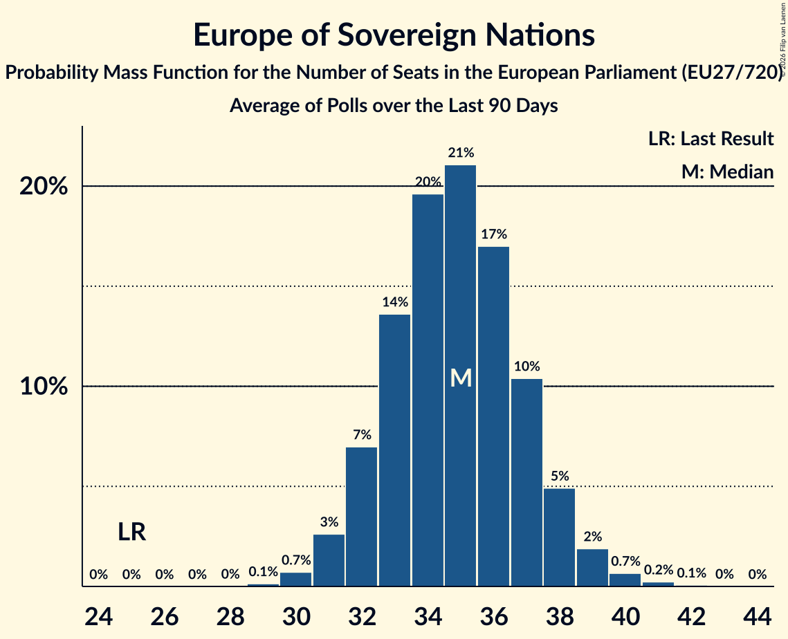

# Europe of Sovereign Nations

Members registered from **1 countries**:

> DE

## Seats

Last result: **25** seats (General Election of 26 May 2019)

Current median: **25** seats (0 seats)

At least one member in **1 countries** have a median of 1 seat or more:

> DE

### Confidence Intervals

| Party | Area | Last Result | Median | 80% Confidence Interval | 90% Confidence Interval | 95% Confidence Interval | 99% Confidence Interval |
|:-----:|:----:|:-----------:|:------:|:-----------------------:|:-----------------------:|:-----------------------:|:-----------------------:|
| Europe of Sovereign Nations | EU | 25 | 25 | 22–26 | 22–27 | 22–28 | 21–28 |
| Alternative für Deutschland | DE | | 25 | 22–26 | 22–27 | 22–28 | 21–28 |

### Probability Mass Function

The following table shows the probability mass function per seat for the [poll average](average-2026-02-28.html) for Europe of Sovereign Nations.

| Number of Seats | Probability | Accumulated | Special Marks |
|:---------------:|:-----------:|:-----------:|:-------------:|
| 20 | 0.1% | 100% |  |
| 21 | 2% | 99.9% |  |
| 22 | 10% | 98% |  |
| 23 | 16% | 88% |  |
| 24 | 19% | 72% |  |
| 25 | 28% | 52% | Last Result, Median |
| 26 | 14% | 24% |  |
| 27 | 7% | 10% |  |
| 28 | 3% | 3% |  |
| 29 | 0.1% | 0.1% |  |
| 30 | 0% | 0% |  |

