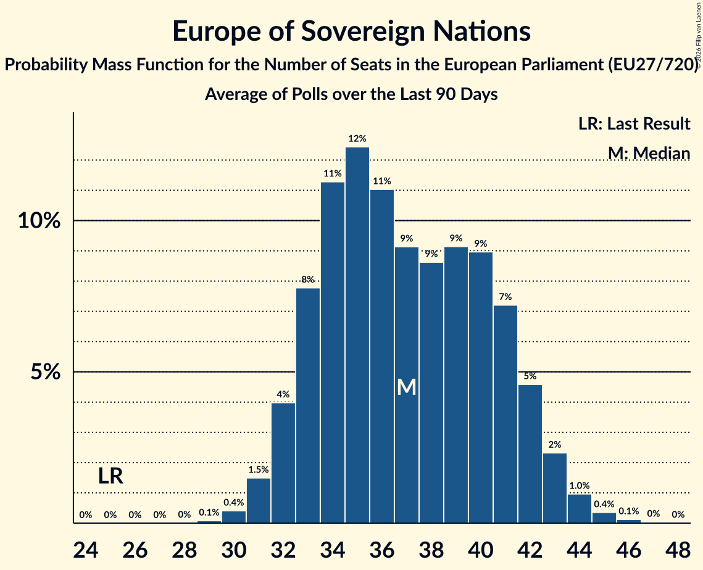

# Europe of Sovereign Nations

Members registered from **7 countries**:

> BG, CZ, DE, HU, NL, PL, SK

## Seats

Last result: **25** seats (General Election of 26 May 2019)

Current median: **35** seats (+10 seats)

At least one member in **7 countries** have a median of 1 seat or more:

> BG, CZ, DE, HU, NL, PL, SK

### Confidence Intervals

| Party | Area | Last Result | Median | 80% Confidence Interval | 90% Confidence Interval | 95% Confidence Interval | 99% Confidence Interval |
|:-----:|:----:|:-----------:|:------:|:-----------------------:|:-----------------------:|:-----------------------:|:-----------------------:|
| Europe of Sovereign Nations | EU | 25 | 35 | 33–38 | 32–38 | 31–39 | 30–41 |
| Alternative für Deutschland | DE | | 23 | 22–25 | 21–26 | 21–26 | 20–28 |
| Nowa Nadzieja | PL | | 4 | 4–5 | 3–6 | 3–6 | 3–6 |
| Forum voor Democratie | NL | | 2 | 2–3 | 2–3 | 2–4 | 2–4 |
| REPUBLIKA | SK | | 2 | 1–2 | 1–2 | 1–2 | 1–3 |
| Mi Hazánk Mozgalom | HU | | 1 | 0–1 | 0–1 | 0–1 | 0–2 |
| Svoboda a přímá demokracie | CZ | | 1 | 1–2 | 1–2 | 1–2 | 0–2 |
| Възраждане | BG | | 1 | 0–2 | 0–2 | 0–2 | 0–2 |

### Probability Mass Function

The following table shows the probability mass function per seat for the [poll average](average-2026-02-28.html) for Europe of Sovereign Nations.

| Number of Seats | Probability | Accumulated | Special Marks |
|:---------------:|:-----------:|:-----------:|:-------------:|
| 25 | 0% | 100% | Last Result |
| 26 | 0% | 100% |  |
| 27 | 0% | 100% |  |
| 28 | 0% | 100% |  |
| 29 | 0.1% | 100% |  |
| 30 | 0.7% | 99.8% |  |
| 31 | 3% | 99.1% |  |
| 32 | 6% | 97% |  |
| 33 | 12% | 90% |  |
| 34 | 18% | 78% |  |
| 35 | 20% | 60% | Median |
| 36 | 17% | 39% |  |
| 37 | 12% | 22% |  |
| 38 | 6% | 11% |  |
| 39 | 3% | 4% |  |
| 40 | 1.1% | 2% |  |
| 41 | 0.4% | 0.5% |  |
| 42 | 0.1% | 0.1% |  |
| 43 | 0% | 0% |  |

