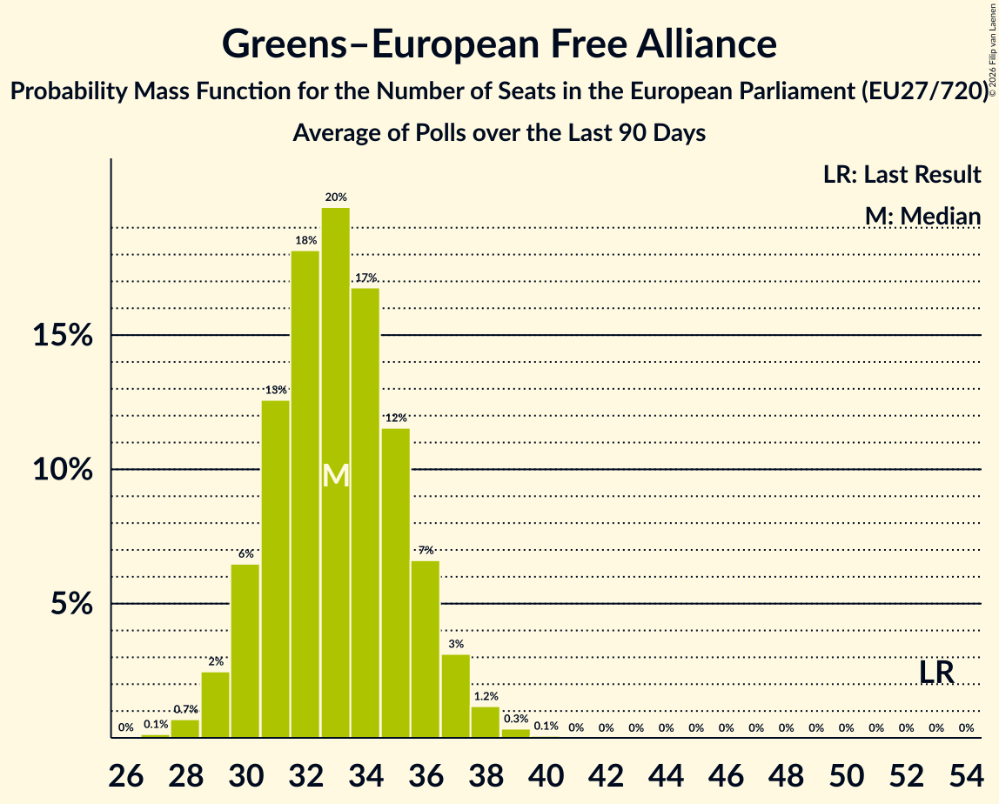

# Greens–European Free Alliance

Members registered from **7 countries**:

> AT, DE, DK, EE, ES, FI, SE

## Seats

Last result: **53** seats (General Election of 26 May 2019)

Current median: **23** seats (-30 seats)

At least one member in **6 countries** have a median of 1 seat or more:

> AT, DE, DK, ES, FI, SE

### Confidence Intervals

| Party | Area | Last Result | Median | 80% Confidence Interval | 90% Confidence Interval | 95% Confidence Interval | 99% Confidence Interval |
|:-----:|:----:|:-----------:|:------:|:-----------------------:|:-----------------------:|:-----------------------:|:-----------------------:|
| Greens–European Free Alliance | EU | 53 | 23 | 21–25 | 20–25 | 20–26 | 19–27 |
| Bündnis 90/Die Grünen | DE | | 12 | 11–13 | 10–14 | 10–14 | 9–15 |
| Movimiento Sumar–Catalunya en Comú–Més–Compromís–Más País–Chunta | ES | | 3 | 2–3 | 2–4 | 2–4 | 2–4 |
| Die Grünen–Die Grüne Alternative | AT | | 2 | 2 | 1–2 | 1–3 | 1–3 |
| Socialistisk Folkeparti | DK | | 2 | 2–3 | 2–3 | 1–3 | 1–3 |
| Esquerra Republicana de Catalunya–Catalunya Sí | ES | | 1 | 1 | 1–2 | 0–2 | 0–2 |
| Miljöpartiet de gröna | SE | | 1 | 1–2 | 1–2 | 1–2 | 1–2 |
| Vihreä liitto | FI | | 1 | 1 | 1 | 1 | 1 |
| Volt Europa | DE | | 1 | 0–1 | 0–1 | 0–2 | 0–2 |
| Alternativet | DK | | 0 | 0 | 0 | 0 | 0 |
| Bloque Nacionalista Galego–Nós Candidatura Galega | ES | | 0 | 0 | 0 | 0–1 | 0–1 |
| Erakond Eestimaa Rohelised | EE | | 0 | 0 | 0 | 0 | 0 |

### Probability Mass Function

The following table shows the probability mass function per seat for the [poll average](average-2026-02-28.html) for Greens–European Free Alliance.

| Number of Seats | Probability | Accumulated | Special Marks |
|:---------------:|:-----------:|:-----------:|:-------------:|
| 18 | 0.2% | 100% |  |
| 19 | 1.3% | 99.7% |  |
| 20 | 6% | 98% |  |
| 21 | 15% | 92% |  |
| 22 | 25% | 77% |  |
| 23 | 25% | 53% | Median |
| 24 | 16% | 28% |  |
| 25 | 8% | 12% |  |
| 26 | 3% | 4% |  |
| 27 | 0.8% | 0.9% |  |
| 28 | 0.1% | 0.2% |  |
| 29 | 0% | 0% |  |
| 30 | 0% | 0% |  |
| 31 | 0% | 0% |  |
| 32 | 0% | 0% |  |
| 33 | 0% | 0% |  |
| 34 | 0% | 0% |  |
| 35 | 0% | 0% |  |
| 36 | 0% | 0% |  |
| 37 | 0% | 0% |  |
| 38 | 0% | 0% |  |
| 39 | 0% | 0% |  |
| 40 | 0% | 0% |  |
| 41 | 0% | 0% |  |
| 42 | 0% | 0% |  |
| 43 | 0% | 0% |  |
| 44 | 0% | 0% |  |
| 45 | 0% | 0% |  |
| 46 | 0% | 0% |  |
| 47 | 0% | 0% |  |
| 48 | 0% | 0% |  |
| 49 | 0% | 0% |  |
| 50 | 0% | 0% |  |
| 51 | 0% | 0% |  |
| 52 | 0% | 0% |  |
| 53 | 0% | 0% | Last Result |

