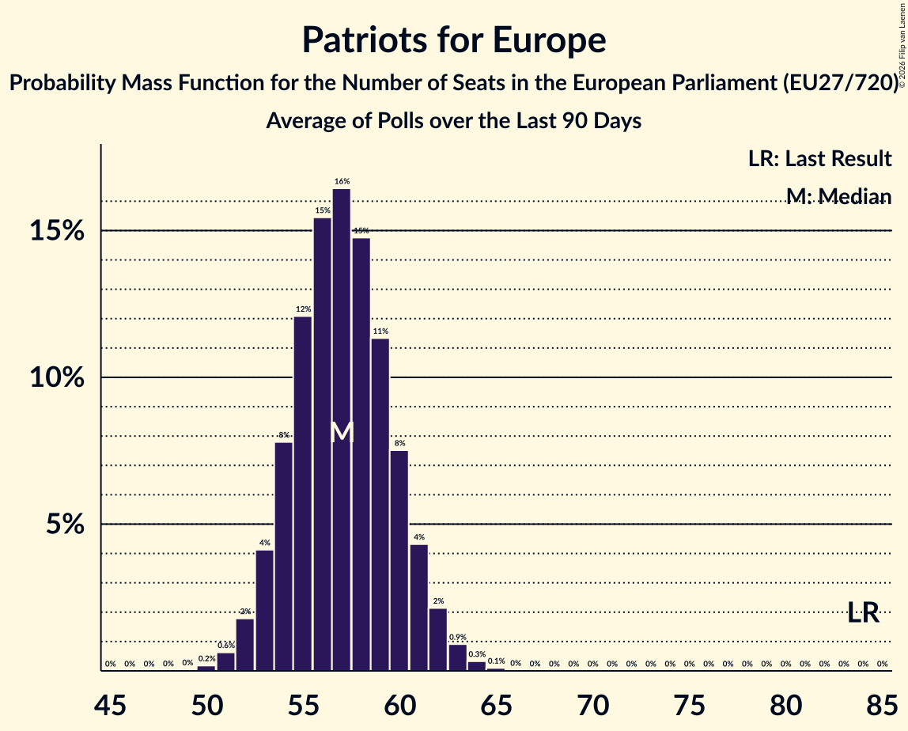

# Patriots for Europe

Members registered from **12 countries**:

> AT, CZ, DK, EE, ES, GR, HU, IT, NL, PL, SI, SK

## Seats

Last result: **84** seats (General Election of 26 May 2019)

Current median: **57** seats (-27 seats)

At least one member in **10 countries** have a median of 1 seat or more:

> AT, CZ, DK, EE, ES, GR, HU, IT, NL, PL

### Confidence Intervals

| Party | Area | Last Result | Median | 80% Confidence Interval | 90% Confidence Interval | 95% Confidence Interval | 99% Confidence Interval |
|:-----:|:----:|:-----------:|:------:|:-----------------------:|:-----------------------:|:-----------------------:|:-----------------------:|
| Patriots for Europe | EU | 84 | 57 | 54–59 | 53–60 | 52–61 | 51–62 |
| Vox | ES | | 13 | 11–14 | 11–15 | 10–15 | 10–15 |
| ANO 2011 | CZ | | 10 | 9–11 | 8–11 | 8–11 | 8–11 |
| Fidesz–Kereszténydemokrata Néppárt | HU | | 9 | 8–11 | 8–11 | 8–11 | 8–11 |
| Freiheitliche Partei Österreichs | AT | | 8 | 7–9 | 7–9 | 7–9 | 7–9 |
| Lega Nord | IT | | 6 | 5–7 | 5–7 | 4–8 | 4–8 |
| Partij voor de Vrijheid | NL | | 4 | 4–5 | 4–5 | 4–5 | 3–5 |
| Ruch Narodowy | PL | | 3 | 3–4 | 2–4 | 2–4 | 2–5 |
| Dansk Folkeparti | DK | | 1 | 1 | 1 | 1 | 0–1 |
| Eesti Konservatiivne Rahvaerakond | EE | | 1 | 1 | 1 | 1 | 1 |
| Φωνή Λογικής | GR | | 1 | 0–1 | 0–1 | 0–1 | 0–1 |
| Motoristé sobě | CZ | | 0 | 0–1 | 0–1 | 0–1 | 0–2 |
| Přísaha | CZ | | 0 | 0 | 0 | 0 | 0 |
| SME RODINA | SK | | 0 | 0 | 0 | 0 | 0 |
| Slovenska nacionalna stranka | SI | | 0 | 0 | 0 | 0 | 0 |
| Slovenská národná strana | SK | | 0 | 0–1 | 0–1 | 0–1 | 0–1 |

### Probability Mass Function

The following table shows the probability mass function per seat for the [poll average](average-2026-02-28.html) for Patriots for Europe.

| Number of Seats | Probability | Accumulated | Special Marks |
|:---------------:|:-----------:|:-----------:|:-------------:|
| 50 | 0.1% | 100% |  |
| 51 | 0.6% | 99.8% |  |
| 52 | 2% | 99.3% |  |
| 53 | 5% | 97% |  |
| 54 | 9% | 93% |  |
| 55 | 15% | 84% |  |
| 56 | 18% | 69% |  |
| 57 | 18% | 51% | Median |
| 58 | 15% | 33% |  |
| 59 | 10% | 18% |  |
| 60 | 5% | 8% |  |
| 61 | 2% | 3% |  |
| 62 | 0.8% | 1.1% |  |
| 63 | 0.2% | 0.3% |  |
| 64 | 0.1% | 0.1% |  |
| 65 | 0% | 0% |  |
| 66 | 0% | 0% |  |
| 67 | 0% | 0% |  |
| 68 | 0% | 0% |  |
| 69 | 0% | 0% |  |
| 70 | 0% | 0% |  |
| 71 | 0% | 0% |  |
| 72 | 0% | 0% |  |
| 73 | 0% | 0% |  |
| 74 | 0% | 0% |  |
| 75 | 0% | 0% |  |
| 76 | 0% | 0% |  |
| 77 | 0% | 0% |  |
| 78 | 0% | 0% |  |
| 79 | 0% | 0% |  |
| 80 | 0% | 0% |  |
| 81 | 0% | 0% |  |
| 82 | 0% | 0% |  |
| 83 | 0% | 0% |  |
| 84 | 0% | 0% | Last Result |

