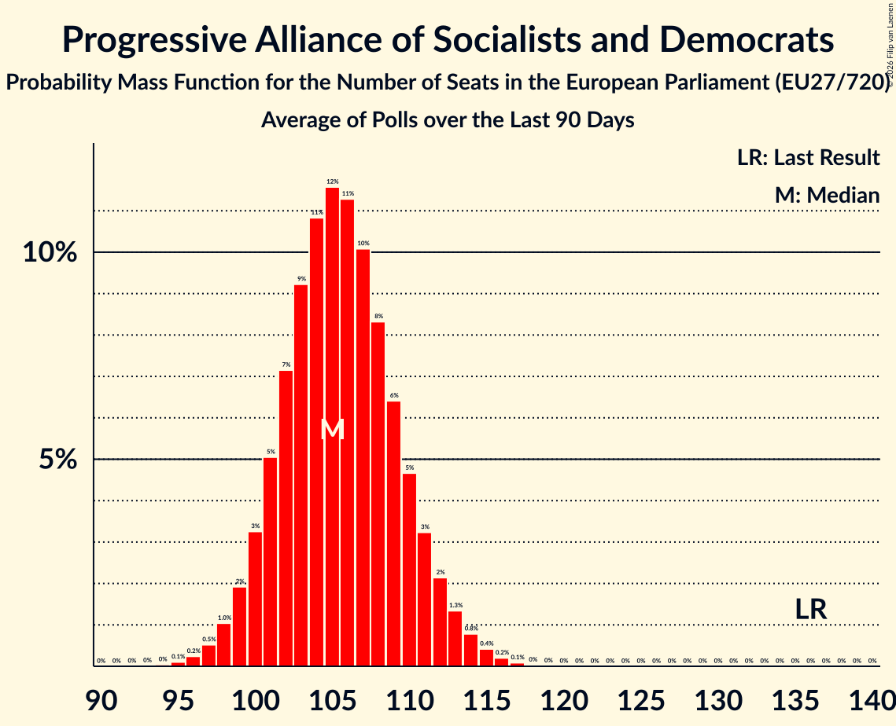

# Progressive Alliance of Socialists and Democrats

Members registered from **12 countries**:

> AT, DE, DK, EE, ES, FI, HR, IE, IT, NL, SE, SI

## Seats

Last result: **136** seats (General Election of 26 May 2019)

Current median: **81** seats (-55 seats)

At least one member in **12 countries** have a median of 1 seat or more:

> AT, DE, DK, EE, ES, FI, HR, IE, IT, NL, SE, SI

### Confidence Intervals

| Party | Area | Last Result | Median | 80% Confidence Interval | 90% Confidence Interval | 95% Confidence Interval | 99% Confidence Interval |
|:-----:|:----:|:-----------:|:------:|:-----------------------:|:-----------------------:|:-----------------------:|:-----------------------:|
| Progressive Alliance of Socialists and Democrats | EU | 136 | 81 | 78–86 | 77–87 | 76–88 | 74–91 |
| Partido Socialista Obrero Español | ES | | 19 | 17–22 | 17–24 | 16–24 | 16–24 |
| Partito Democratico | IT | | 19 | 17–20 | 16–21 | 16–21 | 15–22 |
| Sozialdemokratische Partei Deutschlands | DE | | 14 | 13–16 | 13–17 | 12–17 | 12–17 |
| Sveriges socialdemokratiska arbetareparti | SE | | 7 | 7–8 | 7–8 | 7–8 | 7–8 |
| Suomen Sosialidemokraattinen Puolue | FI | | 5 | 4–5 | 4–5 | 4–5 | 4–5 |
| Socialdemokraterne | DK | | 4 | 3–4 | 3–4 | 3–5 | 3–5 |
| Socijaldemokratska partija Hrvatske | HR | | 4 | 3–4 | 3–4 | 3–4 | 3–5 |
| Sozialdemokratische Partei Österreichs | AT | | 4 | 3–4 | 3–5 | 3–5 | 3–5 |
| Partij van de Arbeid | NL | | 2 | 2–3 | 2–3 | 2–3 | 2–3 |
| Social Democrats | IE | | 2 | 1–3 | 0–3 | 0–3 | 0–3 |
| Socialni demokrati | SI | | 1 | 0–1 | 0–1 | 0–1 | 0–1 |
| Sotsiaaldemokraatlik Erakond | EE | | 1 | 1 | 1 | 1 | 1 |
| Labour Party | IE | | 0 | 0–1 | 0–1 | 0–1 | 0–1 |

### Probability Mass Function

The following table shows the probability mass function per seat for the [poll average](average-2026-02-28.html) for Progressive Alliance of Socialists and Democrats.

| Number of Seats | Probability | Accumulated | Special Marks |
|:---------------:|:-----------:|:-----------:|:-------------:|
| 72 | 0.1% | 100% |  |
| 73 | 0.2% | 99.9% |  |
| 74 | 0.6% | 99.7% |  |
| 75 | 1.3% | 99.1% |  |
| 76 | 3% | 98% |  |
| 77 | 5% | 95% |  |
| 78 | 7% | 90% |  |
| 79 | 10% | 83% |  |
| 80 | 12% | 73% |  |
| 81 | 13% | 61% | Median |
| 82 | 12% | 49% |  |
| 83 | 11% | 37% |  |
| 84 | 8% | 26% |  |
| 85 | 6% | 18% |  |
| 86 | 4% | 12% |  |
| 87 | 3% | 7% |  |
| 88 | 2% | 4% |  |
| 89 | 1.2% | 2% |  |
| 90 | 0.7% | 1.3% |  |
| 91 | 0.4% | 0.6% |  |
| 92 | 0.2% | 0.2% |  |
| 93 | 0.1% | 0.1% |  |
| 94 | 0% | 0% |  |
| 95 | 0% | 0% |  |
| 96 | 0% | 0% |  |
| 97 | 0% | 0% |  |
| 98 | 0% | 0% |  |
| 99 | 0% | 0% |  |
| 100 | 0% | 0% |  |
| 101 | 0% | 0% |  |
| 102 | 0% | 0% |  |
| 103 | 0% | 0% |  |
| 104 | 0% | 0% |  |
| 105 | 0% | 0% |  |
| 106 | 0% | 0% |  |
| 107 | 0% | 0% |  |
| 108 | 0% | 0% |  |
| 109 | 0% | 0% |  |
| 110 | 0% | 0% |  |
| 111 | 0% | 0% |  |
| 112 | 0% | 0% |  |
| 113 | 0% | 0% |  |
| 114 | 0% | 0% |  |
| 115 | 0% | 0% |  |
| 116 | 0% | 0% |  |
| 117 | 0% | 0% |  |
| 118 | 0% | 0% |  |
| 119 | 0% | 0% |  |
| 120 | 0% | 0% |  |
| 121 | 0% | 0% |  |
| 122 | 0% | 0% |  |
| 123 | 0% | 0% |  |
| 124 | 0% | 0% |  |
| 125 | 0% | 0% |  |
| 126 | 0% | 0% |  |
| 127 | 0% | 0% |  |
| 128 | 0% | 0% |  |
| 129 | 0% | 0% |  |
| 130 | 0% | 0% |  |
| 131 | 0% | 0% |  |
| 132 | 0% | 0% |  |
| 133 | 0% | 0% |  |
| 134 | 0% | 0% |  |
| 135 | 0% | 0% |  |
| 136 | 0% | 0% | Last Result |

