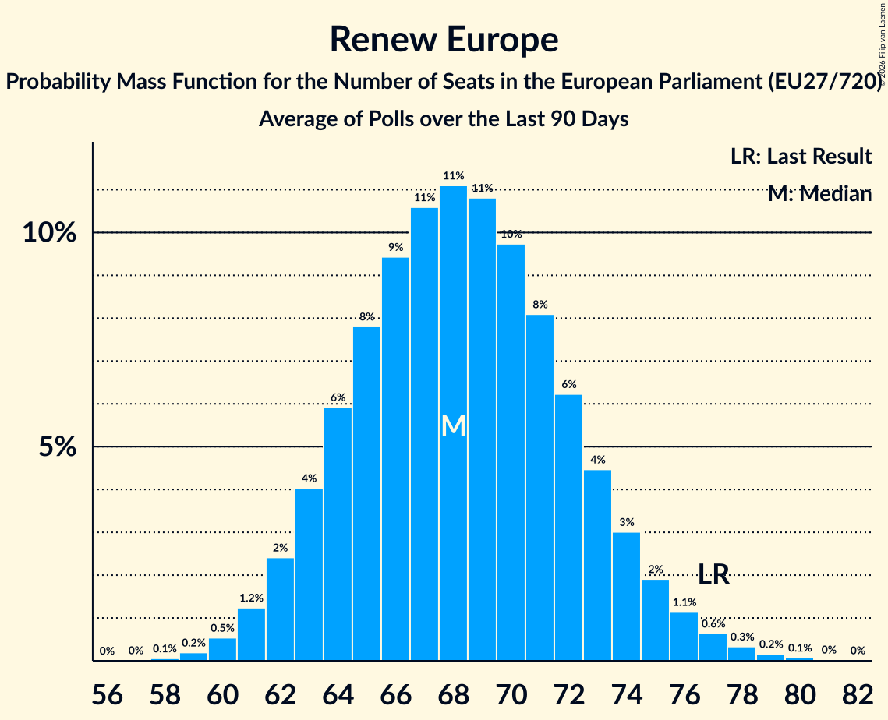

# Renew Europe

Members registered from **19 countries**:

> AT, BG, CY, DE, DK, EE, ES, FI, GR, HR, IE, IT, LT, NL, PL, RO, SE, SI, SK

## Seats

Last result: **77** seats (General Election of 26 May 2019)

Current median: **46** seats (-31 seats)

At least one member in **15 countries** have a median of 1 seat or more:

> AT, BG, CY, DE, DK, EE, FI, IE, LT, NL, PL, RO, SE, SI, SK

### Confidence Intervals

| Party | Area | Last Result | Median | 80% Confidence Interval | 90% Confidence Interval | 95% Confidence Interval | 99% Confidence Interval |
|:-----:|:----:|:-----------:|:------:|:-----------------------:|:-----------------------:|:-----------------------:|:-----------------------:|
| Renew Europe | EU | 77 | 46 | 43–50 | 43–51 | 42–52 | 41–54 |
| Democraten 66 | NL | | 6 | 6–7 | 6–7 | 6–7 | 6–8 |
| Volkspartij voor Vrijheid en Democratie | NL | | 5 | 4–6 | 4–6 | 4–6 | 3–6 |
| Progresívne Slovensko | SK | | 4 | 3–4 | 3–4 | 3–5 | 3–5 |
| Uniunea Salvați România | RO | | 4 | 3–4 | 3–5 | 3–5 | 3–5 |
| Fianna Fáil | IE | | 3 | 2–4 | 1–4 | 1–4 | 1–5 |
| Freie Demokratische Partei | DE | | 3 | 3–4 | 2–5 | 2–5 | 2–5 |
| Gibanje Svoboda | SI | | 3 | 2–4 | 2–4 | 2–4 | 2–4 |
| Eesti Keskerakond | EE | | 2 | 2 | 2 | 1–2 | 1–2 |
| Freie Wähler | DE | | 2 | 1–3 | 1–3 | 1–3 | 1–3 |
| Suomen Keskusta | FI | | 2 | 2–3 | 2–3 | 2–3 | 2–3 |
| Venstre | DK | | 2 | 1–2 | 1–2 | 1–2 | 1–2 |
| Продължаваме промяната | BG | | 2 | 2–3 | 2–3 | 1–3 | 1–3 |
| .Nowoczesna | PL | | 1 | 0–1 | 0–1 | 0–1 | 0–2 |
| Centerpartiet | SE | | 1 | 1 | 1 | 0–1 | 0–1 |
| Eesti Reformierakond | EE | | 1 | 1 | 1 | 1 | 1 |
| Liberalų Sąjūdis | LT | | 1 | 1 | 1–2 | 1–2 | 1–2 |
| Moderaterne | DK | | 1 | 0–1 | 0–1 | 0–1 | 0–1 |
| NEOS–Das Neue Österreich und Liberales Forum | AT | | 1 | 1–2 | 1–2 | 1–2 | 1–2 |
| Αξιοπρέπεια Λογοδοσία Μεταρρύθμιση Ανάπτυξη | CY | | 1 | 1 | 1 | 1 | 1 |
| Azione | IT | | 0 | 0–4 | 0–4 | 0–4 | 0–5 |
| Centar | HR | | 0 | 0 | 0 | 0 | 0 |
| Coalición Canaria–Partido Nacionalista Canario | ES | | 0 | 0 | 0 | 0 | 0 |
| Euzko Alderdi Jeltzalea/Partido Nacionalista Vasco | ES | | 0 | 0 | 0–1 | 0–1 | 0–1 |
| Fokus na bitno | HR | | 0 | 0 | 0 | 0 | 0 |
| Hrvatska narodna stranka–liberalni demokrati | HR | | 0 | 0 | 0 | 0 | 0 |
| Hrvatska socijalno-liberalna stranka | HR | | 0 | 0 | 0 | 0 | 0 |
| Independent Ireland | IE | | 0 | 0–1 | 0–1 | 0–1 | 0–1 |
| Independents | IE | | 0 | 0 | 0 | 0–1 | 0–1 |
| Istarski demokratski sabor | HR | | 0 | 0 | 0 | 0 | 0 |
| Italia Viva | IT | | 0 | 0 | 0 | 0 | 0–3 |
| Laisvės partija | LT | | 0 | 0–1 | 0–1 | 0–1 | 0–1 |
| Liberalerna | SE | | 0 | 0 | 0 | 0 | 0 |
| Partito Liberaldemocratico | IT | | 0 | 0 | 0 | 0 | 0 |
| Più Europa | IT | | 0 | 0 | 0 | 0 | 0 |
| Polska 2050 | PL | | 0 | 0 | 0 | 0–3 | 0–3 |
| Radikale Venstre | DK | | 0 | 0–1 | 0–1 | 0–1 | 0–1 |
| Reînnoim Proiectul European al României | RO | | 0 | 0 | 0 | 0 | 0 |
| Stranka generacij–Zeleni Slovenije | SI | | 0 | 0 | 0 | 0 | 0 |
| Svenska folkpartiet i Finland | FI | | 0 | 0 | 0 | 0 | 0–1 |
| Δημοκράτες–Προοδευτικό Κέντρο | GR | | 0 | 0–1 | 0–1 | 0–1 | 0–1 |
| Δημοκρατική Παράταξη | CY | | 0 | 0 | 0 | 0 | 0 |
| Алианс за права и свободи | BG | | 0 | 0 | 0 | 0 | 0 |

### Probability Mass Function

The following table shows the probability mass function per seat for the [poll average](average-2026-02-28.html) for Renew Europe.

| Number of Seats | Probability | Accumulated | Special Marks |
|:---------------:|:-----------:|:-----------:|:-------------:|
| 39 | 0.1% | 100% |  |
| 40 | 0.4% | 99.9% |  |
| 41 | 1.2% | 99.5% |  |
| 42 | 3% | 98% |  |
| 43 | 6% | 95% |  |
| 44 | 10% | 89% |  |
| 45 | 14% | 79% |  |
| 46 | 16% | 65% | Median |
| 47 | 15% | 49% |  |
| 48 | 12% | 35% |  |
| 49 | 9% | 23% |  |
| 50 | 6% | 14% |  |
| 51 | 4% | 8% |  |
| 52 | 2% | 4% |  |
| 53 | 1.2% | 2% |  |
| 54 | 0.6% | 1.0% |  |
| 55 | 0.3% | 0.4% |  |
| 56 | 0.1% | 0.1% |  |
| 57 | 0% | 0% |  |
| 58 | 0% | 0% |  |
| 59 | 0% | 0% |  |
| 60 | 0% | 0% |  |
| 61 | 0% | 0% |  |
| 62 | 0% | 0% |  |
| 63 | 0% | 0% |  |
| 64 | 0% | 0% |  |
| 65 | 0% | 0% |  |
| 66 | 0% | 0% |  |
| 67 | 0% | 0% |  |
| 68 | 0% | 0% |  |
| 69 | 0% | 0% |  |
| 70 | 0% | 0% |  |
| 71 | 0% | 0% |  |
| 72 | 0% | 0% |  |
| 73 | 0% | 0% |  |
| 74 | 0% | 0% |  |
| 75 | 0% | 0% |  |
| 76 | 0% | 0% |  |
| 77 | 0% | 0% | Last Result |

