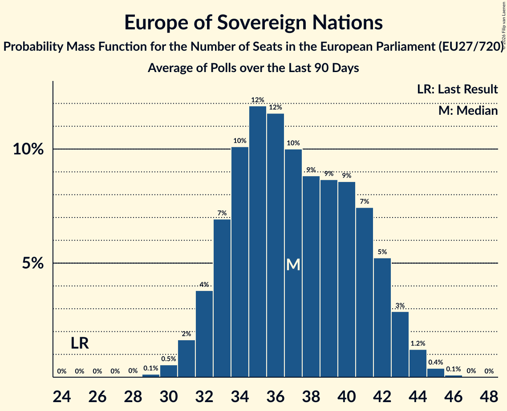

# Europe of Sovereign Nations

Members registered from **8 countries**:

> BG, CZ, DE, FR, HU, NL, PL, SK

## Seats

Last result: **25** seats (General Election of 26 May 2019)

Current median: **37** seats (+12 seats)

At least one member in **7 countries** have a median of 1 seat or more:

> BG, CZ, DE, HU, NL, PL, SK

### Confidence Intervals

| Party | Area | Last Result | Median | 80% Confidence Interval | 90% Confidence Interval | 95% Confidence Interval | 99% Confidence Interval |
|:-----:|:----:|:-----------:|:------:|:-----------------------:|:-----------------------:|:-----------------------:|:-----------------------:|
| Europe of Sovereign Nations | EU | 25 | 37 | 33–41 | 32–42 | 31–43 | 30–45 |
| Alternative für Deutschland | DE | | 23 | 21–25 | 21–26 | 20–26 | 20–27 |
| Nowa Nadzieja | PL | | 4 | 3–5 | 3–6 | 3–6 | 3–7 |
| Forum voor Democratie | NL | | 2 | 2–3 | 2–4 | 2–4 | 2–4 |
| REPUBLIKA | SK | | 2 | 1–3 | 1–3 | 1–3 | 1–3 |
| Mi Hazánk Mozgalom | HU | | 1 | 0–1 | 0–1 | 0–2 | 0–2 |
| Svoboda a přímá demokracie | CZ | | 1 | 1–2 | 1–2 | 1–2 | 0–2 |
| Възраждане | BG | | 1 | 0–2 | 0–2 | 0–2 | 0–2 |
| Reconquête | FR | | 0 | 0–5 | 0–5 | 0–5 | 0–5 |

### Probability Mass Function

The following table shows the probability mass function per seat for the [poll average](average-2026-03-31.html) for Europe of Sovereign Nations.

| Number of Seats | Probability | Accumulated | Special Marks |
|:---------------:|:-----------:|:-----------:|:-------------:|
| 25 | 0% | 100% | Last Result |
| 26 | 0% | 100% |  |
| 27 | 0% | 100% |  |
| 28 | 0% | 100% |  |
| 29 | 0.2% | 100% |  |
| 30 | 0.6% | 99.8% |  |
| 31 | 2% | 99.2% |  |
| 32 | 4% | 97% |  |
| 33 | 7% | 93% |  |
| 34 | 10% | 86% |  |
| 35 | 13% | 76% |  |
| 36 | 13% | 63% |  |
| 37 | 12% | 50% | Median |
| 38 | 10% | 39% |  |
| 39 | 8% | 29% |  |
| 40 | 7% | 21% |  |
| 41 | 6% | 14% |  |
| 42 | 4% | 9% |  |
| 43 | 3% | 5% |  |
| 44 | 1.4% | 2% |  |
| 45 | 0.6% | 0.9% |  |
| 46 | 0.2% | 0.3% |  |
| 47 | 0.1% | 0.1% |  |
| 48 | 0% | 0% |  |

