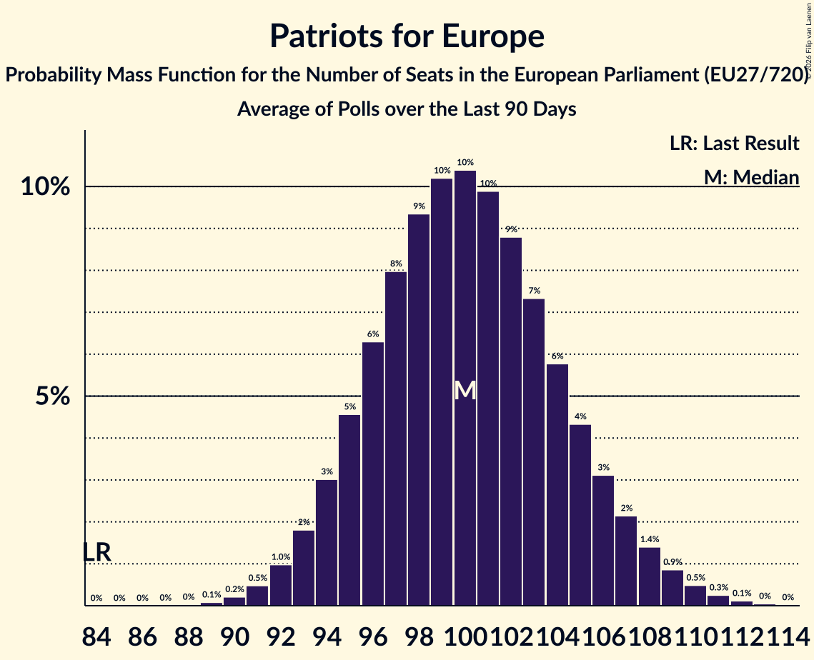

# Patriots for Europe

Members registered from **16 countries**:

> AT, BE, CZ, DK, EE, ES, FR, GR, HU, IT, LV, NL, PL, PT, SI, SK

## Seats

Last result: **84** seats (General Election of 26 May 2019)

Current median: **100** seats (+16 seats)

At least one member in **14 countries** have a median of 1 seat or more:

> AT, BE, CZ, DK, EE, ES, FR, GR, HU, IT, LV, NL, PL, PT

### Confidence Intervals

| Party | Area | Last Result | Median | 80% Confidence Interval | 90% Confidence Interval | 95% Confidence Interval | 99% Confidence Interval |
|:-----:|:----:|:-----------:|:------:|:-----------------------:|:-----------------------:|:-----------------------:|:-----------------------:|
| Patriots for Europe | EU | 84 | 100 | 95–105 | 94–107 | 93–108 | 91–110 |
| Rassemblement national | FR | | 32 | 29–36 | 28–38 | 27–39 | 26–39 |
| Vox | ES | | 13 | 12–15 | 12–15 | 11–15 | 10–16 |
| ANO 2011 | CZ | | 10 | 9–11 | 8–11 | 8–11 | 8–11 |
| Fidesz–Kereszténydemokrata Néppárt | HU | | 9 | 8–11 | 8–12 | 8–12 | 8–12 |
| Freiheitliche Partei Österreichs | AT | | 8 | 8–9 | 8–9 | 7–9 | 7–9 |
| Lega Nord | IT | | 6 | 5–7 | 4–7 | 4–8 | 4–8 |
| Chega | PT | | 5 | 5–6 | 5–6 | 5–6 | 4–7 |
| Partij voor de Vrijheid | NL | | 5 | 4–6 | 4–6 | 4–6 | 3–6 |
| Ruch Narodowy | PL | | 3 | 2–4 | 2–4 | 2–4 | 2–5 |
| Vlaams Belang | BE-VLG | | 3 | 3–4 | 3–4 | 3–4 | 3–4 |
| Latvija pirmajā vietā | LV | | 2 | 1–2 | 1–2 | 1–2 | 1–2 |
| Dansk Folkeparti | DK | | 1 | 1 | 1–2 | 1–2 | 1–2 |
| Eesti Konservatiivne Rahvaerakond | EE | | 1 | 1 | 1 | 1 | 0–1 |
| Φωνή Λογικής | GR | | 1 | 0–1 | 0–1 | 0–1 | 0–1 |
| Chez Nous | BE-FRC | | 0 | 0 | 0 | 0 | 0 |
| Motoristé sobě | CZ | | 0 | 0–1 | 0–1 | 0–1 | 0–2 |
| Přísaha | CZ | | 0 | 0 | 0 | 0 | 0 |
| SME RODINA | SK | | 0 | 0 | 0 | 0 | 0 |
| Slovenska nacionalna stranka | SI | | 0 | 0 | 0 | 0 | 0 |
| Slovenská národná strana | SK | | 0 | 0–1 | 0–1 | 0–1 | 0–1 |

### Probability Mass Function

The following table shows the probability mass function per seat for the [poll average](average-2026-03-31.html) for Patriots for Europe.

| Number of Seats | Probability | Accumulated | Special Marks |
|:---------------:|:-----------:|:-----------:|:-------------:|
| 84 | 0% | 100% | Last Result |
| 85 | 0% | 100% |  |
| 86 | 0% | 100% |  |
| 87 | 0% | 100% |  |
| 88 | 0% | 100% |  |
| 89 | 0.1% | 100% |  |
| 90 | 0.2% | 99.9% |  |
| 91 | 0.5% | 99.7% |  |
| 92 | 1.0% | 99.2% |  |
| 93 | 2% | 98% |  |
| 94 | 3% | 96% |  |
| 95 | 5% | 93% |  |
| 96 | 6% | 89% |  |
| 97 | 8% | 83% |  |
| 98 | 9% | 75% |  |
| 99 | 10% | 65% |  |
| 100 | 10% | 55% | Median |
| 101 | 10% | 45% |  |
| 102 | 9% | 35% |  |
| 103 | 7% | 26% |  |
| 104 | 6% | 19% |  |
| 105 | 4% | 13% |  |
| 106 | 3% | 8% |  |
| 107 | 2% | 5% |  |
| 108 | 1.4% | 3% |  |
| 109 | 0.9% | 2% |  |
| 110 | 0.5% | 0.9% |  |
| 111 | 0.3% | 0.4% |  |
| 112 | 0.1% | 0.2% |  |
| 113 | 0% | 0.1% |  |
| 114 | 0% | 0% |  |

