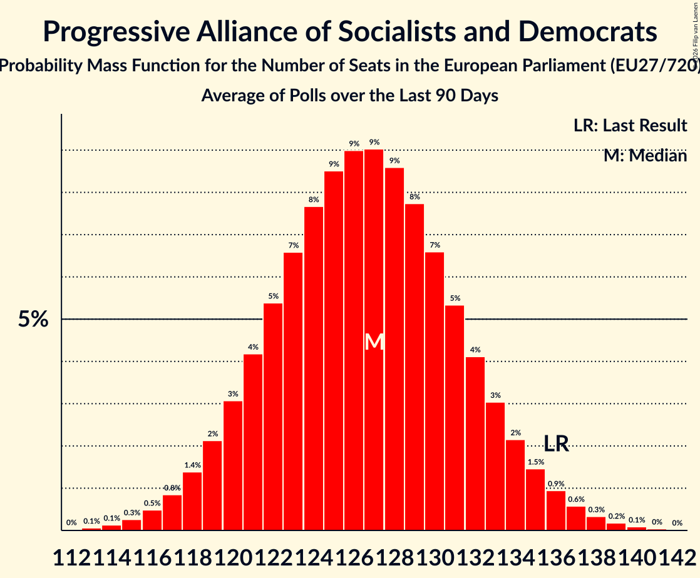

# Progressive Alliance of Socialists and Democrats

Members registered from **26 countries**:

> AT, BE, BG, CY, CZ, DE, DK, EE, ES, FI, FR, GR, HR, HU, IE, IT, LT, LU, LV, MT, NL, PL, PT, RO, SE, SI

## Seats

Last result: **136** seats (General Election of 26 May 2019)

Current median: **126** seats (-10 seats)

At least one member in **22 countries** have a median of 1 seat or more:

> AT, BE, CY, DE, DK, EE, ES, FI, FR, GR, HR, IE, IT, LT, LU, MT, NL, PL, PT, RO, SE, SI

### Confidence Intervals

| Party | Area | Last Result | Median | 80% Confidence Interval | 90% Confidence Interval | 95% Confidence Interval | 99% Confidence Interval |
|:-----:|:----:|:-----------:|:------:|:-----------------------:|:-----------------------:|:-----------------------:|:-----------------------:|
| Progressive Alliance of Socialists and Democrats | EU | 136 | 126 | 120–131 | 118–133 | 117–134 | 114–137 |
| Partito Democratico | IT | | 19 | 17–20 | 16–21 | 16–21 | 15–22 |
| Partido Socialista Obrero Español | ES | | 18 | 17–23 | 17–23 | 16–23 | 15–23 |
| Sozialdemokratische Partei Deutschlands | DE | | 14 | 12–16 | 11–16 | 11–17 | 10–18 |
| Parti socialiste–Place Publique | FR | | 11 | 7–13 | 6–13 | 6–14 | 6–14 |
| Partidul Social Democrat | RO | | 8 | 7–9 | 7–10 | 7–10 | 7–10 |
| Sveriges socialdemokratiska arbetareparti | SE | | 7 | 7–8 | 7–8 | 7–8 | 7–9 |
| Partido Socialista | PT | | 5 | 5–7 | 5–7 | 5–7 | 4–8 |
| Suomen Sosialidemokraattinen Puolue | FI | | 5 | 4–5 | 4–5 | 4–5 | 4–5 |
| Nowa Lewica | PL | | 4 | 2–5 | 0–5 | 0–6 | 0–6 |
| Socialdemokraterne | DK | | 4 | 4 | 4 | 3–4 | 3–4 |
| Socijaldemokratska partija Hrvatske | HR | | 4 | 3–4 | 3–4 | 3–4 | 3–4 |
| Sozialdemokratische Partei Österreichs | AT | | 4 | 3–4 | 3–4 | 3–4 | 3–5 |
| Partij van de Arbeid | NL | | 3 | 3 | 2–4 | 2–4 | 2–4 |
| Partit Laburista | MT | | 3 | 3 | 3 | 3 | 3–4 |
| Κίνημα Αλλαγής | GR | | 3 | 2–3 | 2–3 | 2–4 | 2–4 |
| Lietuvos socialdemokratų partija | LT | | 2 | 1–2 | 1–2 | 1–2 | 1–3 |
| Nemuno aušra | LT | | 2 | 1–2 | 1–2 | 1–2 | 1–2 |
| Parti Socialiste | BE-FRC | | 2 | 2–3 | 2–3 | 2–3 | 2–3 |
| Social Democrats | IE | | 2 | 1–3 | 0–3 | 0–3 | 0–3 |
| Vooruit | BE-VLG | | 2 | 1–2 | 1–2 | 1–2 | 1–2 |
| Lëtzebuerger Sozialistesch Aarbechterpartei | LU | | 1 | 1–2 | 1–2 | 1–2 | 1–2 |
| Socialni demokrati | SI | | 1 | 0–1 | 0–1 | 0–1 | 0–1 |
| Sotsiaaldemokraatlik Erakond | EE | | 1 | 1 | 1 | 1 | 1 |
| Δημοκρατικό Κόμμα | CY | | 1 | 0–1 | 0–1 | 0–1 | 0–1 |
| Demokratikus Koalíció | HU | | 0 | 0–1 | 0–1 | 0–1 | 0–1 |
| Labour Party | IE | | 0 | 0–1 | 0–1 | 0–1 | 0–1 |
| Sociální demokracie | CZ | | 0 | 0 | 0 | 0 | 0 |
| Sociāldemokrātiskā partija “Saskaņa” | LV | | 0 | 0 | 0 | 0 | 0 |
| Κίνημα Σοσιαλδημοκρατών | CY | | 0 | 0 | 0 | 0 | 0 |
| БСП – обединена левица | BG | | 0 | 0 | 0 | 0 | 0–1 |

### Probability Mass Function

The following table shows the probability mass function per seat for the [poll average](average-2026-03-31.html) for Progressive Alliance of Socialists and Democrats.

| Number of Seats | Probability | Accumulated | Special Marks |
|:---------------:|:-----------:|:-----------:|:-------------:|
| 111 | 0% | 100% |  |
| 112 | 0.1% | 99.9% |  |
| 113 | 0.2% | 99.8% |  |
| 114 | 0.3% | 99.7% |  |
| 115 | 0.6% | 99.3% |  |
| 116 | 0.9% | 98.8% |  |
| 117 | 1.4% | 98% |  |
| 118 | 2% | 96% |  |
| 119 | 3% | 94% |  |
| 120 | 4% | 91% |  |
| 121 | 5% | 87% |  |
| 122 | 6% | 82% |  |
| 123 | 7% | 76% |  |
| 124 | 8% | 69% |  |
| 125 | 9% | 60% |  |
| 126 | 9% | 52% | Median |
| 127 | 9% | 43% |  |
| 128 | 8% | 34% |  |
| 129 | 7% | 27% |  |
| 130 | 6% | 20% |  |
| 131 | 4% | 14% |  |
| 132 | 3% | 10% |  |
| 133 | 2% | 6% |  |
| 134 | 2% | 4% |  |
| 135 | 1.0% | 2% |  |
| 136 | 0.6% | 1.3% | Last Result |
| 137 | 0.3% | 0.7% |  |
| 138 | 0.2% | 0.3% |  |
| 139 | 0.1% | 0.2% |  |
| 140 | 0% | 0.1% |  |
| 141 | 0% | 0% |  |

