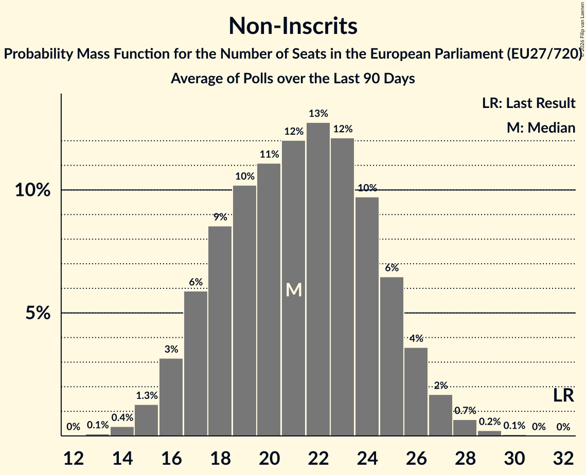

# Non-Inscrits

Members registered from **16 countries**:

> BG, CY, CZ, DE, DK, ES, FI, GR, HR, IT, LT, LV, PL, RO, SI, SK

## Seats

Last result: **32** seats (General Election of 26 May 2019)

Current median: **22** seats (-10 seats)

At least one member in **8 countries** have a median of 1 seat or more:

> BG, DE, ES, GR, IT, LT, PL, SK

### Confidence Intervals

| Party | Area | Last Result | Median | 80% Confidence Interval | 90% Confidence Interval | 95% Confidence Interval | 99% Confidence Interval |
|:-----:|:----:|:-----------:|:------:|:-----------------------:|:-----------------------:|:-----------------------:|:-----------------------:|
| Non-Inscrits | EU | 32 | 22 | 18–25 | 17–26 | 16–27 | 15–28 |
| Konfederacja Korony Polskiej | PL | | 5 | 4–6 | 4–6 | 3–6 | 3–6 |
| Futuro Nazionale | IT | | 4 | 0–5 | 0–5 | 0–5 | 0–6 |
| SMER–sociálna demokracia | SK | | 4 | 3–4 | 3–4 | 3–4 | 3–4 |
| Bündnis Sahra Wagenknecht | DE | | 3 | 2–4 | 2–5 | 1–5 | 1–6 |
| Κομμουνιστικό Κόμμα Ελλάδας | GR | | 2 | 2 | 2 | 2 | 1–2 |
| Darbo Partija | LT | | 1 | 0–1 | 0–1 | 0–1 | 0–1 |
| Die PARTEI | DE | | 1 | 0–1 | 0–1 | 0–1 | 0–1 |
| HLAS–sociálna demokracia | SK | | 1 | 1–2 | 1–2 | 1–2 | 1–2 |
| Se Acabó La Fiesta | ES | | 1 | 0–1 | 0–2 | 0–2 | 0–2 |
| Πλεύση Ελευθερίας | GR | | 1 | 1 | 1 | 1–2 | 1–2 |
| Движение за права и свободи – Ново начало | BG | | 1 | 0–1 | 0–2 | 0–2 | 0–2 |
| Borgernes Parti | DK | | 0 | 0 | 0 | 0 | 0 |
| Democrazia Sovrana e Popolare | IT | | 0 | 0 | 0 | 0 | 0 |
| Junts per Catalunya | ES | | 0 | 0–1 | 0–1 | 0–2 | 0–2 |
| Komunistická strana Čech a Moravy–Spojení demokraté - Sdružení nezávislých–Stačilo! | CZ | | 0 | 0 | 0 | 0 | 0 |
| Kotleba–Ľudová strana Naše Slovensko | SK | | 0 | 0 | 0 | 0 | 0 |
| Latvijas Krievu savienība | LV | | 0 | 0 | 0 | 0 | 0 |
| Liike Nyt | FI | | 0 | 0 | 0 | 0 | 0 |
| Partidul Oamenilor Tineri | RO | | 0 | 0 | 0 | 0 | 0 |
| Partidul S.O.S. România | RO | | 0 | 0–2 | 0–2 | 0–2 | 0–3 |
| Pravo i Pravda | HR | | 0 | 0 | 0 | 0 | 0 |
| Resni.ca | SI | | 0 | 0–1 | 0–1 | 0–1 | 0–1 |
| Stabilitātei! | LV | | 0 | 0 | 0 | 0 | 0 |
| Strana svobodných občanů | CZ | | 0 | 0 | 0 | 0 | 0 |
| Άμεσης Δημοκρατίας | CY | | 0 | 0 | 0 | 0 | 0 |
| Δημοκρατικό Πατριωτικό Κίνημα ΝΙΚΗ | GR | | 0 | 0 | 0 | 0 | 0 |

### Probability Mass Function

The following table shows the probability mass function per seat for the [poll average](average-2026-06-30.html) for Non-Inscrits.

| Number of Seats | Probability | Accumulated | Special Marks |
|:---------------:|:-----------:|:-----------:|:-------------:|
| 14 | 0.1% | 100% |  |
| 15 | 0.7% | 99.8% |  |
| 16 | 2% | 99.2% |  |
| 17 | 5% | 97% |  |
| 18 | 7% | 93% |  |
| 19 | 9% | 85% |  |
| 20 | 10% | 76% |  |
| 21 | 12% | 66% |  |
| 22 | 13% | 54% | Median |
| 23 | 13% | 40% |  |
| 24 | 11% | 27% |  |
| 25 | 8% | 16% |  |
| 26 | 4% | 8% |  |
| 27 | 2% | 3% |  |
| 28 | 0.9% | 1.3% |  |
| 29 | 0.3% | 0.4% |  |
| 30 | 0.1% | 0.1% |  |
| 31 | 0% | 0% |  |
| 32 | 0% | 0% | Last Result |

