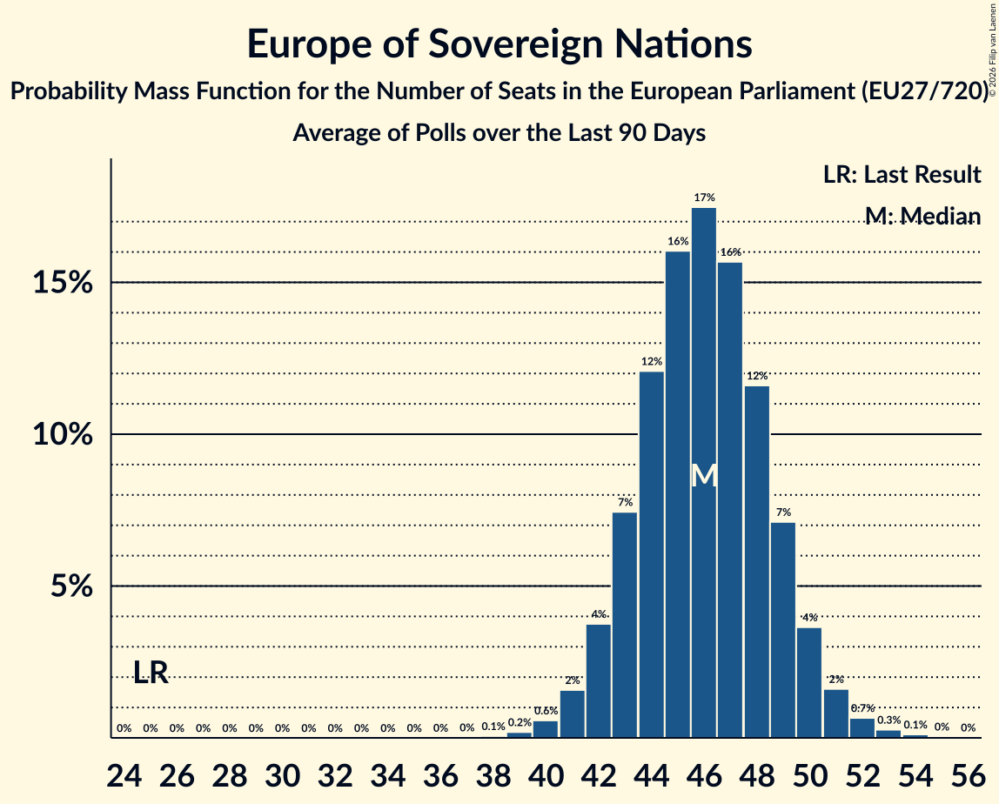

# Europe of Sovereign Nations

Members registered from **10 countries**:

> BG, CZ, DE, FR, HU, IT, LT, NL, PL, SK

## Seats

Last result: **25** seats (General Election of 26 May 2019)

Current median: **46** seats (+21 seats)

At least one member in **7 countries** have a median of 1 seat or more:

> CZ, DE, HU, IT, NL, PL, SK

### Confidence Intervals

| Party | Area | Last Result | Median | 80% Confidence Interval | 90% Confidence Interval | 95% Confidence Interval | 99% Confidence Interval |
|:-----:|:----:|:-----------:|:------:|:-----------------------:|:-----------------------:|:-----------------------:|:-----------------------:|
| Europe of Sovereign Nations | EU | 25 | 46 | 43–49 | 42–50 | 42–51 | 40–52 |
| Alternative für Deutschland | DE | | 27 | 25–28 | 25–29 | 24–29 | 22–30 |
| Futuro Nazionale | IT | | 6 | 5–7 | 5–7 | 5–8 | 5–8 |
| Nowa Nadzieja | PL | | 5 | 4–6 | 3–6 | 3–6 | 2–7 |
| Forum voor Democratie | NL | | 3 | 2–5 | 2–5 | 2–5 | 2–5 |
| REPUBLIKA | SK | | 2 | 1–3 | 1–3 | 1–3 | 1–3 |
| Svoboda a přímá demokracie | CZ | | 2 | 1–2 | 1–2 | 1–2 | 1–2 |
| Mi Hazánk Mozgalom | HU | | 1 | 1–2 | 1–2 | 0–2 | 0–2 |
| Reconquête | FR | | 0 | 0 | 0 | 0 | 0–4 |
| Tautos ir teisingumo sąjunga (centristai, tautininkai) | LT | | 0 | 0 | 0 | 0 | 0 |
| Възраждане | BG | | 0 | 0 | 0–1 | 0–1 | 0–1 |

### Probability Mass Function

The following table shows the probability mass function per seat for the [poll average](average-2026-08-31.html) for Europe of Sovereign Nations.

| Number of Seats | Probability | Accumulated | Special Marks |
|:---------------:|:-----------:|:-----------:|:-------------:|
| 25 | 0% | 100% | Last Result |
| 26 | 0% | 100% |  |
| 27 | 0% | 100% |  |
| 28 | 0% | 100% |  |
| 29 | 0% | 100% |  |
| 30 | 0% | 100% |  |
| 31 | 0% | 100% |  |
| 32 | 0% | 100% |  |
| 33 | 0% | 100% |  |
| 34 | 0% | 100% |  |
| 35 | 0% | 100% |  |
| 36 | 0% | 100% |  |
| 37 | 0% | 100% |  |
| 38 | 0% | 100% |  |
| 39 | 0.2% | 99.9% |  |
| 40 | 0.5% | 99.8% |  |
| 41 | 1.5% | 99.3% |  |
| 42 | 4% | 98% |  |
| 43 | 7% | 94% |  |
| 44 | 12% | 87% |  |
| 45 | 16% | 76% |  |
| 46 | 17% | 60% | Median |
| 47 | 16% | 43% |  |
| 48 | 12% | 27% |  |
| 49 | 8% | 15% |  |
| 50 | 4% | 7% |  |
| 51 | 2% | 3% |  |
| 52 | 0.6% | 0.9% |  |
| 53 | 0.2% | 0.3% |  |
| 54 | 0.1% | 0.1% |  |
| 55 | 0% | 0% |  |

