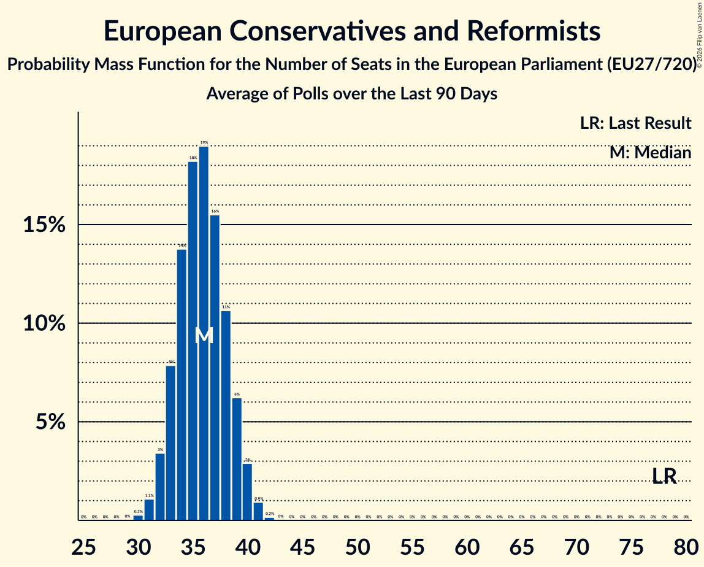

# European Conservatives and Reformists

Members registered from **9 countries**:

> BG, CY, DK, EE, FR, IT, NL, SE, SK

## Seats

Last result: **78** seats (General Election of 26 May 2019)

Current median: **36** seats (-42 seats)

At least one member in **8 countries** have a median of 1 seat or more:

> BG, CY, DK, EE, IT, NL, SE, SK

### Confidence Intervals

| Party | Area | Last Result | Median | 80% Confidence Interval | 90% Confidence Interval | 95% Confidence Interval | 99% Confidence Interval |
|:-----:|:----:|:-----------:|:------:|:-----------------------:|:-----------------------:|:-----------------------:|:-----------------------:|
| European Conservatives and Reformists | EU | 78 | 36 | 33–39 | 33–39 | 32–40 | 31–41 |
| Fratelli d’Italia | IT | | 22 | 21–25 | 20–25 | 19–25 | 19–27 |
| Juiste Antwoord 2021 | NL | | 4 | 3–5 | 3–5 | 3–5 | 3–5 |
| Sverigedemokraterna | SE | | 4 | 4 | 4 | 4 | 4 |
| Danmarksdemokraterne | DK | | 1 | 1 | 1 | 1 | 1 |
| Eesti Keskerakond | EE | | 1 | 1 | 1 | 1 | 0–2 |
| Sloboda a Solidarita | SK | | 1 | 1–2 | 1–2 | 1–2 | 0–2 |
| Εθνικό Λαϊκό Μέτωπο | CY | | 1 | 1 | 1 | 1 | 1 |
| Движение за права и свободи | BG | | 1 | 0–2 | 0–2 | 0–2 | 0–2 |
| Debout la France | FR | | 0 | 0 | 0 | 0 | 0 |
| Eesti Rahvuslased ja Konservatiivid | EE | | 0 | 0 | 0 | 0 | 0 |
| Kresťanská únia | SK | | 0 | 0 | 0 | 0 | 0 |
| Staatkundig Gereformeerde Partij | NL | | 0 | 0–1 | 0–1 | 0–1 | 0–1 |

### Probability Mass Function

The following table shows the probability mass function per seat for the [poll average](average-2026-10-31.html) for European Conservatives and Reformists.

| Number of Seats | Probability | Accumulated | Special Marks |
|:---------------:|:-----------:|:-----------:|:-------------:|
| 30 | 0.3% | 100% |  |
| 31 | 1.1% | 99.7% |  |
| 32 | 3% | 98.6% |  |
| 33 | 8% | 95% |  |
| 34 | 14% | 87% |  |
| 35 | 18% | 74% |  |
| 36 | 19% | 55% | Median |
| 37 | 16% | 36% |  |
| 38 | 11% | 21% |  |
| 39 | 6% | 10% |  |
| 40 | 3% | 4% |  |
| 41 | 0.9% | 1.1% |  |
| 42 | 0.2% | 0.2% |  |
| 43 | 0% | 0% |  |
| 44 | 0% | 0% |  |
| 45 | 0% | 0% |  |
| 46 | 0% | 0% |  |
| 47 | 0% | 0% |  |
| 48 | 0% | 0% |  |
| 49 | 0% | 0% |  |
| 50 | 0% | 0% |  |
| 51 | 0% | 0% |  |
| 52 | 0% | 0% |  |
| 53 | 0% | 0% |  |
| 54 | 0% | 0% |  |
| 55 | 0% | 0% |  |
| 56 | 0% | 0% |  |
| 57 | 0% | 0% |  |
| 58 | 0% | 0% |  |
| 59 | 0% | 0% |  |
| 60 | 0% | 0% |  |
| 61 | 0% | 0% |  |
| 62 | 0% | 0% |  |
| 63 | 0% | 0% |  |
| 64 | 0% | 0% |  |
| 65 | 0% | 0% |  |
| 66 | 0% | 0% |  |
| 67 | 0% | 0% |  |
| 68 | 0% | 0% |  |
| 69 | 0% | 0% |  |
| 70 | 0% | 0% |  |
| 71 | 0% | 0% |  |
| 72 | 0% | 0% |  |
| 73 | 0% | 0% |  |
| 74 | 0% | 0% |  |
| 75 | 0% | 0% |  |
| 76 | 0% | 0% |  |
| 77 | 0% | 0% |  |
| 78 | 0% | 0% | Last Result |

