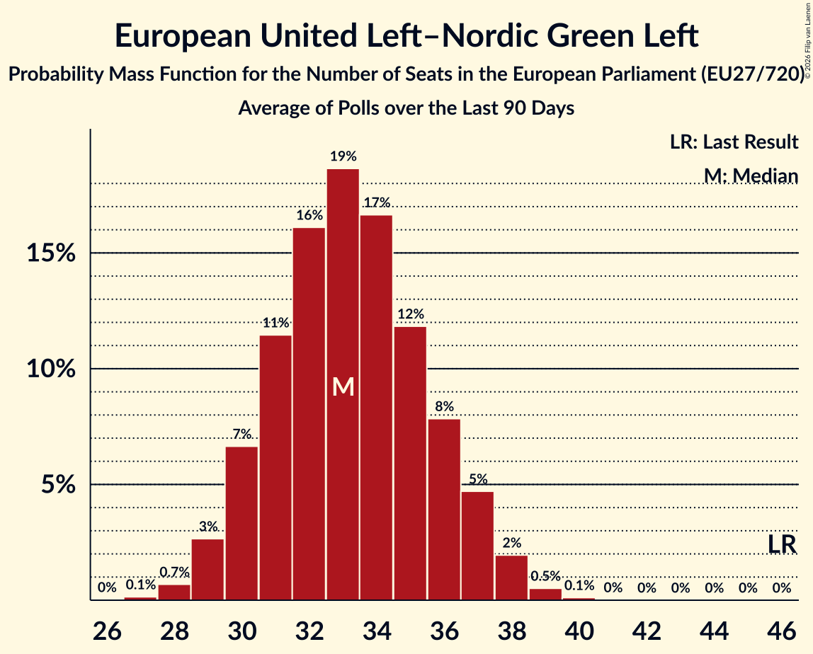

# European United Left–Nordic Green Left

Members registered from **7 countries**:

> AT, CY, DE, DK, FR, SE, SI

## Seats

Last result: **46** seats (General Election of 26 May 2019)

Current median: **33** seats (-13 seats)

At least one member in **5 countries** have a median of 1 seat or more:

> CY, DE, DK, FR, SE

### Confidence Intervals

| Party | Area | Last Result | Median | 80% Confidence Interval | 90% Confidence Interval | 95% Confidence Interval | 99% Confidence Interval |
|:-----:|:----:|:-----------:|:------:|:-----------------------:|:-----------------------:|:-----------------------:|:-----------------------:|
| European United Left–Nordic Green Left | EU | 46 | 33 | 30–36 | 30–37 | 29–38 | 28–39 |
| La France insoumise | FR | | 15 | 14–18 | 13–18 | 13–18 | 12–19 |
| Die Linke | DE | | 11 | 9–12 | 9–13 | 9–13 | 8–14 |
| Vänsterpartiet | SE | | 2 | 2 | 2 | 2 | 2 |
| Ανορθωτικό Κόμμα Εργαζόμενου Λαού | CY | | 2 | 2 | 2 | 2 | 2 |
| Enhedslisten–De Rød-Grønne | DK | | 1 | 1 | 1 | 1 | 1 |
| Partei Mensch Klima Tierschutz | DE | | 1 | 1 | 1–2 | 0–2 | 0–2 |
| Kommunistische Partei Österreichs | AT | | 0 | 0–1 | 0–1 | 0–1 | 0–1 |
| Levica | SI | | 0 | 0–1 | 0–1 | 0–1 | 0–1 |
| Parti communiste français | FR | | 0 | 0 | 0 | 0 | 0 |

### Probability Mass Function

The following table shows the probability mass function per seat for the [poll average](average-2026-10-31.html) for European United Left–Nordic Green Left.

| Number of Seats | Probability | Accumulated | Special Marks |
|:---------------:|:-----------:|:-----------:|:-------------:|
| 27 | 0.1% | 100% |  |
| 28 | 0.7% | 99.8% |  |
| 29 | 3% | 99.1% |  |
| 30 | 7% | 96% |  |
| 31 | 11% | 90% |  |
| 32 | 16% | 78% |  |
| 33 | 19% | 62% | Median |
| 34 | 17% | 44% |  |
| 35 | 12% | 27% |  |
| 36 | 8% | 15% |  |
| 37 | 5% | 7% |  |
| 38 | 2% | 3% |  |
| 39 | 0.5% | 0.6% |  |
| 40 | 0.1% | 0.1% |  |
| 41 | 0% | 0% |  |
| 42 | 0% | 0% |  |
| 43 | 0% | 0% |  |
| 44 | 0% | 0% |  |
| 45 | 0% | 0% |  |
| 46 | 0% | 0% | Last Result |

