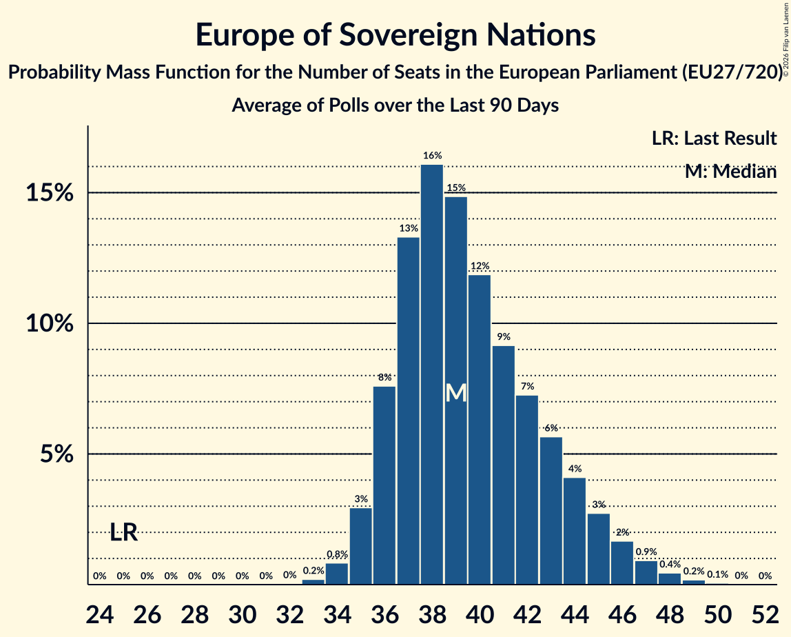

# Europe of Sovereign Nations

Members registered from **6 countries**:

> BG, DE, FR, IT, NL, SK

## Seats

Last result: **25** seats (General Election of 26 May 2019)

Current median: **39** seats (+14 seats)

At least one member in **4 countries** have a median of 1 seat or more:

> DE, IT, NL, SK

### Confidence Intervals

| Party | Area | Last Result | Median | 80% Confidence Interval | 90% Confidence Interval | 95% Confidence Interval | 99% Confidence Interval |
|:-----:|:----:|:-----------:|:------:|:-----------------------:|:-----------------------:|:-----------------------:|:-----------------------:|
| Europe of Sovereign Nations | EU | 25 | 39 | 36–44 | 36–45 | 35–46 | 34–48 |
| Alternative für Deutschland | DE | | 26 | 25–29 | 24–29 | 24–30 | 23–31 |
| Futuro Nazionale | IT | | 6 | 6–8 | 5–8 | 5–8 | 4–9 |
| Forum voor Democratie | NL | | 3 | 2–3 | 2–3 | 2–3 | 2–3 |
| REPUBLIKA | SK | | 2 | 2–3 | 2–3 | 2–3 | 2–4 |
| Reconquête | FR | | 0 | 0–5 | 0–5 | 0–5 | 0–6 |
| Възраждане | BG | | 0 | 0–1 | 0–1 | 0–1 | 0–2 |

### Probability Mass Function

The following table shows the probability mass function per seat for the [poll average](average-2026-10-31.html) for Europe of Sovereign Nations.

| Number of Seats | Probability | Accumulated | Special Marks |
|:---------------:|:-----------:|:-----------:|:-------------:|
| 25 | 0% | 100% | Last Result |
| 26 | 0% | 100% |  |
| 27 | 0% | 100% |  |
| 28 | 0% | 100% |  |
| 29 | 0% | 100% |  |
| 30 | 0% | 100% |  |
| 31 | 0% | 100% |  |
| 32 | 0% | 100% |  |
| 33 | 0.2% | 100% |  |
| 34 | 0.8% | 99.7% |  |
| 35 | 3% | 98.9% |  |
| 36 | 8% | 96% |  |
| 37 | 13% | 88% |  |
| 38 | 16% | 75% |  |
| 39 | 15% | 59% | Median |
| 40 | 12% | 44% |  |
| 41 | 9% | 32% |  |
| 42 | 7% | 23% |  |
| 43 | 6% | 16% |  |
| 44 | 4% | 10% |  |
| 45 | 3% | 6% |  |
| 46 | 2% | 3% |  |
| 47 | 0.9% | 2% |  |
| 48 | 0.4% | 0.7% |  |
| 49 | 0.2% | 0.3% |  |
| 50 | 0.1% | 0.1% |  |
| 51 | 0% | 0% |  |

