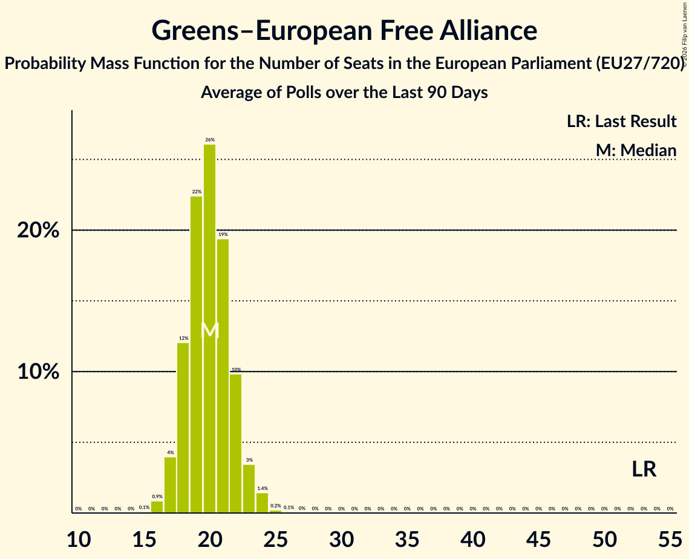

# Greens–European Free Alliance

Members registered from **7 countries**:

> AT, CY, DE, DK, FR, SE, SI

## Seats

Last result: **53** seats (General Election of 26 May 2019)

Current median: **20** seats (-33 seats)

At least one member in **4 countries** have a median of 1 seat or more:

> AT, DE, DK, SE

### Confidence Intervals

| Party | Area | Last Result | Median | 80% Confidence Interval | 90% Confidence Interval | 95% Confidence Interval | 99% Confidence Interval |
|:-----:|:----:|:-----------:|:------:|:-----------------------:|:-----------------------:|:-----------------------:|:-----------------------:|
| Greens–European Free Alliance | EU | 53 | 20 | 18–22 | 18–23 | 17–23 | 16–24 |
| Bündnis 90/Die Grünen | DE | | 14 | 13–15 | 12–16 | 12–17 | 12–17 |
| Die Grünen–Die Grüne Alternative | AT | | 2 | 1–3 | 1–3 | 1–3 | 1–4 |
| Socialistisk Folkeparti | DK | | 2 | 1–2 | 1–2 | 1–2 | 1–2 |
| Miljöpartiet de gröna | SE | | 1 | 1 | 1 | 1 | 1 |
| Volt Europa | DE | | 1 | 0–1 | 0–2 | 0–2 | 0–2 |
| Alternativet | DK | | 0 | 0 | 0 | 0 | 0 |
| Les Écologistes – Europe Écologie Les Verts | FR | | 0 | 0 | 0 | 0 | 0–4 |
| Piratska stranka Slovenije | SI | | 0 | 0 | 0 | 0 | 0 |
| Prerod – Stranka Vladimirja Prebiliča | SI | | 0 | 0 | 0 | 0 | 0 |
| VESNA–Zelena stranka | SI | | 0 | 0 | 0 | 0 | 0 |
| Βολτ Κύπρος | CY | | 0 | 0 | 0 | 0 | 0 |
| Κίνημα Οικολόγων—Συνεργασία Πολιτών | CY | | 0 | 0 | 0 | 0 | 0 |

### Probability Mass Function

The following table shows the probability mass function per seat for the [poll average](average-2026-10-31.html) for Greens–European Free Alliance.

| Number of Seats | Probability | Accumulated | Special Marks |
|:---------------:|:-----------:|:-----------:|:-------------:|
| 15 | 0.1% | 100% |  |
| 16 | 0.9% | 99.9% |  |
| 17 | 4% | 99.0% |  |
| 18 | 12% | 95% |  |
| 19 | 22% | 83% |  |
| 20 | 26% | 61% | Median |
| 21 | 19% | 34% |  |
| 22 | 10% | 15% |  |
| 23 | 3% | 5% |  |
| 24 | 1.4% | 2% |  |
| 25 | 0.2% | 0.4% |  |
| 26 | 0.1% | 0.1% |  |
| 27 | 0% | 0% |  |
| 28 | 0% | 0% |  |
| 29 | 0% | 0% |  |
| 30 | 0% | 0% |  |
| 31 | 0% | 0% |  |
| 32 | 0% | 0% |  |
| 33 | 0% | 0% |  |
| 34 | 0% | 0% |  |
| 35 | 0% | 0% |  |
| 36 | 0% | 0% |  |
| 37 | 0% | 0% |  |
| 38 | 0% | 0% |  |
| 39 | 0% | 0% |  |
| 40 | 0% | 0% |  |
| 41 | 0% | 0% |  |
| 42 | 0% | 0% |  |
| 43 | 0% | 0% |  |
| 44 | 0% | 0% |  |
| 45 | 0% | 0% |  |
| 46 | 0% | 0% |  |
| 47 | 0% | 0% |  |
| 48 | 0% | 0% |  |
| 49 | 0% | 0% |  |
| 50 | 0% | 0% |  |
| 51 | 0% | 0% |  |
| 52 | 0% | 0% |  |
| 53 | 0% | 0% | Last Result |

