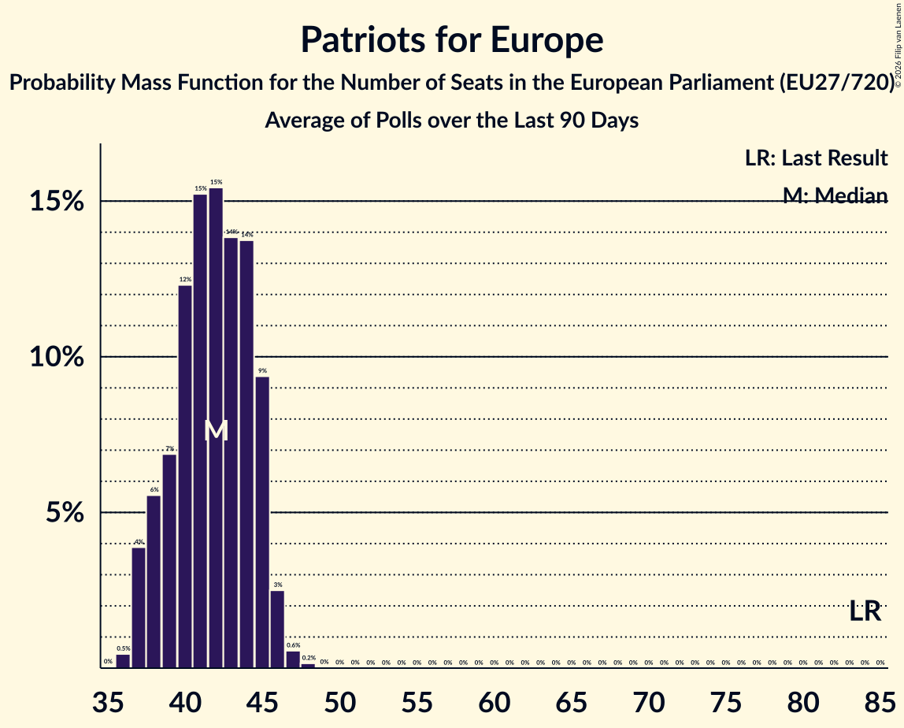

# Patriots for Europe

Members registered from **9 countries**:

> AT, DK, EE, ES, FR, IT, NL, SI, SK

## Seats

Last result: **84** seats (General Election of 26 May 2019)

Current median: **65** seats (-19 seats)

At least one member in **7 countries** have a median of 1 seat or more:

> AT, DK, EE, ES, FR, IT, NL

### Confidence Intervals

| Party | Area | Last Result | Median | 80% Confidence Interval | 90% Confidence Interval | 95% Confidence Interval | 99% Confidence Interval |
|:-----:|:----:|:-----------:|:------:|:-----------------------:|:-----------------------:|:-----------------------:|:-----------------------:|
| Patriots for Europe | EU | 84 | 65 | 61–68 | 59–69 | 58–70 | 56–71 |
| Rassemblement national | FR | | 32 | 28–34 | 27–34 | 27–35 | 27–36 |
| Vox | ES | | 13 | 11–14 | 11–14 | 11–14 | 10–15 |
| Freiheitliche Partei Österreichs | AT | | 8 | 8–9 | 8–9 | 7–9 | 7–10 |
| Lega Nord | IT | | 5 | 4–6 | 0–7 | 0–7 | 0–8 |
| Partij voor de Vrijheid | NL | | 5 | 3–5 | 3–5 | 3–5 | 3–5 |
| Dansk Folkeparti | DK | | 2 | 2–3 | 2–3 | 2–3 | 2–3 |
| Eesti Konservatiivne Rahvaerakond | EE | | 1 | 1 | 1 | 1 | 1 |
| SME RODINA | SK | | 0 | 0 | 0 | 0 | 0 |
| Slovenska nacionalna stranka | SI | | 0 | 0 | 0 | 0 | 0 |
| Slovenská národná strana | SK | | 0 | 0 | 0 | 0–1 | 0–1 |

### Probability Mass Function

The following table shows the probability mass function per seat for the [poll average](average-2026-10-31.html) for Patriots for Europe.

| Number of Seats | Probability | Accumulated | Special Marks |
|:---------------:|:-----------:|:-----------:|:-------------:|
| 54 | 0.1% | 100% |  |
| 55 | 0.2% | 99.9% |  |
| 56 | 0.4% | 99.7% |  |
| 57 | 0.7% | 99.3% |  |
| 58 | 1.3% | 98.7% |  |
| 59 | 3% | 97% |  |
| 60 | 4% | 95% |  |
| 61 | 6% | 90% |  |
| 62 | 8% | 84% |  |
| 63 | 10% | 76% |  |
| 64 | 12% | 66% |  |
| 65 | 13% | 54% | Median |
| 66 | 13% | 40% |  |
| 67 | 11% | 27% |  |
| 68 | 8% | 15% |  |
| 69 | 4% | 8% |  |
| 70 | 2% | 3% |  |
| 71 | 0.8% | 1.2% |  |
| 72 | 0.3% | 0.4% |  |
| 73 | 0.1% | 0.1% |  |
| 74 | 0% | 0% |  |
| 75 | 0% | 0% |  |
| 76 | 0% | 0% |  |
| 77 | 0% | 0% |  |
| 78 | 0% | 0% |  |
| 79 | 0% | 0% |  |
| 80 | 0% | 0% |  |
| 81 | 0% | 0% |  |
| 82 | 0% | 0% |  |
| 83 | 0% | 0% |  |
| 84 | 0% | 0% | Last Result |

