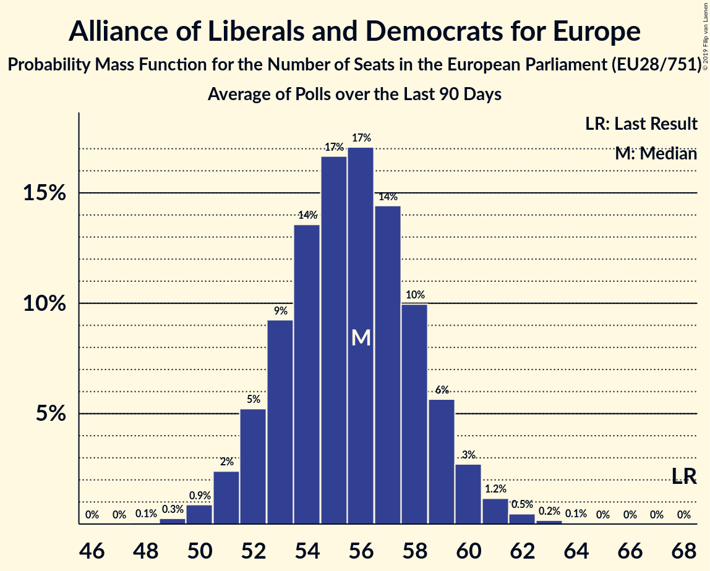

# Alliance of Liberals and Democrats for Europe

Members registered from **19 countries**:

> AT, CZ, DE, DK, EE, ES, FI, GR, HR, HU, IE, IT, LT, LV, NL, PL, SE, SI, SK

## Seats

Last result: **68** seats (General Election of 25 May 2014)

Current median: **61** seats (-7 seats)

At least one member in **15 countries** have a median of 1 seat or more:

> AT, CZ, DE, DK, EE, ES, FI, HU, IE, LT, LV, NL, SE, SI, SK

### Confidence Intervals

| Party | Area | Last Result | Median | 80% Confidence Interval | 90% Confidence Interval | 95% Confidence Interval | 99% Confidence Interval |
|:-----:|:----:|:-----------:|:------:|:-----------------------:|:-----------------------:|:-----------------------:|:-----------------------:|
| Alliance of Liberals and Democrats for Europe | EU | 68 | 61 | 58–64 | 57–64 | 56–65 | 55–67 |
| Ciudadanos–Partido de la Ciudadanía | ES | | 9 | 7–11 | 7–11 | 7–12 | 6–12 |
| Freie Demokratische Partei | DE | | 8 | 7–9 | 6–9 | 6–9 | 5–10 |
| ANO 2011 | CZ | | 7 | 7–8 | 7–8 | 6–8 | 6–8 |
| Volkspartij voor Vrijheid en Democratie | NL | | 6 | 5–6 | 5–6 | 5–6 | 5–6 |
| Fianna Fáil | IE | | 4 | 4–5 | 4–5 | 4–5 | 4–5 |
| Eesti Reformierakond | EE | | 3 | 2–3 | 2–3 | 2–3 | 2–3 |
| Lista Marjana Šarca | SI | | 3 | 3 | 2–3 | 2–3 | 2–4 |
| Venstre | DK | | 3 | 3–4 | 3–4 | 3–4 | 3–4 |
| Centerpartiet | SE | | 2 | 1–2 | 1–2 | 1–2 | 1–2 |
| Democraten 66 | NL | | 2 | 2 | 2 | 2 | 1–2 |
| Momentum Mozgalom | HU | | 2 | 2 | 1–2 | 1–2 | 1–2 |
| Progresívne Slovensko–SPOLU–Občianska Demokracia | SK | | 2 | 2 | 2 | 2–3 | 2–3 |
| Suomen Keskusta | FI | | 2 | 2 | 2 | 1–2 | 1–2 |
| Attīstībai/Par! | LV | | 1 | 1 | 1 | 1 | 1 |
| Darbo Partija | LT | | 1 | 1 | 1 | 1 | 1–2 |
| Eesti Keskerakond | EE | | 1 | 1–2 | 1–2 | 1–2 | 1–2 |
| Euzko Alderdi Jeltzalea/Partido Nacionalista Vasco | ES | | 1 | 0–1 | 0–1 | 0–1 | 0–1 |
| Freie Wähler | DE | | 1 | 1–2 | 1–2 | 1–2 | 0–2 |
| NEOS–Das Neue Österreich und Liberales Forum | AT | | 1 | 1–2 | 1–2 | 1–2 | 1–2 |
| Partit Demòcrata Europeu Català | ES | | 1 | 0–1 | 0–1 | 0–1 | 0–1 |
| Radikale Venstre | DK | | 1 | 1 | 1 | 1 | 0–1 |
| .Nowoczesna | PL | | 0 | 0 | 0 | 0 | 0 |
| Coalición Canaria–Partido Nacionalista Canario | ES | | 0 | 0 | 0 | 0 | 0–1 |
| Demokratična stranka upokojencev Slovenije | SI | | 0 | 0 | 0 | 0 | 0 |
| Eesti 200 | EE | | 0 | 0 | 0 | 0 | 0 |
| Građansko-liberalni savez | HR | | 0 | 0 | 0 | 0 | 0 |
| Hrvatska narodna stranka–liberalni demokrati | HR | | 0 | 0 | 0 | 0 | 0 |
| Istarski demokratski sabor | HR | | 0 | 0 | 0 | 0 | 0 |
| Liberal Alliance | DK | | 0 | 0 | 0 | 0 | 0 |
| Liberalerna | SE | | 0 | 0–1 | 0–1 | 0–1 | 0–1 |
| Liberalų Sąjūdis | LT | | 0 | 0 | 0 | 0–1 | 0–1 |
| Pametno | HR | | 0 | 0 | 0 | 0 | 0 |
| Più Europa | IT | | 0 | 0 | 0–3 | 0–3 | 0–4 |
| Stranka Alenke Bratušek | SI | | 0 | 0 | 0 | 0 | 0 |
| Stranka modernega centra | SI | | 0 | 0 | 0 | 0 | 0 |
| Svenska folkpartiet i Finland | FI | | 0 | 0 | 0 | 0–1 | 0–1 |
| Ένωση Κεντρώων | GR | | 0 | 0 | 0 | 0–1 | 0–1 |

### Probability Mass Function

The following table shows the probability mass function per seat for the [poll average](average-2019-07-31.html) for Alliance of Liberals and Democrats for Europe.

| Number of Seats | Probability | Accumulated | Special Marks |
|:---------------:|:-----------:|:-----------:|:-------------:|
| 53 | 0.1% | 100% |  |
| 54 | 0.3% | 99.9% |  |
| 55 | 0.9% | 99.7% |  |
| 56 | 2% | 98.8% |  |
| 57 | 5% | 96% |  |
| 58 | 9% | 91% |  |
| 59 | 13% | 82% |  |
| 60 | 17% | 69% |  |
| 61 | 17% | 52% | Median |
| 62 | 14% | 35% |  |
| 63 | 10% | 20% |  |
| 64 | 6% | 10% |  |
| 65 | 3% | 5% |  |
| 66 | 1.2% | 2% |  |
| 67 | 0.5% | 0.7% |  |
| 68 | 0.2% | 0.3% | Last Result |
| 69 | 0.1% | 0.1% |  |
| 70 | 0% | 0% |  |

