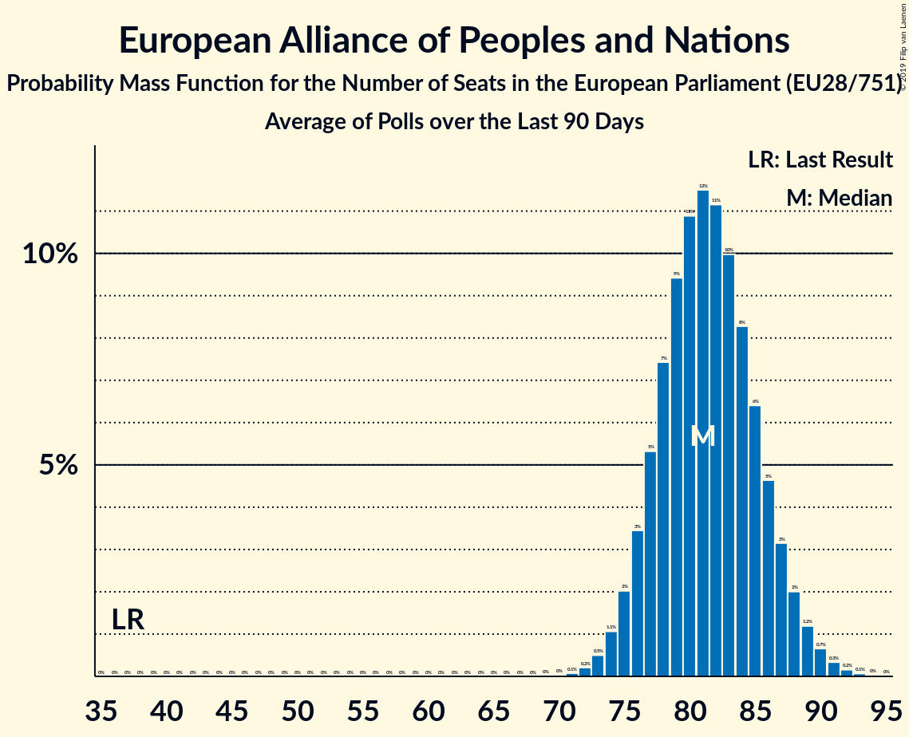

# European Alliance of Peoples and Nations

## Seats

Last result: **37** seats (General Election of 25 May 2014)

### Confidence Intervals

| Party | Last Result | Median | 80% Confidence Interval | 90% Confidence Interval | 95% Confidence Interval | 99% Confidence Interval |
|:-----:|:-----------:|:------:|:-----------------------:|:-----------------------:|:-----------------------:|:-----------------------:|
| European Alliance of Peoples and Nations | 37 | 82 | 78–87 | 77–88 | 76–90 | 73–92 |
| Lega Nord [IT] (EAPN) | | 25 | 23–29 | 23–30 | 22–30 | 21–32 |
| Rassemblement national [FR] (EAPN) | | 20 | 19–22 | 18–23 | 18–23 | 17–23 |
| Alternative für Deutschland [DE] (EAPN) | | 12 | 10–14 | 9–14 | 9–14 | 8–15 |
| Vox [ES] (EAPN) | | 6 | 5–7 | 4–8 | 4–8 | 3–9 |
| Freiheitliche Partei Österreichs [AT] (EAPN) | | 4 | 4–5 | 4–5 | 4–5 | 3–5 |
| Partij voor de Vrijheid [NL] (EAPN) | | 3 | 1–4 | 1–4 | 1–4 | 1–4 |
| Perussuomalaiset [FI] (EAPN) | | 3 | 3 | 3 | 3 | 3 |
| Dansk Folkeparti [DK] (EAPN) | | 2 | 2–3 | 2–3 | 2–3 | 2–3 |
| Svoboda a přímá demokracie [CZ] (EAPN) | | 2 | 0–2 | 0–2 | 0–2 | 0–3 |
| Eesti Konservatiivne Rahvaerakond [EE] (EAPN) | | 1 | 1–2 | 1–2 | 1–2 | 1–2 |
| SME RODINA [SK] (EAPN) | | 1 | 1–2 | 1–2 | 1–2 | 1–2 |
| Slovenská národná strana [SK] (EAPN) | | 1 | 1 | 1 | 1 | 1 |
| Vlaams Belang [BE-VLG] (EAPN) | | 1 | 1–2 | 1–2 | 1–2 | 1–2 |
| UK Independence Party [GB-GBN] (EAPN) | | 0 | 0–2 | 0–2 | 0–2 | 0–2 |

### Probability Mass Function

The following table shows the probability mass function per seat for the [poll average](average-2019-04-30.html) for European Alliance of Peoples and Nations.

| Number of Seats | Probability | Accumulated | Special Marks |
|:---------------:|:-----------:|:-----------:|:-------------:|
| 37 | 0% | 100% | Last Result |
| 38 | 0% | 100% |  |
| 39 | 0% | 100% |  |
| 40 | 0% | 100% |  |
| 41 | 0% | 100% |  |
| 42 | 0% | 100% |  |
| 43 | 0% | 100% |  |
| 44 | 0% | 100% |  |
| 45 | 0% | 100% |  |
| 46 | 0% | 100% |  |
| 47 | 0% | 100% |  |
| 48 | 0% | 100% |  |
| 49 | 0% | 100% |  |
| 50 | 0% | 100% |  |
| 51 | 0% | 100% |  |
| 52 | 0% | 100% |  |
| 53 | 0% | 100% |  |
| 54 | 0% | 100% |  |
| 55 | 0% | 100% |  |
| 56 | 0% | 100% |  |
| 57 | 0% | 100% |  |
| 58 | 0% | 100% |  |
| 59 | 0% | 100% |  |
| 60 | 0% | 100% |  |
| 61 | 0% | 100% |  |
| 62 | 0% | 100% |  |
| 63 | 0% | 100% |  |
| 64 | 0% | 100% |  |
| 65 | 0% | 100% |  |
| 66 | 0% | 100% |  |
| 67 | 0% | 100% |  |
| 68 | 0% | 100% |  |
| 69 | 0% | 100% |  |
| 70 | 0% | 100% |  |
| 71 | 0.1% | 100% |  |
| 72 | 0.1% | 99.9% |  |
| 73 | 0.3% | 99.8% |  |
| 74 | 0.7% | 99.5% |  |
| 75 | 1.3% | 98.8% |  |
| 76 | 2% | 98% |  |
| 77 | 4% | 95% |  |
| 78 | 5% | 92% |  |
| 79 | 7% | 86% |  |
| 80 | 9% | 79% |  |
| 81 | 11% | 70% |  |
| 82 | 11% | 59% | Median |
| 83 | 11% | 48% |  |
| 84 | 10% | 37% |  |
| 85 | 8% | 27% |  |
| 86 | 6% | 19% |  |
| 87 | 5% | 13% |  |
| 88 | 3% | 8% |  |
| 89 | 2% | 5% |  |
| 90 | 1.3% | 3% |  |
| 91 | 0.7% | 1.4% |  |
| 92 | 0.4% | 0.7% |  |
| 93 | 0.2% | 0.3% |  |
| 94 | 0.1% | 0.1% |  |
| 95 | 0% | 0% |  |

