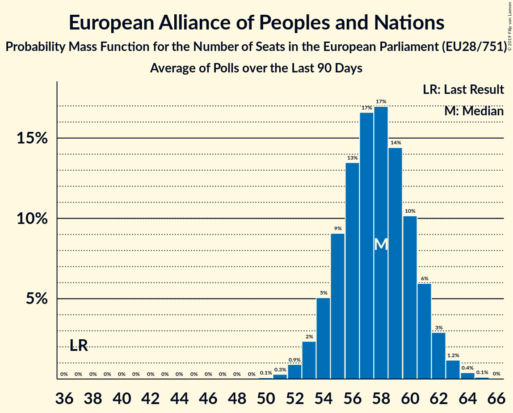

# European Alliance of Peoples and Nations

## Seats

Last result: **37** seats (General Election of 25 May 2014)

### Confidence Intervals

| Party | Last Result | Median | 80% Confidence Interval | 90% Confidence Interval | 95% Confidence Interval | 99% Confidence Interval |
|:-----:|:-----------:|:------:|:-----------------------:|:-----------------------:|:-----------------------:|:-----------------------:|
| European Alliance of Peoples and Nations | 37 |  | 2–4 | 2–4 | 1–4 | 1–4 |
| Partij voor de Vrijheid [NL] (EAPN) | |  | 1–2 | 1–2 | 0–3 | 0–3 |
| SME RODINA [SK] (EAPN) | |  | 1 | 1–2 | 1–2 | 1–2 |

### Probability Mass Function

The following table shows the probability mass function per seat for the [poll average](average-2019-07-31.html) for European Alliance of Peoples and Nations.

