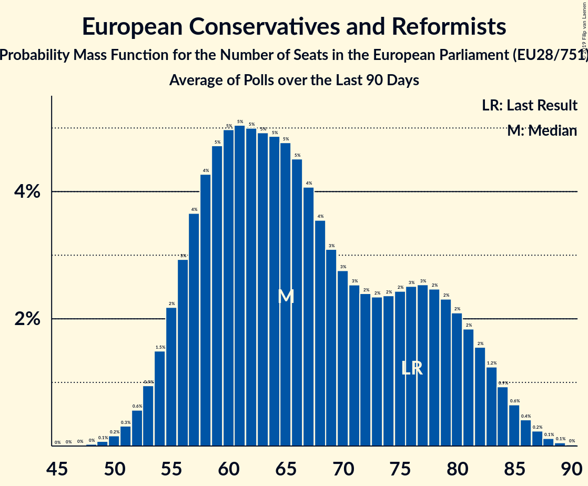

# European Conservatives and Reformists

## Seats

Last result: **53** seats (General Election of 25 May 2014)

### Confidence Intervals

| Party | Last Result | Median | 80% Confidence Interval | 90% Confidence Interval | 95% Confidence Interval | 99% Confidence Interval |
|:-----:|:-----------:|:------:|:-----------------------:|:-----------------------:|:-----------------------:|:-----------------------:|
| European Conservatives and Reformists | 53 | 53 | 47–59 | 46–60 | 44–62 | 42–64 |
| Prawo i Sprawiedliwość (ECR) | | 22 | 19–25 | 18–25 | 18–26 | 17–27 |
| Conservative Party (ECR) | | 10 | 10–14 | 9–15 | 9–15 | 9–16 |
| Forum voor Democratie (ECR) | | 4 | 3–6 | 3–7 | 3–7 | 2–7 |
| Fratelli d’Italia (ECR) | | 4 | 0–5 | 0–5 | 0–5 | 0–6 |
| Sverigedemokraterna (ECR) | | 4 | 3–4 | 3–5 | 3–5 | 3–5 |
| Sloboda a Solidarita (ECR) | | 2 | 1–2 | 1–2 | 1–2 | 1–2 |
| ChristenUnie (ECR) | | 1 | 1–2 | 1–2 | 0–2 | 0–2 |
| Nacionālā apvienība „Visu Latvijai!”–„Tēvzemei un Brīvībai/LNNK” (ECR) | | 1 | 1 | 1 | 1 | 0–2 |
| OBYČAJNÍ ĽUDIA a nezávislé osobnosti (ECR) | | 1 | 1–2 | 1–2 | 1–2 | 1–2 |
| Debout la France (ECR) | | 0 | 0–6 | 0–6 | 0–6 | 0–7 |
| Hrvatska konzervativna stranka (ECR) | | 0 | 0 | 0 | 0 | 0 |
| Lietuvos lenkų rinkimų akcija (ECR) | | 0 | 0–1 | 0–1 | 0–1 | 0–1 |
| Staatkundig Gereformeerde Partij (ECR) | | 0 | 0 | 0 | 0 | 0–1 |
| Ulster Unionist Party (ECR) | | 0 | 0–1 | 0–1 | 0–1 | 0–1 |
| Ανεξάρτητοι Έλληνες (ECR) | | 0 | 0 | 0 | 0 | 0 |

### Probability Mass Function

The following table shows the probability mass function per seat for the [poll average](average-2019-04-15.html) for European Conservatives and Reformists.

| Number of Seats | Probability | Accumulated | Special Marks |
|:---------------:|:-----------:|:-----------:|:-------------:|
| 40 | 0.1% | 100% |  |
| 41 | 0.2% | 99.9% |  |
| 42 | 0.4% | 99.7% |  |
| 43 | 0.7% | 99.3% |  |
| 44 | 1.2% | 98.7% |  |
| 45 | 2% | 97% |  |
| 46 | 3% | 96% |  |
| 47 | 4% | 93% |  |
| 48 | 5% | 89% |  |
| 49 | 6% | 84% |  |
| 50 | 7% | 77% |  |
| 51 | 8% | 70% |  |
| 52 | 9% | 62% |  |
| 53 | 8% | 53% | Last Result, Median |
| 54 | 8% | 45% |  |
| 55 | 7% | 36% |  |
| 56 | 7% | 29% |  |
| 57 | 6% | 22% |  |
| 58 | 5% | 16% |  |
| 59 | 4% | 12% |  |
| 60 | 3% | 8% |  |
| 61 | 2% | 5% |  |
| 62 | 1.3% | 3% |  |
| 63 | 0.8% | 2% |  |
| 64 | 0.4% | 0.8% |  |
| 65 | 0.2% | 0.4% |  |
| 66 | 0.1% | 0.2% |  |
| 67 | 0% | 0.1% |  |
| 68 | 0% | 0% |  |

