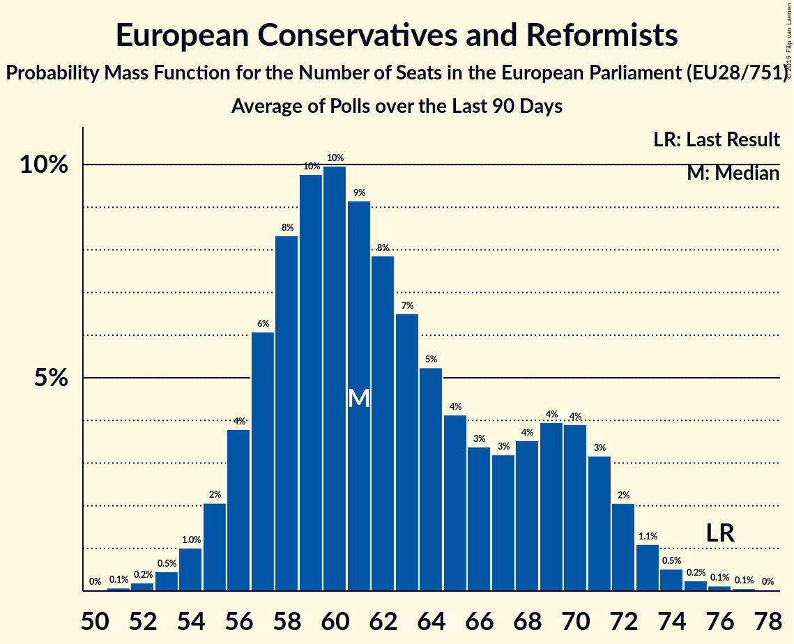

# European Conservatives and Reformists

## Seats

Last result: **76** seats (General Election of 25 May 2014)

### Confidence Intervals

| Party | Last Result | Median | 80% Confidence Interval | 90% Confidence Interval | 95% Confidence Interval | 99% Confidence Interval |
|:-----:|:-----------:|:------:|:-----------------------:|:-----------------------:|:-----------------------:|:-----------------------:|
| European Conservatives and Reformists | 76 | 63 | 59–68 | 58–70 | 57–71 | 55–74 |
| Prawo i Sprawiedliwość [PL] (ECR) | | 22 | 20–24 | 20–24 | 19–25 | 19–25 |
| Conservative Party [GB-GBN] (ECR) | | 11 | 8–14 | 8–15 | 8–16 | 8–19 |
| Forum voor Democratie [NL] (ECR) | | 5 | 4–5 | 4–5 | 4–5 | 4–6 |
| Fratelli d’Italia [IT] (ECR) | | 4 | 3–5 | 3–5 | 0–5 | 0–6 |
| N-VA [BE-VLG] (ECR) | | 4 | 3–4 | 3–4 | 3–4 | 3–4 |
| Sverigedemokraterna [SE] (ECR) | | 4 | 3–4 | 3–5 | 3–5 | 2–5 |
| Občanská demokratická strana [CZ] (ECR) | | 3 | 3–4 | 3–4 | 2–5 | 2–5 |
| ChristenUnie–Staatkundig Gereformeerde Partij [NL] (ECR) | | 2 | 1–2 | 1–2 | 1–2 | 1–2 |
| Sloboda a Solidarita [SK] (ECR) | | 2 | 1–2 | 1–2 | 1–2 | 1–2 |
| Most nezavisnih lista [HR] (ECR) | | 1 | 0–1 | 0–1 | 0–1 | 0–1 |
| Nacionālā apvienība „Visu Latvijai!”–„Tēvzemei un Brīvībai/LNNK” [LV] (ECR) | | 1 | 1 | 1 | 1 | 1 |
| OBYČAJNÍ ĽUDIA a nezávislé osobnosti [SK] (ECR) | | 1 | 1 | 1 | 1–2 | 1–2 |
| Partija tvarka ir teisingumas [LT] (ECR) | | 1 | 0–1 | 0–1 | 0–1 | 0–1 |
| ВМРО–Българско Национално Движение [BG] (ECR) | | 1 | 0–2 | 0–2 | 0–2 | 0–2 |
| Debout la France [FR] (ECR) | | 0 | 0 | 0 | 0–4 | 0–5 |
| Hrvatska konzervativna stranka [HR] (ECR) | | 0 | 0 | 0 | 0 | 0 |
| Latvijas Reģionu apvienība [LV] (ECR) | | 0 | 0–1 | 0–1 | 0–1 | 0–1 |
| Lietuvos Centro Partija [LT] (ECR) | | 0 | 0–1 | 0–1 | 0–1 | 0–1 |
| Lietuvos lenkų rinkimų akcija [LT] (ECR) | | 0 | 0–1 | 0–1 | 0–1 | 0–1 |
| Sininen tulevaisuus [FI] (ECR) | | 0 | 0 | 0 | 0 | 0 |
| Ulster Unionist Party [GB-NIR] (ECR) | | 0 | 0–1 | 0–1 | 0–1 | 0–1 |
| Ανεξάρτητοι Έλληνες [GR] (ECR) | | 0 | 0 | 0 | 0 | 0 |

### Probability Mass Function

The following table shows the probability mass function per seat for the [poll average](average-2019-05-01.html) for European Conservatives and Reformists.

| Number of Seats | Probability | Accumulated | Special Marks |
|:---------------:|:-----------:|:-----------:|:-------------:|
| 53 | 0.1% | 100% |  |
| 54 | 0.2% | 99.9% |  |
| 55 | 0.4% | 99.7% |  |
| 56 | 0.9% | 99.4% |  |
| 57 | 2% | 98% |  |
| 58 | 3% | 97% |  |
| 59 | 5% | 94% |  |
| 60 | 8% | 88% |  |
| 61 | 10% | 81% |  |
| 62 | 11% | 71% |  |
| 63 | 12% | 60% | Median |
| 64 | 11% | 48% |  |
| 65 | 10% | 37% |  |
| 66 | 8% | 28% |  |
| 67 | 6% | 20% |  |
| 68 | 5% | 13% |  |
| 69 | 3% | 9% |  |
| 70 | 2% | 5% |  |
| 71 | 1.4% | 3% |  |
| 72 | 0.8% | 2% |  |
| 73 | 0.5% | 1.0% |  |
| 74 | 0.3% | 0.5% |  |
| 75 | 0.1% | 0.3% |  |
| 76 | 0.1% | 0.1% | Last Result |
| 77 | 0% | 0.1% |  |
| 78 | 0% | 0% |  |

